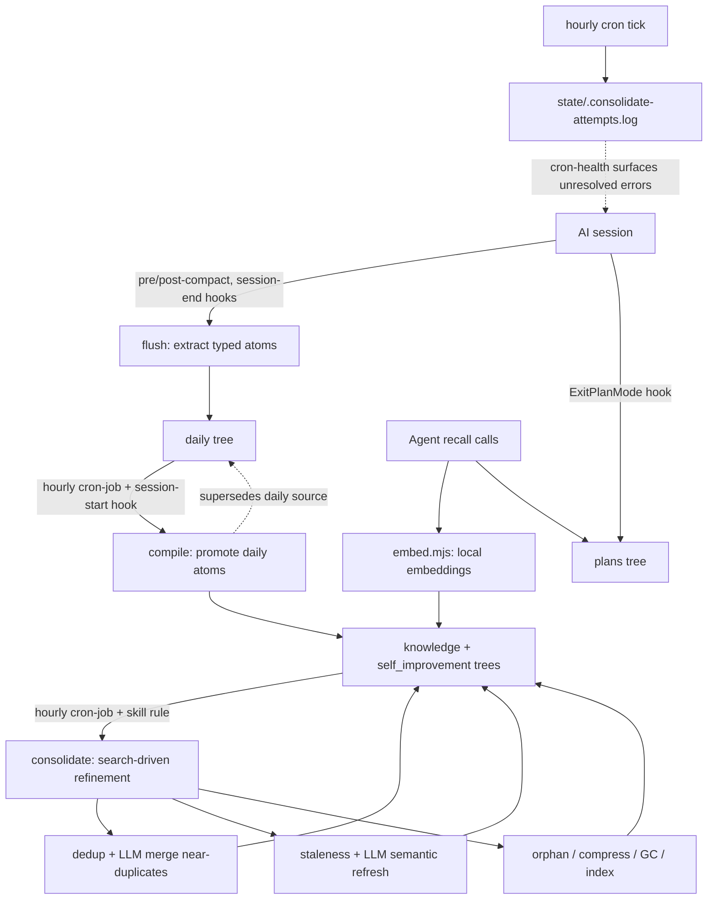
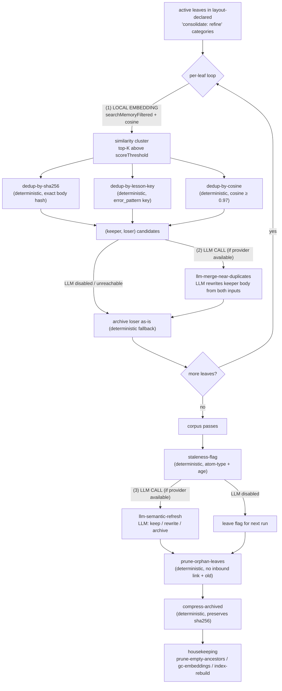
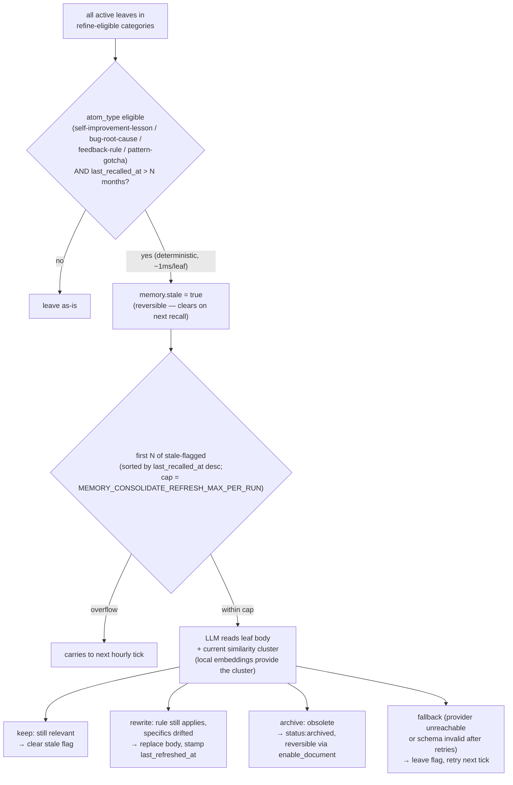

<div align="center">

# LLM Wiki Memory

### Local, git-versioned memory for AI coding agents. Capture, compile, recall — now with offline consolidation.

The same capture / compile / recall loop and self-improvement behaviour you'd get from a RAG memory stack, stored as a local [LLM wiki](https://github.com/ctxr-dev/skill-llm-wiki) with local-embedding recall and a deterministic write-gate.

**No RAG. No Docker. No external service.**

<br/>

[](https://nodejs.org)
[](LICENSE)
[](https://modelcontextprotocol.io)
[](https://huggingface.co/Xenova/bge-large-en-v1.5)
[](#)
[](https://github.com/ctxr-dev/skill-llm-wiki)
[](#testing)
[](https://github.com/ctxr-dev/llm-wiki-memory/stargazers)

</div>

---

## Install

Paste this into your AI coding agent:

> Clone `https://github.com/ctxr-dev/llm-wiki-memory` into `./.llm-wiki-memory/src` in this project, then run `./.llm-wiki-memory/src/bootstrap.sh`. This sets up local LLM-wiki memory: hooks that capture conversations and compile them into knowledge and self-improvement lessons, an hourly cron that refines the corpus over time, and a local stdio MCP server for save and recall. Local embeddings, no Docker. When it finishes, if I am on Claude Code tell me to restart; otherwise show me `./.llm-wiki-memory/src/scripts/mcp-config.sh <my-client>` so I can register the server.

Or run it yourself:

```bash
git clone https://github.com/ctxr-dev/llm-wiki-memory ./.llm-wiki-memory/src
./.llm-wiki-memory/src/bootstrap.sh                    # add --commit-memory to commit the wiki
./.llm-wiki-memory/src/bootstrap.sh --schedule daily   # optional: hourly cron / launchd
```

The bootstrap is **idempotent** — re-running preserves your edits to `.env` and your rule files.

<details>
<summary><strong>What bootstrap does (8 steps)</strong></summary>

1. Installs dependencies in `./.llm-wiki-memory/src`.
2. Auto-detects the LLM provider: `claude` CLI → `codex` CLI → `ANTHROPIC_API_KEY` → `OPENAI_API_KEY` → `MEMORY_LLM_BASE_URL` → ollama at `:11434` → `mock` (with a stderr warning).
3. Writes `./.llm-wiki-memory/settings/.env` (preserves your edits on re-run).
4. Merges hooks into `.claude/settings.json` and the stdio server into `.mcp.json`.
5. Renders vendor-neutral configs into `.agents/` and discipline rules into `.agents/rules/`, `.claude/skills/`, `.claude/rules/`, `.cursor/rules/`.
6. Materialises the hosted wiki at `./.llm-wiki-memory/wiki` (with the layout template that declares `consolidate: refine | none` per category) and validates it.
7. Adds `/.llm-wiki-memory` to `.gitignore` (`--commit-memory` commits the wiki instead).
8. Optionally installs the hourly compile + consolidate cron via a wrapper script (`--schedule daily`).

</details>

<details>
<summary><strong>Register with a non-Claude client</strong></summary>

```bash
./.llm-wiki-memory/src/scripts/mcp-config.sh cursor          # .cursor/mcp.json
./.llm-wiki-memory/src/scripts/mcp-config.sh codex           # ~/.codex/config.toml
./.llm-wiki-memory/src/scripts/mcp-config.sh claude-desktop  # claude_desktop_config.json
./.llm-wiki-memory/src/scripts/mcp-config.sh all
```

</details>

## Highlights

- **Zero infrastructure.** Everything lives in a local `.llm-wiki-memory/` folder. No vector DB, no container, no API service to run.
- **Git-versioned memory.** Every memory is a markdown leaf in a hierarchical wiki with full history, maintained by [`@ctxr/skill-llm-wiki`](https://github.com/ctxr-dev/skill-llm-wiki).
- **Write-gated, cross-client.** Self-improvement lessons can only be saved with explicit user consent. Three layers of enforcement: discipline instructions, an optional Claude Code hook, and an airtight MCP server-side gate (covers Cursor, Codex, generic clients).
- **Offline consolidation.** An hourly cron + a search-driven orchestrator deduplicate near-identical leaves, archive stale entries, and optionally rewrite bodies via the same LLM the rest of the pipeline uses. Never hard-deletes; always reversible.
- **Self-healing.** Every cron tick appends a structured attempt entry to a log. If the most recent attempt failed and a later one didn't clear it, your next session surfaces the unresolved error and offers to investigate.
- **Local semantic recall.** Transformer embeddings (default `Xenova/bge-large-en-v1.5`) rank queries on-device. One env var swaps in a lighter model — or falls back to a lexical scorer with no model download.
- **Layout-declared eligibility.** Every category in `<wiki>/.layout/layout.yaml` declares `consolidate: refine | none` explicitly. No magic defaults — author intent is always in plain view.
- **One-prompt install.** Paste a prompt into your agent or run one script. Idempotent.

## Why a wiki instead of RAG

RAG memory stacks are powerful but heavy: a vector database, a container, an embedding service, ongoing ops. For small and medium projects that overhead is rarely worth it, yet you still want the agent to remember everything and improve itself across sessions.

`llm-wiki-memory` gives you that loop with a local hosted wiki as the substrate. Every category stays a nested tree (never a flat pile of files): non-daily categories nest by the metadata facets you search by; daily by date; an additional `subject` axis scatters leaves by what they're about. Git history and validation come free, and the tree stays readable by humans. Recall runs on local embeddings — nothing leaves your machine.

## How it works



**The loop in one sentence:** session hooks capture typed atoms into `daily/`; the hourly cron promotes them into `knowledge/` and `self_improvement/` (compile) and then refines those trees over time (consolidate); every recall hits the same embedding index; every cron attempt logs its outcome so the next session can surface unresolved failures.

## Memory write-gate (read-freely, write-gated)

Self-improvement lessons are **propose-then-confirm**: the agent NEVER calls `save_lesson` (or `save_to_dataset(dataset="self_improvement", ...)` / `write_memory(datasetId="self_improvement", ...)`) on its own. It proposes the save in chat, waits for an explicit user yes in the same turn, then calls the tool with `userRequested: true`. The server refuses gated writes without the flag.

Three enforcement layers, defence-in-depth:

| Layer | Where | What it does | Why |
| --- | --- | --- | --- |
| **Instructions (probabilistic)** | MCP `initialize` + rule files in `.agents/rules/`, `.claude/rules/`, `.cursor/rules/` | Tells the model the rule, the wording to propose, and the consent contract. | Reaches *every* MCP client (Claude Code, Cursor, Codex, generic). Not airtight on its own — the model could still ignore it — which is why the next two layers exist. |
| **Claude Code hook (deterministic, Claude Code only)** | `PreToolUse` hook on the three gated writers | Inspects the latest user turn for explicit save phrases. Matches → `allow`. No match → `ask` (Claude Code prompts the user yes/no). Also denies direct `Write`/`Edit` to `~/.claude/projects/<workspace>/memory/`. | Stops a mis-instructed model BEFORE the call leaves the client. Adds a one-click user gate when needed. |
| **MCP server-side gate (deterministic, every client)** | `save_lesson` / `save_to_dataset` / `write_memory` handlers in the local stdio MCP server | Refuses calls without `userRequested: true`. Also refuses when `path:` lands the write under `self_improvement/...` from a non-gated `dataset:` claim (closes the path-bypass). | The airtight bottom layer. Works for Cursor, Codex, Claude Desktop, generic MCP clients — they don't have hooks, so the server is the only deterministic checkpoint. |

**Reconciliation:** layers are independent and additive. Any one of them can refuse a save. The model can NOT bypass them: it can't suppress the discipline (sent at `initialize`), can't disable the Claude Code hook from inside a tool call, and can't forge the `userRequested` flag (the only legitimate-bypass path is the internal `withSystemMaintenance` async frame that consolidate uses for its own bookkeeping — entered only by the orchestrator's own code, never by a client request body).

Knowledge, plans, investigations, daily, and tracker-issue writes are **not** gated — their routing rules apply directly. Set `MEMORY_WRITE_GATE_SELF_IMPROVEMENT=off` in `.env` to disable the server-side check as an operator escape hatch (the other two layers still apply).

## Consolidate (offline refinement)

The `consolidate` orchestrator runs hourly via the cron (chained after `compile`) and at session end via a hook-less skill rule. It walks the **layout-declared** `consolidate: refine` categories and refines each leaf against its similarity cluster.

### Where local-embedding runs · where LLM runs · why each pass exists



**(1) Local embedding** lights up only inside the per-leaf cluster lookup. The bge model runs on-device; nothing leaves your machine to find which leaves are similar. Cosine similarity (a pure math op) then ranks the cluster — also local.

**(2) LLM call · merge near-duplicates** runs once per `(keeper, loser)` pair found by any of the three dedup passes — but only when an LLM provider is reachable. The LLM sees both bodies + frontmatter, decides whether to merge them into one fresher body or leave the keeper as-is. If the provider is missing or the call fails, consolidate falls back to "archive the loser unchanged" so the run never blocks.

**(3) LLM call · semantic refresh** runs once per stale-flagged leaf, capped at `MEMORY_CONSOLIDATE_REFRESH_MAX_PER_RUN`. The LLM sees the leaf + its current cluster context and chooses keep / rewrite / archive. The deterministic staleness-flag pass nominates candidates; the LLM only acts when it can.

Why each pass:

| Pass | Why it exists |
| --- | --- |
| `dedupe-by-sha256` | Same file content was written twice (race between compile runs, manual re-save). Cheapest dedup. |
| `dedupe-by-lesson-key` | Same failure pattern logged with different wording. Catches semantic duplicates the byte hash misses. |
| `dedupe-by-cosine` | Near-paraphrases that drifted across edits. The cosine-against-cluster check is the safety net for "we already said this". |
| `llm-merge-near-duplicates` | When two leaves overlap, the keeper shouldn't just survive — it should be the synthesis of both. The LLM produces that synthesis from the structured pair. |
| `staleness-flag` | Long-untouched leaves are candidates for review. The flag is the deterministic gate to a more expensive LLM revisit. |
| `llm-semantic-refresh` | A bug-root-cause may be fixed; a feedback-rule may be reversed. The LLM judges current relevance against fresh context and updates the leaf accordingly. |
| `prune-orphan-leaves` | Leaves with no inbound link and no recall hits in a year contribute noise to recall. Archive (reversibly). |
| `compress-archived` | An archived body sitting in git forever is dead weight; truncate to the gist + footer pointing at the original sha256 in frontmatter. |
| `prune-empty-ancestors` / `gc-embeddings` / `index-rebuild` | Structural hygiene. Empty dirs, orphan embedding-cache entries, ancestor `index.md` regens. |

### Keeping knowledge accurate as your code drifts

A memory store that only ever GROWS becomes a graveyard. Bug root-causes get fixed permanently. Feedback rules get reversed. Pattern-gotchas survive an API rename and start pointing at functions that no longer exist. Without a way to revisit aged knowledge, recall starts surfacing leaves that contradict the current codebase — and your agent confidently gives advice that was correct two quarters ago.

`consolidate`'s answer is a deliberate two-step pipeline. The cheap deterministic step nominates candidates; the expensive LLM step judges them.



**Step 1 — staleness-flag (deterministic).** Pure file-metadata rule: atom_type in the eligible set + `max(last_recalled_at, frontmatter.updated)` older than `MEMORY_CONSOLIDATE_STALE_AFTER_MONTHS` (default 6). No LLM, no body inspection — just a flag. It also flips OFF: a single recall hit on a previously-stale leaf clears the flag on the next run, so freshly-relevant content un-flags itself automatically.

**Step 2 — llm-semantic-refresh (LLM, capped, runs on the stale-flagged subset only).** For each candidate, the LLM sees the leaf's body, its frontmatter, and a small bundle of *currently-active* leaves on the same topic (the similarity cluster — pulled via local embeddings, no network). It returns one of four verdicts:

| Verdict | What happens | When the LLM picks this |
| --- | --- | --- |
| **keep** | `memory.stale` cleared; body untouched. | The content is still factually correct; the staleness flag was a false positive (low recall ≠ low relevance). The reset means the next 6-month window restarts cleanly. |
| **rewrite** | Body replaced with the LLM's synthesis; `memory.last_refreshed_at` stamped; `memory.stale` cleared. | The rule still applies but specifics drifted — file paths renamed, library upgraded, API moved, dependency replaced. The lesson survives; the references update. |
| **archive** | `disableDocument` — `memory.status: archived`, `memory.consolidated_at` stamped. File stays on disk + in git for recovery. | The bug got fixed permanently. The convention was reversed. The gotcha became obsolete after a refactor. Reversible at any time via `enable_document`. |
| **fallback** | The flag persists; the next hourly cron tick retries. | The LLM provider is unreachable, the response didn't satisfy the schema after `MEMORY_CONSOLIDATE_LLM_MAX_RETRIES` attempts, or the model hallucinated the leaf id. Bias is always toward NOT destroying content. |

**Why an LLM, and not a deterministic rule?** The flag is structural ("when was this leaf last touched?"); the verdict is semantic ("is what this leaf SAYS still true?"). No deterministic rule can read a `bug-root-cause` body and decide whether the bug was fixed in v1.4.2; no rule can tell that a `pattern-gotcha` about an `apply` factory still applies after a team-wide migration to `def resource(...)` smart constructors. Reading the leaf body **in current context** and producing a *trinary* decision (keep / rewrite / archive) is exactly the kind of judgment an LLM does well — and exactly what a deterministic policy can't reach without becoming either too aggressive ("archive everything aged" — loses live knowledge) or too timid ("never touch anything" — the wiki ages into noise).

**Why capped per run?** `MEMORY_CONSOLIDATE_REFRESH_MAX_PER_RUN` (default 25) bounds the LLM call budget per hourly tick. A corpus with 100 stale-flagged leaves makes 25 calls this hour, 25 the next, and so on — steady progress without billing surprises. Recently-recalled leaves are processed first (they're more likely to be load-bearing in active work), so the budget always lands on the highest-leverage candidates.

**Why opt-out exists.** Set `MEMORY_CONSOLIDATE_LLM_PASSES=off` to keep the deterministic flag but skip the LLM verdict. The flag still gets set; nothing acts on it. Useful for cost-sensitive setups, sealed environments, or running consolidate purely for dedup + housekeeping. You can flip it back on later — the flags accumulated in the meantime become this-run's working set.

**Net effect on the wiki's shape.**
- Recall keeps finding **correct, current** advice instead of two-year-old reruns.
- Leaf count plateaus instead of growing forever (archives count toward "compressed", not "live").
- Knowledge that's still right is left alone (`keep`); knowledge that drifted is updated in place (`rewrite`); knowledge that's obsolete moves out of the active set (`archive`) but stays recoverable.
- Every change is reversible — the wiki is its own git repo, and `consolidate` uses `disableDocument` exclusively. There is no `deleteDocument` path inside the orchestrator; the user is the only one who can hard-delete, and only via the explicit MCP tool.
- The next hourly tick reads the now-cleaner corpus, so the cluster quality for dedup + refresh **compounds**: less noise to dedup against, sharper similarity scores, fewer false positives, more confident verdicts.

### Layout decides which trees are eligible

Every category in `<wiki>/.layout/layout.yaml` must say `consolidate: refine` or `consolidate: none` — **no defaults applied**. `consolidate: none` categories (plans, investigations, daily by default — owned by other lifecycles) are never walked by per-leaf passes. The orchestrator refuses to run with a clear error envelope if any category lacks the field.

### Pass parameters at a glance

| Pass | Knob (default) |
| --- | --- |
| `dedupe-by-cosine` | `MEMORY_CONSOLIDATE_COSINE_THRESHOLD` (`0.97`; `0.995` on lexical fallback) |
| `dedupe-*` cluster scope | `MEMORY_CONSOLIDATE_CLUSTER_TOP_K` (`12`) + `MEMORY_CONSOLIDATE_CLUSTER_SCORE_THRESHOLD` (`0.75`) |
| `staleness-flag` window | `MEMORY_CONSOLIDATE_STALE_AFTER_MONTHS` (`6`) |
| `llm-semantic-refresh` cap | `MEMORY_CONSOLIDATE_REFRESH_MAX_PER_RUN` (`25`) |
| `prune-orphan-leaves` TTL | `MEMORY_CONSOLIDATE_ORPHAN_TTL_DAYS` (`365`) |
| `compress-archived` body cap / age | `MEMORY_CONSOLIDATE_ARCHIVE_BODY_MAX` (`1200`) / `MEMORY_CONSOLIDATE_ARCHIVE_AGE_DAYS` (`30`) |
| LLM passes on/off + retry | `MEMORY_CONSOLIDATE_LLM_PASSES` (`on`) / `MEMORY_CONSOLIDATE_LLM_MAX_RETRIES` (`2`) |
| Throttle | `MEMORY_CONSOLIDATE_INTERVAL_DAYS` (`1`) |

### Self-healing operation

Each hourly cron tick runs `cli.mjs cron-job`, which appends a structured attempt entry to `state/.consolidate-attempts.log`. The internal `--if-due` throttle bounds the heavy lifting to once per `MEMORY_CONSOLIDATE_INTERVAL_DAYS`. Transient failures get retried at the next tick; persistent ones are surfaced to the next session by the SessionStart hook (`cli.mjs cron-health` for hook-less agents) with a one-line summary and an offer to investigate.

### Determinism

Deterministic passes produce byte-identical state across two runs on the same wiki + frozen clock. LLM passes are reproducible via `MEMORY_LLM_MOCK_FILE` / `MEMORY_LLM_MOCK_RESPONSE` for tests. Locking is shared with `compile.mjs`, so they never race; the cron-job wrapper sequences them.

Never hard-deletes — every archival uses `disableDocument` (status flip), recoverable via `enable_document`.

## Works with your agent

| MCP client | Hooks (Claude Code only) | MCP tools | Write-gate enforcement |
| --- | :---: | :---: | --- |
| **Claude Code** | ✅ session-start / pre-compact / post-compact / session-end / exit-plan-mode / pre-tool-use | ✅ | instructions + hook + server (full three-layer) |
| **Cursor** | ✗ | ✅ | instructions + server |
| **Codex / OpenAI** | ✗ | ✅ | instructions + server |
| **Claude Desktop** | ✗ | ✅ | instructions + server |
| **Any MCP client** | ✗ | ✅ | instructions + server |

Hook-driven auto-capture is Claude Code only; every other client gets the same MCP tools + the same discipline. Hook-less clients invoke `cli.mjs cron-health` at session start (per the rule rendered into `.agents/rules/`) to surface unresolved cron failures.

The **LLM provider** that extracts typed atoms during capture / compile / consolidate is set in `.llm-wiki-memory/settings/.env` and is independent of the client:

[](#) [](#) [](#) [](#) [](#) [](#)

`openai-compatible` covers ollama, vLLM, lm-studio, llama.cpp server, and litellm proxies — point `MEMORY_LLM_BASE_URL` at a local endpoint and `OPENAI_API_KEY` becomes optional on loopback / RFC1918. The provider is auto-detected at install; explicit `--provider` or a user-edited `.env` always wins.

## MCP tools

| Tool | Purpose |
| --- | --- |
| `recall_lessons` | Recall self-improvement lessons before a task (fall-back ladder drops `error_pattern`, then `language`, then `task_type`). |
| `search_memory` | Cross-category embedding search with metadata pre-filtering. |
| `save_lesson` | **Write-gated.** Persist a lesson after explicit user yes (requires `userRequested: true`). |
| `save_to_dataset` | Upsert a plan, investigation, knowledge artefact, or other category by name. Write-gated when `dataset="self_improvement"`. |
| `write_memory` | Create a memory leaf, optionally superseding an existing one. Write-gated when `datasetId="self_improvement"`. |
| `consolidate_memory` | Run the deterministic + LLM consolidation passes. System-maintenance; not write-gated. |
| `disable_document` / `enable_document` / `delete_document` | Archive (reversible) or remove a leaf. |
| `audit_memory` | Surface duplicate keys, missing metadata, and cleanup candidates. |
| `list_datasets`, `get_memory_config`, `reload_provider`, `reload_layout` | Inspect categories, config, LLM provider, and force-refresh caches. |
| `validate_layout`, `validate_topology`, `test_path_compiler` | Layout + topology + placement-compiler sanity checks. |

## Configuration

All settings live in `./.llm-wiki-memory/settings/.env` (see [`templates/env.example`](templates/env.example)). Highlights:

| Key | Default | Meaning |
| --- | --- | --- |
| `MEMORY_LLM_PROVIDER` | auto | `claude` / `codex` / `anthropic` / `openai` / `openai-compatible` / `mock`. Detected at install. |
| `MEMORY_LLM_BASE_URL` | (unset) | OpenAI-compatible local endpoint (ollama, vLLM, lm-studio, llama.cpp, litellm). |
| `MEMORY_LLM_MODEL` | (unset) | Provider-agnostic model override (wins over `ANTHROPIC_MODEL` / `OPENAI_MODEL`). |
| `MEMORY_EMBED_MODEL` | `Xenova/bge-large-en-v1.5` | Embedding model — see the model comparison below. |
| `MEMORY_WRITE_GATE_SELF_IMPROVEMENT` | `on` | Operator escape hatch for the server-side gate. |
| `MEMORY_CONSOLIDATE_INTERVAL_DAYS` | `1` | Throttle for `consolidate --if-due` (hourly cron, but actual work at most once per N days). |
| `MEMORY_CONSOLIDATE_LLM_PASSES` | `on` | Disable to run deterministic-only consolidation. |
| `MEMORY_CONSOLIDATE_COSINE_THRESHOLD` | `0.97` | Dedup threshold (auto-bumped to `0.995` on the lexical fallback). |
| `MEMORY_RECALL_TOUCH` | `on` | Whether `searchMemoryFiltered` stamps `last_recalled_at` on hits (24h throttled). |

<details>
<summary><strong>Full env-knob list</strong></summary>

See [`templates/env.example`](templates/env.example) for the complete annotated set:

- LLM provider + model overrides
- Embedding backend / model / cache
- Hook thresholds (`MEMORY_HOOK_MAX_TURNS`, `MEMORY_HOOK_MAX_CHARS`, …)
- Compile tuning (`MEMORY_ATOM_BODY_MAX_CHARS`, `MEMORY_COMPILE_QUALITY_STRICT`, lock TTL)
- Embedding-cache GC cadence (`MEMORY_GC_INTERVAL_DAYS`)
- All `MEMORY_CONSOLIDATE_*` knobs (orphan TTL, staleness window, archive-body cap, cluster top-K + score threshold, LLM retry budget, refresh-per-run cap)
- Recall-touch throttle (`MEMORY_RECALL_TOUCH_MIN_HOURS`)
- Identity (`MEMORY_DEFAULT_PROJECT_MODULE`)

</details>

<details>
<summary><strong>Choosing an embedding model</strong></summary>

Recall ranks queries with an on-device [transformers.js](https://github.com/xenova/transformers.js) model, set by `MEMORY_EMBED_MODEL`. The default `Xenova/bge-large-en-v1.5` gives the best routing quality; lighter models trade some accuracy for a much smaller download. Sizes below are the **quantized** ONNX weights transformers.js downloads by default (full-precision is ≈ 4× larger), lightest first:

| Model | Dim | Download | Notes |
| --- | :---: | :---: | --- |
| `Xenova/all-MiniLM-L6-v2` | 384 | ~25 MB | Smallest and fastest. Modest retrieval quality. |
| `Xenova/bge-small-en-v1.5` | 384 | ~35 MB | Strong quality for a small download. |
| `Xenova/bge-base-en-v1.5` | 768 | ~110 MB | Noticeably better routing than `small`. |
| `Xenova/bge-large-en-v1.5` | 1024 | ~340 MB | **Default.** Best routing quality. |

Set a lighter model in `.env`:

```bash
MEMORY_EMBED_MODEL=Xenova/bge-small-en-v1.5
```

Changing the model invalidates the embedding cache automatically. Stay within the MiniLM / BGE / GTE / mxbai families: they're mean-pooled with no query prefix, which is how this engine embeds. Prefix-based models (e5, nomic) underperform here because the engine doesn't add the `query:` / `search_document:` prefixes they expect.

</details>

## Manual commands

```bash
cd .llm-wiki-memory/src

# Inspect what consolidate WOULD do (no mutations).
node scripts/cli.mjs consolidate --dry-run --force --json | jq

# Run consolidate for real (bypass the daily throttle).
node scripts/cli.mjs consolidate --force --json | jq '.totals'

# Full cron-job (compile + consolidate + attempt log entry).
node scripts/cli.mjs cron-job

# Inspect cron health (what SessionStart shows you on a failure).
node scripts/cli.mjs cron-health | jq

# Inspect the per-run report + the attempt log history.
cat ../state/.consolidate.json | jq
cat ../state/.consolidate-attempts.log | jq -s 'reverse | .[:5]'

# The classic ops trio.
node scripts/cli.mjs init       # materialise or repair the wiki shell
node scripts/cli.mjs validate   # skill-llm-wiki validate
node scripts/cli.mjs heal       # classify state and name the next command

# Recall / search from the terminal.
node scripts/cli.mjs recall "<query>"
node scripts/cli.mjs search "<query>"

# Resolved paths + LLM provider + skill location.
node scripts/cli.mjs where
```

Schedule the hourly cron (or remove it):

```bash
./.llm-wiki-memory/src/bootstrap.sh --schedule daily   # cron on Linux, launchd on macOS, hourly
./.llm-wiki-memory/src/bootstrap.sh --schedule off     # remove
```

The cron entry calls a generated wrapper (`state/cron-daily.sh`) — safe across workspaces whose paths contain single-quotes, percents, or spaces.

<details>
<summary><strong>Architecture (responsibility matrix)</strong></summary>

| Path | Role |
| --- | --- |
| `scripts/lib/wiki-store.mjs` | Storage seam: every document is a wiki leaf. Drives the skill for index-rebuild / validate / heal / rebuild. Hosts the recall-touch instrumentation and `getConsolidateLayout()` reader. |
| `scripts/lib/embed.mjs` | Transformer embeddings, cosine, content-hash cache (lexical fallback). The only retrieval engine. |
| `scripts/lib/recall.mjs` | `recall_lessons` ladder, `search_memory`, `save_lesson`. |
| `scripts/lib/llm.mjs` | LLM provider dispatch (claude / codex / anthropic / openai / openai-compatible / mock) + `health()` probe + `isLocalEndpoint` heuristic. |
| `scripts/lib/llm-callJSON.mjs` | Prompt-file + variable-interpolation + zod-schema-validated LLM JSON-call wrapper. Used by compile + consolidate. |
| `scripts/lib/maintenance-tag.mjs` | AsyncLocalStorage-backed `withSystemMaintenance` frame for the server-side gate exemption. |
| `scripts/lib/discipline.mjs` | Single source of the memory discipline (MCP `instructions` + the SessionStart context). |
| `scripts/lib/layout-validator.mjs` | Zod schema for `<wiki>/.layout/layout.yaml`. |
| `scripts/lib/wiki-cli.mjs` | Wrapper around the `skill-llm-wiki` bin (bottom-up `index-rebuild-one`). |
| `scripts/consolidate.mjs` | Search-driven AutoDream consolidation orchestrator. |
| `scripts/cron-job.mjs` | Hourly cron entry point + structured attempt log + `cronHealth`. |
| `scripts/compile.mjs` | LLM-driven daily → knowledge / self_improvement promotion. |
| `scripts/hooks/*` | Claude Code lifecycle hooks (capture, gate, plan-sync, embed-gc, session-start). |
| `mcp-server/index.mjs` | Local stdio MCP server. |
| `templates/`, `bootstrap.sh`, `scripts/mcp-config.sh` | Install and multi-client registration. |

Full per-concern responsibility split (this package vs the underlying engine) and known smells: [**ARCHITECTURE.md**](ARCHITECTURE.md).

</details>

## Testing

```bash
npm test           # unit suite
npm run test:e2e   # full lifecycle against the real skill-llm-wiki CLI (LLM stubbed)
```

**676 tests** in total. The e2e suite builds a wiki from scratch in a temp directory and asserts genesis, daily capture, lesson + knowledge + plan + investigation absorption, compile promotion + dedup, recall, tree-growth integrity, and idempotency — against the real `skill-llm-wiki` CLI with mocked LLM responses.

## Requirements

Node 20 or newer, and git. No Docker, no Python. The embedding model downloads on first recall (set `MEMORY_EMBED_BACKEND=lexical` to skip it entirely).

## License

[MIT](LICENSE)
