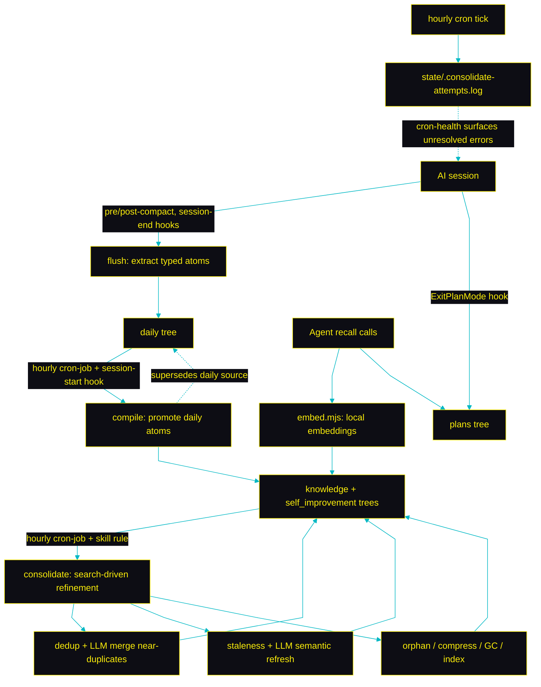
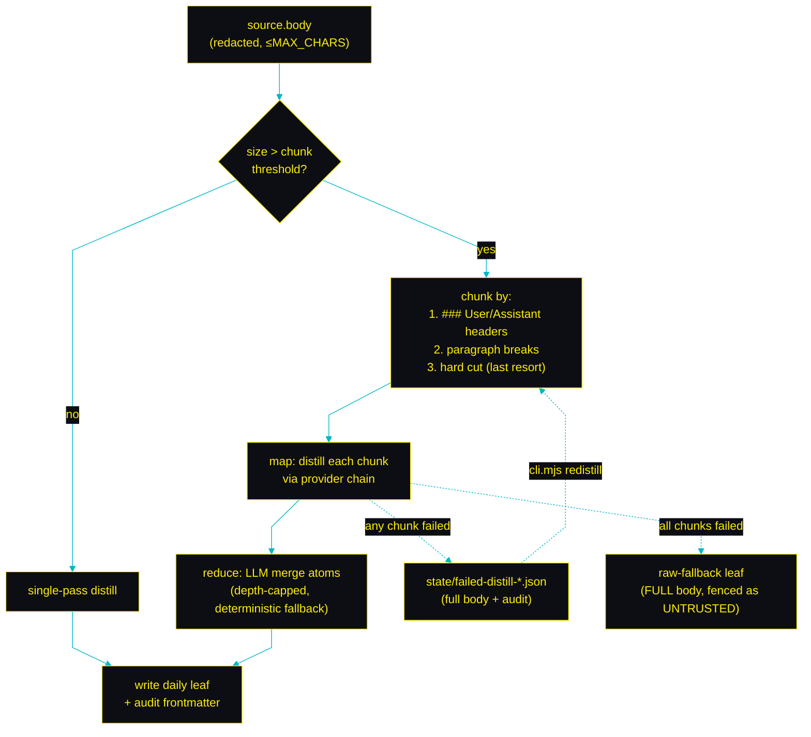
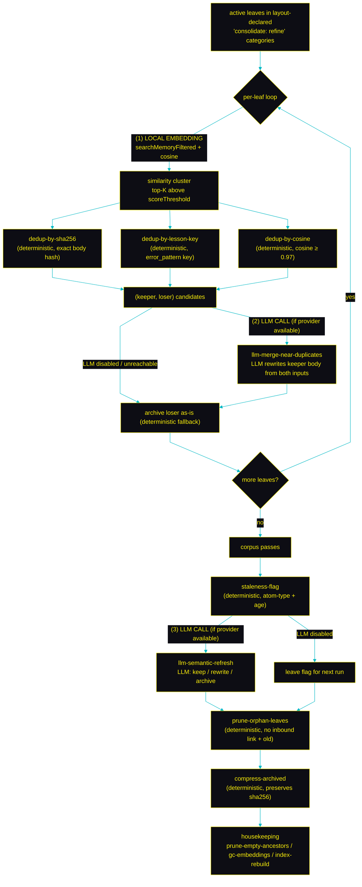
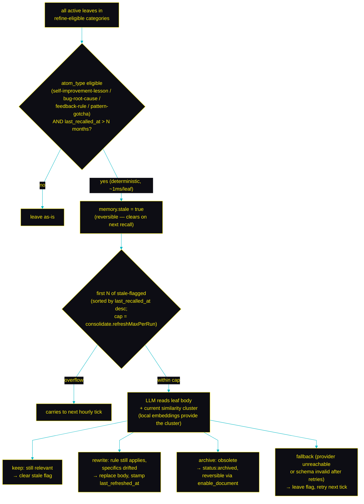

<div align="center">


### Persistent local memory for AI coding agents. Your agent remembers every session, learns from its mistakes, and gets smarter the longer you work with it.

Claude Code, Cursor, Codex, and every other MCP client forget everything when a session ends. LLM Wiki Memory fixes that: it captures your conversations, compiles them into durable project knowledge and lessons your agent applies next time, and recalls the right context through a local MCP server. Memory lives on your machine as plain Markdown in an [LLM wiki](https://github.com/ctxr-dev/skill-llm-wiki) versioned in git, searched with local embeddings, and consolidated offline while you sleep.

<samp><b>No RAG stack. No vector database. No Docker. No cloud. Install with one prompt and your agent never starts from zero again.</b></samp>

<br/>
<br/>

[](#testing)
[](https://nodejs.org)
[](LICENSE)
[](https://modelcontextprotocol.io)

[](https://huggingface.co/Xenova/bge-large-en-v1.5)
[](#why-a-wiki-instead-of-rag)
[](https://github.com/ctxr-dev/skill-llm-wiki)
[](https://github.com/ctxr-dev/llm-wiki-memory/stargazers)

</div>

## Install


Paste this one-liner into your AI coding agent (copy button on the right) — it covers both a **fresh install** and an **update** of an existing one. The full procedure lives in [`AI-INSTALL-PROMPT.md`](AI-INSTALL-PROMPT.md); the agent fetches and follows it:

```text
Set up llm-wiki-memory in this project: fetch https://raw.githubusercontent.com/ctxr-dev/llm-wiki-memory/main/AI-INSTALL-PROMPT.md and follow it EXACTLY (it covers fresh install and update; if already installed, the same file is local at @.llm-wiki-memory/src/AI-INSTALL-PROMPT.md).
```

Or run it yourself — fresh install:

```bash
git clone https://github.com/ctxr-dev/llm-wiki-memory ./.llm-wiki-memory/src
./.llm-wiki-memory/src/bootstrap.sh                    # add --commit-memory to commit the wiki
./.llm-wiki-memory/src/bootstrap.sh --schedule daily   # optional: hourly cron / launchd
```

Update an existing install:

```bash
git -C .llm-wiki-memory/src fetch origin
# Runbooks you have NOT applied yet — READ THESE FIRST, oldest → newest:
git -C .llm-wiki-memory/src diff --name-only HEAD origin/main -- docs/releases | grep 'update-prompt\.md$' | sort
git -C .llm-wiki-memory/src merge --ff-only origin/main
( cd .llm-wiki-memory/src && npm install --no-audit --no-fund )
./.llm-wiki-memory/src/bootstrap.sh   # idempotent; runbooks may add one-shot steps + verification
```

The bootstrap is **idempotent** — re-running preserves your edits to `.env` and your rule files.

<details>
<summary><strong>What bootstrap does (8 steps)</strong></summary>

1. Installs dependencies in `./.llm-wiki-memory/src`.
2. Auto-detects the LLM provider: `claude` CLI → `codex` CLI → `ANTHROPIC_API_KEY` → `OPENAI_API_KEY` → `MEMORY_LLM_BASE_URL` → ollama at `:11434` → `mock` (with a stderr warning).
3. Writes `./.llm-wiki-memory/settings/.env` (preserves your edits on re-run).
4. Merges hooks into `.claude/settings.json` and the stdio server into `.mcp.json`.
5. Renders vendor-neutral configs into `.agents/` and discipline rules into `.agents/rules/`, `.claude/skills/`, `.claude/rules/`, `.cursor/rules/`.
6. Materialises the hosted wiki at `./.llm-wiki-memory/wiki` (with the layout template that declares `consolidate: refine | none` per category) and validates it.
7. Adds `/.llm-wiki-memory` to `.gitignore` (`--commit-memory` commits the wiki instead).
8. Optionally installs the hourly compile + consolidate cron via a wrapper script (`--schedule daily`).

</details>

<details>
<summary><strong>Register with a non-Claude client</strong></summary>

```bash
./.llm-wiki-memory/src/scripts/mcp-config.sh cursor          # .cursor/mcp.json
./.llm-wiki-memory/src/scripts/mcp-config.sh codex           # ~/.codex/config.toml
./.llm-wiki-memory/src/scripts/mcp-config.sh claude-desktop  # claude_desktop_config.json
./.llm-wiki-memory/src/scripts/mcp-config.sh all
```

</details>

## Highlights


**Everything lives in a local `.llm-wiki-memory/` folder.** No vector DB, no container, no API service to run.


**Every memory is a markdown leaf with full history**, maintained by [`@ctxr/skill-llm-wiki`](https://github.com/ctxr-dev/skill-llm-wiki). Every change commits itself to the wiki's own repo with what, when, and why in the message (one commit per save, flush, compile, or consolidate run), so `git log` alone explains how your memory evolved. Disable via `wiki.autoCommit`; your project repo is never touched.


**Self-improvement lessons save only with explicit user consent, one approval per lesson.** Three layers of enforcement: discipline instructions, a Claude Code hook enabled by default (disable via `gate.claudeHookEnabled`) that confirms each lesson rather than letting one save phrase flush a batch, and an airtight MCP server-side gate (covers Cursor, Codex, generic clients). Every gate decision (and each compile-distilled lesson) lands in a redacted audit ledger (`cli.mjs gate-audit`).


**Long sessions are chunked and distilled in pieces** (header-aware → paragraph fallback → hard cut), so a 100K-char transcript never single-passes its way into a CLI timeout. Failed runs persist a full-body stash + structured audit; one `cli.mjs redistill` retries with no data loss.


**A YAML-declared provider chain** (anthropic API → openai API → claude CLI → codex CLI → cursor CLI) and per-provider model fallback lists let a deprecated model or a missing CLI cascade automatically — without inlining model names in code.


**An hourly cron + a search-driven orchestrator** deduplicate near-identical leaves, archive stale entries, and optionally rewrite bodies via the same LLM the rest of the pipeline uses. Never hard-deletes; always reversible.


**Health is judged per entity, not per run**: every cron tick keeps a slim attempt entry (last `consolidate.attemptsKeep` runs) plus a full sharded log under `state/logs/<yyyy>/<mm>/` for deep diagnosis. A failure that resolves on a later tick stays silent; an entity still failing after `consolidate.escalateAfterAttempts` consecutive runs (or one error signature recurring across many entities) escalates into a redacted skeleton issue report at `issues/<yyyy>/<mm>/<dd>/<signature>.<version>.md` that your next session surfaces and offers to investigate — ready to copy upstream or turn into a fix PR.


**Transformer embeddings rank queries on-device** (default `Xenova/bge-large-en-v1.5`). One setting swaps in a lighter model — or falls back to a lexical scorer with no model download.


**Every category declares its consolidation eligibility** in `<wiki>/.layout/layout.yaml` (`consolidate: refine | none`). No magic defaults — author intent is always in plain view.


**Paste one prompt into your agent or run one script.** Idempotent.


**Every atom carries an apply-strength** — `P0` (a hard constraint / guardrail you must honour), `P1` (a strong default to apply whenever relevant), `P2` (contextual). A rubric fills it by atom type, so you rarely set it by hand. At recall, **relevance still ranks first**; priority only breaks near-ties and decides which bodies survive the response budget, so a guardrail or key lesson is never crowded out by merely-similar context. `P0` is scarce — you confirm it, it is never auto-assigned.

## Why a wiki instead of RAG


RAG memory stacks are powerful but heavy: a vector database, a container, an embedding service, ongoing ops. For small and medium projects that overhead is rarely worth it, yet you still want the agent to remember everything and improve itself across sessions.

`llm-wiki-memory` gives you that loop with a local hosted wiki as the substrate. Every category stays a nested tree (never a flat pile of files): non-daily categories nest by the metadata facets you search by; daily by date; an additional `subject` axis scatters leaves by what they're about. Git history and validation come free, and the tree stays readable by humans. Recall runs on local embeddings — nothing leaves your machine.

## How it works




**The loop in one sentence:** session hooks capture typed atoms into `daily/`; the hourly cron promotes them into `knowledge/` and `self_improvement/` (compile) and then refines those trees over time (consolidate); every recall hits the same embedding index; every cron attempt logs its outcome so the next session can surface unresolved failures.

## Capture pipeline — chunked & recoverable


The flush worker (PostCompact / SessionEnd hooks) chunks oversized transcripts and runs each chunk through a provider/model chain. A clean "nothing durable" verdict writes **no leaf at all** (the breadcrumb log keeps visibility); a partial or total failure preserves the full body to a stash so `cli.mjs redistill` can re-attempt later with no data loss.



The audit fields recorded on every leaf — `chunks_total`, `chunks_succeeded`, `failed_chunks`, `provider_chain_tried`, `final_provider` — make every distillation reproducible from frontmatter alone. Redistilled leaves carry `redistilled_from`, `redistill_attempts`, and `original_outcome`.


| Failure mode | What used to happen | What happens now |
| --- | --- | --- |
| One CLI call exceeds 120 s | Whole session lost; last 8 K tail preserved in a non-recoverable leaf | Each chunk has its own budget; failed chunk(s) stashed for retry |
| Model deprecated mid-run | Hard fail (the `claude-sonnet-4-X` string was inlined in code) | Provider's model list iterates to the next entry; if exhausted, chain moves to next provider |
| `claude` / `codex` CLI not installed | Hard fail | Chain transparently fast-fails to the next provider |
| Distillation produced no atoms | "nothing-durable" marker file written | **No leaf written.** Breadcrumb log only |
| Redistill races a live worker | Both writers raced → one silently overwrote the other; stash deleted | Per-session lock → `ESESSIONBUSY`; stash preserved |


## Memory write-gate (read-freely, write-gated)


Self-improvement lessons are **propose-then-confirm**: the agent NEVER calls `save_lesson` (or `save_to_dataset(dataset="self_improvement", ...)` / `write_memory(datasetId="self_improvement", ...)`) on its own. It proposes the save in chat, waits for an explicit user yes in the same turn, then calls the tool with `userRequested: true`. The server refuses gated writes without the flag.

Three enforcement layers, defence-in-depth:


| Layer | Where | What it does | Why |
| --- | --- | --- | --- |
| **Instructions (probabilistic)** | MCP `initialize` + rule files in `.agents/rules/`, `.claude/rules/`, `.cursor/rules/` | Tells the model the rule, the wording to propose, and the consent contract. | Reaches *every* MCP client (Claude Code, Cursor, Codex, generic). Not airtight on its own — the model could still ignore it — which is why the next two layers exist. |
| **Claude Code hook (deterministic, Claude Code only)** | `PreToolUse` hook on the three gated writers; enabled by default, `gate.claudeHookEnabled: false` makes it a no-op | Inspects the latest user turn for explicit save phrases. Matches → `allow`. No match → `ask` (Claude Code prompts the user yes/no). **Per-lesson consent** (`gate.perLessonConsent`, default on): a save phrase auto-allows only the FIRST gated write of a turn; every later one re-prompts, so a batch flush cannot ride one yes. Also denies direct `Write`/`Edit` to `~/.claude/projects/<workspace>/memory/`. | Stops a mis-instructed model BEFORE the call leaves the client. Adds a one-click user gate when needed, per lesson. |
| **MCP server-side gate (deterministic, every client)** | `save_lesson` / `save_to_dataset` / `write_memory` handlers in the local stdio MCP server | Refuses calls without `userRequested: true`. Also refuses when `path:` lands the write under `self_improvement/...` from a non-gated `dataset:` claim (closes the path-bypass). | The airtight bottom layer. Works for Cursor, Codex, Claude Desktop, generic MCP clients — they don't have hooks, so the server is the only deterministic checkpoint. |


**Reconciliation:** layers are independent and additive. Any one of them can refuse a save. The model can NOT bypass them: it can't suppress the discipline (sent at `initialize`), can't disable the Claude Code hook from inside a tool call, and can't forge the `userRequested` flag (the only legitimate-bypass path is the internal `withSystemMaintenance` async frame that consolidate uses for its own bookkeeping — entered only by the orchestrator's own code, never by a client request body).

Knowledge, plans, investigations, daily, and tracker-issue writes are **not** gated — their routing rules apply directly. Set `gate.selfImprovementEnabled: false` in `settings.yaml` to disable the server-side check as an operator escape hatch (the other two layers still apply). Set `gate.claudeHookEnabled: false` to disable the Claude Code hook the same way: it exits with no decision and the normal permission flow applies.

**Audit trail.** Every write to the gated self_improvement category is appended (redacted, gitignored) to `state/.save-gate-audit.log`, so the ledger shows how each lesson came to exist: the server records each interactive `accepted` decision (with its consent basis: `user-flag`, `system-maintenance`, or `gate-disabled`) and each `refused` decision; the Claude Code hook records each `allow` / `ask` decision (`allow` records also carry the redacted trigger phrase that authorised them); and the compile pipeline records each lesson it auto-distills from your sessions (`layer: compile`, `consent: compile-distilled`). Inspect it with `cli.mjs gate-audit [--limit N]`. It is best-effort observability (never blocks or slows a write or compile, creates no file until something is recorded). Disable with `gate.auditTrailEnabled: false`; bound its size with `gate.auditKeep` (default 1000). Restore the legacy turn-level consent with `gate.perLessonConsent: false`.

## Consolidate (offline refinement)


The `consolidate` orchestrator runs hourly via the cron (chained after `compile`) and at session end via a hook-less skill rule. It walks the **layout-declared** `consolidate: refine` categories and refines each leaf against its similarity cluster.

### Where local-embedding runs · where LLM runs · why each pass exists



**(1) Local embedding** lights up only inside the per-leaf cluster lookup. The bge model runs on-device; nothing leaves your machine to find which leaves are similar. Cosine similarity (a pure math op) then ranks the cluster — also local.

**(2) LLM call · merge near-duplicates** runs once per `(keeper, loser)` pair found by any of the three dedup passes — but only when an LLM provider is reachable. The LLM sees both bodies + frontmatter, decides whether to merge them into one fresher body or leave the keeper as-is. If the provider is missing or the call fails, consolidate falls back to "archive the loser unchanged" so the run never blocks.

**(3) LLM call · semantic refresh** runs once per stale-flagged leaf, capped at `consolidate.refreshMaxPerRun`. The LLM sees the leaf + its current cluster context and chooses keep / rewrite / archive. The deterministic staleness-flag pass nominates candidates; the LLM only acts when it can.

Why each pass:


| Pass | Why it exists |
| --- | --- |
| `dedupe-by-sha256` | Same file content was written twice (race between compile runs, manual re-save). Cheapest dedup. |
| `dedupe-by-lesson-key` | Same failure pattern logged with different wording. Catches semantic duplicates the byte hash misses. |
| `dedupe-by-cosine` | Near-paraphrases that drifted across edits. The cosine-against-cluster check is the safety net for "we already said this". |
| `llm-merge-near-duplicates` | When two leaves overlap, the keeper shouldn't just survive — it should be the synthesis of both. The LLM produces that synthesis from the structured pair. |
| `staleness-flag` | Long-untouched leaves are candidates for review. The flag is the deterministic gate to a more expensive LLM revisit. |
| `llm-semantic-refresh` | A bug-root-cause may be fixed; a feedback-rule may be reversed. The LLM judges current relevance against fresh context and updates the leaf accordingly. |
| `prune-orphan-leaves` | Leaves with no inbound link and no recall hits in a year contribute noise to recall. Archive (reversibly). |
| `compress-archived` | An archived body sitting in git forever is dead weight; truncate to the gist + footer pointing at the original sha256 in frontmatter. |
| `prune-empty-ancestors` / `gc-embeddings` / `index-rebuild` | Structural hygiene. Empty dirs, orphan embedding-cache entries, ancestor `index.md` regens. |


### Keeping knowledge accurate as your code drifts

A memory store that only ever GROWS becomes a graveyard. Bug root-causes get fixed permanently. Feedback rules get reversed. Pattern-gotchas survive an API rename and start pointing at functions that no longer exist. Without a way to revisit aged knowledge, recall starts surfacing leaves that contradict the current codebase — and your agent confidently gives advice that was correct two quarters ago.

`consolidate`'s answer is a deliberate two-step pipeline. The cheap deterministic step nominates candidates; the expensive LLM step judges them.



**Step 1 — staleness-flag (deterministic).** Pure file-metadata rule: atom_type in the eligible set + `max(last_recalled_at, frontmatter.updated)` older than `consolidate.staleAfterMonths` (default 6). No LLM, no body inspection — just a flag. It also flips OFF: a single recall hit on a previously-stale leaf clears the flag on the next run, so freshly-relevant content un-flags itself automatically.

**Step 2 — llm-semantic-refresh (LLM, capped, runs on the stale-flagged subset only).** For each candidate, the LLM sees the leaf's body, its frontmatter, and a small bundle of *currently-active* leaves on the same topic (the similarity cluster — pulled via local embeddings, no network). It returns one of four verdicts:


| Verdict | What happens | When the LLM picks this |
| --- | --- | --- |
| **keep** | `memory.stale` cleared; body untouched. | The content is still factually correct; the staleness flag was a false positive (low recall ≠ low relevance). The reset means the next 6-month window restarts cleanly. |
| **rewrite** | Body replaced with the LLM's synthesis; `memory.last_refreshed_at` stamped; `memory.stale` cleared. | The rule still applies but specifics drifted — file paths renamed, library upgraded, API moved, dependency replaced. The lesson survives; the references update. |
| **archive** | `disableDocument` — `memory.status: archived`, `memory.consolidated_at` stamped. File stays on disk + in git for recovery. | The bug got fixed permanently. The convention was reversed. The gotcha became obsolete after a refactor. Reversible at any time via `enable_document`. |
| **fallback** | The flag persists; the next hourly cron tick retries. | The LLM provider is unreachable, the response didn't satisfy the schema after `consolidate.llmMaxRetries` attempts, or the model hallucinated the leaf id. Bias is always toward NOT destroying content. |


**Why an LLM, and not a deterministic rule?** The flag is structural ("when was this leaf last touched?"); the verdict is semantic ("is what this leaf SAYS still true?"). No deterministic rule can read a `bug-root-cause` body and decide whether the bug was fixed in v1.4.2; no rule can tell that a `pattern-gotcha` about an `apply` factory still applies after a team-wide migration to `def resource(...)` smart constructors. Reading the leaf body **in current context** and producing a *trinary* decision (keep / rewrite / archive) is exactly the kind of judgment an LLM does well — and exactly what a deterministic policy can't reach without becoming either too aggressive ("archive everything aged" — loses live knowledge) or too timid ("never touch anything" — the wiki ages into noise).

**Why capped per run?** `consolidate.refreshMaxPerRun` (default 25) bounds the LLM call budget per hourly tick. A corpus with 100 stale-flagged leaves makes 25 calls this hour, 25 the next, and so on — steady progress without billing surprises. Recently-recalled leaves are processed first (they're more likely to be load-bearing in active work), so the budget always lands on the highest-leverage candidates.

**Why opt-out exists.** Set `consolidate.llmPassesEnabled: false` in `settings.yaml` to keep the deterministic flag but skip the LLM verdict. The flag still gets set; nothing acts on it. Useful for cost-sensitive setups, sealed environments, or running consolidate purely for dedup + housekeeping. You can flip it back on later — the flags accumulated in the meantime become this-run's working set.

**Net effect on the wiki's shape.**
- Recall keeps finding **correct, current** advice instead of two-year-old reruns.
- Leaf count plateaus instead of growing forever (archives count toward "compressed", not "live").
- Knowledge that's still right is left alone (`keep`); knowledge that drifted is updated in place (`rewrite`); knowledge that's obsolete moves out of the active set (`archive`) but stays recoverable.
- Every change is reversible — the wiki is its own git repo, and `consolidate` uses `disableDocument` exclusively. There is no `deleteDocument` path inside the orchestrator; the user is the only one who can hard-delete, and only via the explicit MCP tool.
- The next hourly tick reads the now-cleaner corpus, so the cluster quality for dedup + refresh **compounds**: less noise to dedup against, sharper similarity scores, fewer false positives, more confident verdicts.

### Layout decides which trees are eligible

Every category in `<wiki>/.layout/layout.yaml` must say `consolidate: refine` or `consolidate: none` — **no defaults applied**. `consolidate: none` categories (plans, investigations, daily by default — owned by other lifecycles) are never walked by per-leaf passes. The orchestrator refuses to run with a clear error envelope if any category lacks the field.

### Pass parameters at a glance


| Pass | Knob (default) |
| --- | --- |
| `dedupe-by-cosine` | `consolidate.cosineThreshold` (`0.97`; `0.995` on lexical fallback) |
| `dedupe-*` cluster scope | `consolidate.clusterTopK` (`12`) + `consolidate.clusterScoreThreshold` (`0.75`) |
| `staleness-flag` window | `consolidate.staleAfterMonths` (`6`) |
| `llm-semantic-refresh` cap | `consolidate.refreshMaxPerRun` (`25`) |
| `prune-orphan-leaves` TTL | `consolidate.orphanTtlDays` (`365`) |
| `compress-archived` body cap / age | `consolidate.archiveBodyMax` (`1200`) / `consolidate.archiveAgeDays` (`30`) |
| LLM passes on/off + retry | `consolidate.llmPassesEnabled` (`on`) / `consolidate.llmMaxRetries` (`2`) |
| Throttle | `consolidate.intervalDays` (`1`) |


### Self-healing operation

Each hourly cron tick runs `cli.mjs cron-job`. Logging is two-tier: a slim attempt entry (timings, exit codes, totals, a pointer to the full log) appends to `state/.consolidate-attempts.log` (last `consolidate.attemptsKeep` runs), and the complete record of the run — redacted stdout/stderr plus the full per-entity consolidate report — lands at `state/logs/<yyyy>/<mm>/cron-<ts>.json`, pruned after `consolidate.fullLogRetentionDays`. The internal `--if-due` throttle bounds the heavy lifting to once per `consolidate.intervalDays`. When daily docs are pending but no LLM provider is reachable, `compile` exits `69` (`EX_UNAVAILABLE`): the tick records a FAILED attempt (so `cron-health` flips `healthy:false` immediately and self-clears on the next good tick) while consolidate's deterministic passes still run. The scheduled job's PATH is baked by bootstrap (your login PATH plus well-known CLI install dirs), and provider spawns append the same dirs at runtime, so launchd/cron's minimal PATH can no longer hide the provider CLIs.

Health is judged per ENTITY across runs, not per tick: a failure that a later tick resolves stays silent, while an entity still failing after `consolidate.escalateAfterAttempts` consecutive attempts — or one error signature recurring across several distinct entities, which smells like a code bug — escalates. Provider availability itself is tracked the same way: persistent provider-unavailable compile aborts and consolidate LLM-skips accrue as the synthetic entities `system:compile-llm-providers` / `system:consolidate-llm-providers` and escalate after the same threshold; the first healthy tick resolves the episode. Escalation deterministically writes a redacted skeleton issue report to `issues/<yyyy>/<mm>/<dd>/<signature>.<version>.md` (episodes version on recurrence; resolution flips `status: resolved` in place, files are never auto-pruned). The SessionStart hook (`cli.mjs cron-health` for hook-less agents) surfaces open escalations with a one-line summary and the newest report path, and offers to investigate; copy the report to the [llm-wiki-memory issues](https://github.com/ctxr-dev/llm-wiki-memory/issues) or use it to draft a fix PR.

### Determinism

Deterministic passes produce byte-identical state across two runs on the same wiki + frozen clock. LLM passes are reproducible via `MEMORY_LLM_MOCK_FILE` / `MEMORY_LLM_MOCK_RESPONSE` for tests. Locking is shared with `compile.mjs`, so they never race; the cron-job wrapper sequences them.

Never hard-deletes — every archival uses `disableDocument` (status flip), recoverable via `enable_document`.

## Works with your agent


| MCP client | Hooks (Claude Code only) | MCP tools | Write-gate enforcement |
| --- | :---: | :---: | --- |
| **Claude Code** | ✅ session-start / pre-compact / post-compact / session-end / exit-plan-mode / pre-tool-use | ✅ | instructions + hook + server (full three-layer) |
| **Cursor** | ✗ | ✅ | instructions + server |
| **Codex / OpenAI** | ✗ | ✅ | instructions + server |
| **Claude Desktop** | ✗ | ✅ | instructions + server |
| **Any MCP client** | ✗ | ✅ | instructions + server |


Hook-driven auto-capture is Claude Code only; every other client gets the same MCP tools + the same discipline. Hook-less clients invoke `cli.mjs cron-health` at session start (per the rule rendered into `.agents/rules/`) to surface unresolved cron failures.

The **LLM provider** that extracts typed atoms during capture / compile / consolidate is set in `.llm-wiki-memory/settings/.env` and is independent of the client:

[](#) [](#) [](#) [](#) [](#) [](#) [](#)

`openai-compatible` covers ollama, vLLM, lm-studio, llama.cpp server, and litellm proxies — point `MEMORY_LLM_BASE_URL` at a local endpoint and `OPENAI_API_KEY` becomes optional on loopback / RFC1918. The provider is auto-detected at install; explicit `--provider` or a user-edited `settings/settings.yaml` chain always wins.

**Provider chain + model fallback** are declared in `./.llm-wiki-memory/settings/settings.yaml` (materialised by bootstrap). Each API provider has a `models: [...]` list tried newest-first on `model_not_found` / `404` errors; the cross-provider `chain: [...]` advances on timeout / unavailable. CLI providers (claude / codex / cursor) defer to whatever their binary is logged into — model names live ONLY in YAML, never in code.

## MCP tools


| Tool | Purpose |
| --- | --- |
| `recall_lessons` | Recall self-improvement lessons before a task (fall-back ladder drops `error_pattern`, then `language`, then `task_type`). |
| `search_memory` | Cross-category embedding search with metadata pre-filtering. Each hit is annotated with its `priority` (P0/P1/P2); relevance ranks first and priority breaks near-ties + decides which bodies survive. Hit bodies are excerpted at the response boundary (per-hit + total budget) so a broad query can't overflow; pass `fullContent: true` for whole bodies. |
| `save_lesson` | **Write-gated.** Persist a lesson after explicit user yes (requires `userRequested: true`). |
| `save_to_dataset` | Upsert a plan, investigation, knowledge artefact, or other category by name. Write-gated when `dataset="self_improvement"`. |
| `write_memory` | Create a memory leaf, optionally superseding an existing one. Write-gated when `datasetId="self_improvement"`. |
| `consolidate_memory` | Run the deterministic + LLM consolidation passes. System-maintenance; not write-gated. |
| `disable_document` / `enable_document` / `delete_document` | Archive (reversible) or remove a leaf. |
| `move_document` | Relocate a leaf within the curated (`consolidate: none`, non-facet) zone, preserving content + embedding + both `index.md` files. Facet / topology categories relocate via metadata / compiler path instead, and are refused. |
| `audit_memory` | Surface duplicate keys, missing metadata, and cleanup candidates. |
| `list_datasets`, `get_memory_config`, `reload_provider`, `reload_layout` | Inspect categories, config, LLM provider, and force-refresh caches. |
| `validate_layout`, `validate_topology`, `test_path_compiler` | Layout + topology + placement-compiler sanity checks. |


Some read-only CLI counterparts have no MCP tool: `cli.mjs doctor` (a layout-derived health scan that lists broken index references and stray / orphan leaves, exit `3` on findings; the opt-in `cli.mjs doctor --fix` surgically rebuilds the parent indexes holding a broken ref — the default stays read-only), `cli.mjs move-leaf <from> <to>` (the curated-move above, from a shell), and the self-observability pair `cli.mjs monitor` / `cli.mjs monitoring-health` (below). Run `doctor` after any suspected cloud-sync event.

**Self-observability (opt-in).** Enable it with `bootstrap.sh --enable-self-observability` and the agent watches the memory system while you work: on a confirmed llm-wiki-memory bug it records a redacted forensic capture under `.llm-wiki-memory/monitoring/<yyyy>/<mm>/<dd>/` via `cli.mjs monitor` (reusing the same redaction + signature primitives as the cron escalation path), and at session-end it offers to review the open captures (`cli.mjs monitoring-health`) and plan fixes for `.llm-wiki-memory/src`. The capture tree lives outside the wiki: gitignored, never indexed, never auto-fixed. Opt out any time with `--disable-self-observability`. This is the interactive counterpart to the background cron self-healing path — distinct stores, shared signature vocabulary.

> **Caveat — cloud-synced workspaces.** A sync daemon (Drive, Dropbox, iCloud, OneDrive) can relocate, revert, or half-replicate files mid-session and strip the executable bit from shell scripts. The wiki's own git repo is the source of truth: commit per step, recover with `git reset --hard HEAD`, run `cli.mjs doctor` after a suspected scramble, and set `git config core.fileMode false` in the `src/` clone so mode-only changes don't block `--ff-only` updates. The shipped `cloud-sync-safety` rule (rendered by bootstrap) carries the full checklist.

## Configuration


Settings live in **two** files in `./.llm-wiki-memory/settings/`:

- **`.env`** — secrets, provider switches, deployment paths, workspace identity, test seams. Things that genuinely need shell precedence. See [`templates/env.example`](templates/env.example).
- **`settings.yaml`** — every other knob, nested by concern: `consolidate`, `flush`, `hook`, `embed`, `recall`, `compile`, `gc`, `gate`, `providers`, `crossCuttingAreas`. See [`templates/settings.yaml`](templates/settings.yaml).

The `.env` file's strict subset overrides the YAML where it overlaps (e.g. `MEMORY_LLM_PROVIDER` collapses the YAML chain). **As of the [2026-06-03 v2 release](docs/releases/2026/06/03/v2/update-prompt.md)**, every `MEMORY_*` env var that's NOT on the strict allow-list is a silent no-op — application config moved into `settings.yaml`. The runbook covers the migration.

Strict-subset `.env` keys:


| Key | Default | Meaning |
| --- | --- | --- |
| `ANTHROPIC_API_KEY` / `OPENAI_API_KEY` | (unset) | Provider API keys (only needed for API providers). |
| `MEMORY_LLM_PROVIDER` | auto | `claude` / `codex` / `cursor` / `anthropic` / `openai` / `openai-compatible` / `mock`. When set, collapses the YAML chain to this one provider. |
| `MEMORY_LLM_MODEL` | (unset) | Provider-agnostic model override; prepends to the head provider's models list. |
| `MEMORY_LLM_BASE_URL` | (unset) | OpenAI-compatible local endpoint (ollama, vLLM, lm-studio, llama.cpp, litellm). |
| `MEMORY_LLM_TIMEOUT_MS` | `120000` | Per-call CLI/API timeout. |
| `MEMORY_DATA_DIR` / `LLM_WIKI_MEMORY_ROOT` / `MEMORY_EMBED_CACHE` / `MEMORY_SETTINGS_PATH` | derived | Deployment paths. |
| `MEMORY_DEFAULT_PROJECT_MODULE` | basename(workspace) | Workspace identity (scopes recall). |
| `MEMORY_LLM_MOCK_*` | (unset) | Test seams for the mock provider. |
| `MEMORY_MCP_SERVER_NAME` | `llm-wiki-memory` | MCP server name advertised at initialize. |


Highlights from `settings.yaml`:


| Section.key | Default | Meaning |
| --- | --- | --- |
| `flush.chunkTargetK` | `5` | Target chunk count for map-reduce distillation. |
| `flush.chunkParallelism` | `1` | Concurrent chunks distilled at once. |
| `flush.reduceMaxChars` | `30000` | Reduce-step input cap (tree-recurse above this; depth cap 16). |
| `flush.reduceModelPromote` | `true` | Use one-tier-stronger model for the reduce step. |
| `embed.model` | `Xenova/bge-large-en-v1.5` | Embedding model — see the model comparison below. |
| `embed.backend` | `transformers` | `transformers` (on-device bge) or `lexical` (no model download). |
| `gate.selfImprovementEnabled` | `true` | Operator escape hatch for the server-side write-gate. |
| `gate.claudeHookEnabled` | `true` | Enable or disable the Claude Code PreToolUse write-gate hook (no-op when false). |
| `gate.perLessonConsent` | `true` | One save phrase auto-allows only the first gated write of a turn; later ones re-prompt (Claude Code). `false` restores turn-level consent. |
| `gate.auditTrailEnabled` | `true` | Append a redacted ledger of every gate decision to `state/.save-gate-audit.log` (read via `cli.mjs gate-audit`). |
| `gate.auditKeep` | `1000` | Max records kept in the audit ledger (older lines front-truncated). |
| `consolidate.intervalDays` | `1` | Throttle for `consolidate --if-due`. |
| `consolidate.llmPassesEnabled` | `true` | Disable to run deterministic-only consolidation. |
| `consolidate.attemptsKeep` | `50` | Slim cron attempt entries kept in `state/.consolidate-attempts.log`. |
| `consolidate.fullLogRetentionDays` | `90` | Days before sharded full run logs (`state/logs/yyyy/mm/`) are pruned. |
| `consolidate.escalateAfterAttempts` | `3` | Consecutive per-entity failures before an escalation issue report is written. |
| `wiki.autoCommit` | `true` | Auto-commit every wiki change to the wiki's own git repo (one commit per logical operation). |
| `consolidate.cosineThreshold` | `0.97` | Dedup threshold (auto-bumped to `0.995` on the lexical fallback). |
| `recall.touchEnabled` | `true` | Whether `searchMemoryFiltered` stamps `last_recalled_at` on hits. |
| `providers.chain` | `[]` → auto-detect | Cross-provider fallback chain. |
| `providers.<api-provider>.models` | (template ships) | Per-provider model fallback list (newest-first). |


<details>
<summary><strong>Full schema</strong></summary>

See [`templates/settings.yaml`](templates/settings.yaml) for the complete annotated set with every knob in each of the nine config sections plus the top-level `crossCuttingAreas` list.

</details>

<details>
<summary><strong>Choosing an embedding model</strong></summary>

Recall ranks queries with an on-device [transformers.js](https://github.com/xenova/transformers.js) model, set by `embed.model` in `settings.yaml`. The default `Xenova/bge-large-en-v1.5` gives the best routing quality; lighter models trade some accuracy for a much smaller download. Sizes below are the **quantized** ONNX weights transformers.js downloads by default (full-precision is ≈ 4× larger), lightest first:


| Model | Dim | Download | Notes |
| --- | :---: | :---: | --- |
| `Xenova/all-MiniLM-L6-v2` | 384 | ~25 MB | Smallest and fastest. Modest retrieval quality. |
| `Xenova/bge-small-en-v1.5` | 384 | ~35 MB | Strong quality for a small download. |
| `Xenova/bge-base-en-v1.5` | 768 | ~110 MB | Noticeably better routing than `small`. |
| `Xenova/bge-large-en-v1.5` | 1024 | ~340 MB | **Default.** Best routing quality. |


Set a lighter model in `settings.yaml`:

```yaml
embed:
  model: Xenova/bge-small-en-v1.5
```

Changing the model invalidates the embedding cache automatically. Stay within the MiniLM / BGE / GTE / mxbai families: they're mean-pooled with no query prefix, which is how this engine embeds. Prefix-based models (e5, nomic) underperform here because the engine doesn't add the `query:` / `search_document:` prefixes they expect.

</details>

## Manual commands


```bash
cd .llm-wiki-memory/src

# Inspect what consolidate WOULD do (no mutations).
node scripts/cli.mjs consolidate --dry-run --force --json | jq

# Run consolidate for real (bypass the daily throttle).
node scripts/cli.mjs consolidate --force --json | jq '.totals'

# Full cron-job (compile + consolidate + attempt log entry).
node scripts/cli.mjs cron-job

# Inspect cron health (what SessionStart shows you on a failure).
node scripts/cli.mjs cron-health | jq

# Inspect the per-run report + the attempt log history.
cat ../state/.consolidate.json | jq
cat ../state/.consolidate-attempts.log | jq -s 'reverse | .[:5]'

# The classic ops trio.
node scripts/cli.mjs init       # materialise or repair the wiki shell
node scripts/cli.mjs validate   # skill-llm-wiki validate
node scripts/cli.mjs heal       # classify state and name the next command

# Recall / search from the terminal.
node scripts/cli.mjs recall "<query>"
node scripts/cli.mjs search "<query>"

# Resolved paths + LLM provider + skill location.
node scripts/cli.mjs where

# Recover a failed distillation. Reads either the stash (from a recent
# failure) or the in-leaf raw fallback (for older leaves with no stash).
node scripts/cli.mjs redistill --leaf <path>      # one daily leaf
node scripts/cli.mjs redistill --session <id>     # newest stash for a session
node scripts/cli.mjs redistill --all              # every pending stash
```

Schedule the hourly cron (or remove it):

```bash
./.llm-wiki-memory/src/bootstrap.sh --schedule daily   # cron on Linux, launchd on macOS, hourly
./.llm-wiki-memory/src/bootstrap.sh --schedule off     # remove
```

The cron entry calls a generated wrapper (`state/cron-daily.sh`) — safe across workspaces whose paths contain single-quotes, percents, or spaces.

<details>
<summary><strong>Architecture (responsibility matrix)</strong></summary>


| Path | Role |
| --- | --- |
| `scripts/lib/wiki-store.mjs` | Storage seam: every document is a wiki leaf. Drives the skill for index-rebuild / validate / heal / rebuild. Hosts the recall-touch instrumentation and `getConsolidateLayout()` reader. |
| `scripts/lib/embed.mjs` | Transformer embeddings, cosine, content-hash cache (lexical fallback). The only retrieval engine. |
| `scripts/lib/recall.mjs` | `recall_lessons` ladder, `search_memory`, `save_lesson`. |
| `scripts/lib/llm.mjs` | LLM provider dispatch (claude / codex / anthropic / openai / openai-compatible / mock) + `health()` probe + `isLocalEndpoint` heuristic. |
| `scripts/lib/llm-callJSON.mjs` | Prompt-file + variable-interpolation + zod-schema-validated LLM JSON-call wrapper. Used by compile + consolidate. |
| `scripts/lib/maintenance-tag.mjs` | AsyncLocalStorage-backed `withSystemMaintenance` frame for the server-side gate exemption. |
| `scripts/lib/discipline.mjs` | Single source of the memory discipline (MCP `instructions` + the SessionStart context). |
| `scripts/lib/layout-validator.mjs` | Zod schema for `<wiki>/.layout/layout.yaml`. |
| `scripts/lib/wiki-cli.mjs` | Wrapper around the `skill-llm-wiki` bin (bottom-up `index-rebuild-one`). |
| `scripts/consolidate.mjs` | Search-driven AutoDream consolidation orchestrator. |
| `scripts/cron-job.mjs` | Hourly cron entry point + structured attempt log + `cronHealth`. |
| `scripts/compile.mjs` | LLM-driven daily → knowledge / self_improvement promotion. |
| `scripts/hooks/*` | Claude Code lifecycle hooks (capture, gate, plan-sync, embed-gc, session-start). |
| `mcp-server/index.mjs` | Local stdio MCP server. |
| `templates/`, `bootstrap.sh`, `scripts/mcp-config.sh` | Install and multi-client registration. |


Full per-concern responsibility split (this package vs the underlying engine) and known smells: [**ARCHITECTURE.md**](ARCHITECTURE.md).

</details>

## Testing


```bash
npm test           # unit suite
npm run test:e2e   # full lifecycle against the real skill-llm-wiki CLI (LLM stubbed)
```

**1028 tests** in total. The unit suite covers the chunker (header/paragraph/hard-cut boundaries, surrogate-safe cuts), the provider+model chain (model-not-found iteration, cross-provider fallback, provenance accumulation), the map-reduce flow (depth cap, shrink check, partial-failure stash, in-leaf recovery), the redistill CLI, the wiki auto-commit layer (batching, repo-safety probe, injection guards), and the entity-level self-healing pipeline (escalations, episode-versioned issue reports, log retention, provider-availability tracking: compile's EX_UNAVAILABLE exit, synthetic `system:` entities, the hybrid cron PATH builder), word-boundary truncation, the facet vocabulary collector, and the LLM-only cosine merge band. The e2e suite builds a wiki from scratch in a temp directory and asserts genesis, daily capture, lesson + knowledge + plan + investigation absorption, compile promotion + dedup, recall, tree-growth integrity, and idempotency — against the real `skill-llm-wiki` CLI with mocked LLM responses.

## Requirements


Node 20 or newer, and git. No Docker, no Python. The embedding model downloads on first recall (set `embed.backend: lexical` in `settings.yaml` to skip it entirely).

## License


[MIT](LICENSE)
