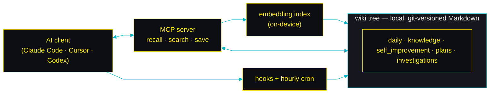
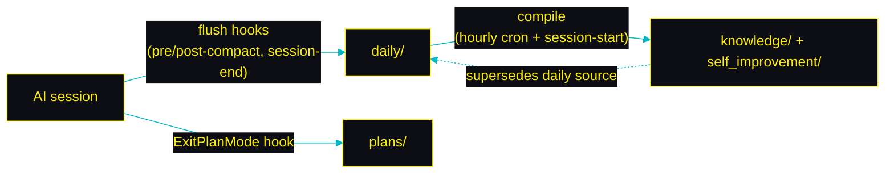

<div align="center">



### Persistent local memory for AI coding agents. Your agent remembers every session, learns from its mistakes, and gets smarter the longer you work with it.

Claude Code, Cursor, Codex, and every other MCP client forget everything when a session ends. LLM Wiki Memory fixes that: it captures your conversations, compiles them into durable project knowledge and lessons your agent applies next time, and recalls the right context through a local MCP server. Memory lives on your machine as plain Markdown in an [LLM wiki](https://github.com/ctxr-dev/skill-llm-wiki) versioned in git, searched with local embeddings, and consolidated offline while you sleep.

<samp><b>No RAG stack. No vector database. No Docker. No cloud. Install with one prompt and your agent never starts from zero again.</b></samp>

<br/>
<br/>

[](#testing)
[](https://nodejs.org)
[](LICENSE)
[](https://modelcontextprotocol.io)

[](#why-a-wiki-instead-of-rag)
[](https://github.com/ctxr-dev/skill-llm-wiki)
[](https://github.com/ctxr-dev/llm-wiki-memory/stargazers)

</div>

## Install


Paste this one-liner into your AI coding agent (copy button on the right) — it covers both a **fresh install** and an **update**. The full procedure lives in [`AI-INSTALL-PROMPT.md`](AI-INSTALL-PROMPT.md); the agent fetches and follows it:

```text
Set up llm-wiki-memory in this project: fetch https://raw.githubusercontent.com/ctxr-dev/llm-wiki-memory/main/AI-INSTALL-PROMPT.md and follow it EXACTLY (it covers fresh install and update; if already installed, the same file is local at @.llm-wiki-memory/src/AI-INSTALL-PROMPT.md).
```

Or run it yourself — **macOS / Linux**:

```bash
git clone https://github.com/ctxr-dev/llm-wiki-memory ./.llm-wiki-memory/src
./.llm-wiki-memory/src/bootstrap.sh                    # add --commit-memory to git-track the wiki (you commit it)
./.llm-wiki-memory/src/bootstrap.sh --schedule hourly  # optional: hourly cron / launchd
```

**Windows** (PowerShell — the native installer, same flags):

```powershell
git clone https://github.com/ctxr-dev/llm-wiki-memory ./.llm-wiki-memory/src
./.llm-wiki-memory/src/bootstrap.ps1                    # add -CommitMemory to git-track the wiki (you commit it)
./.llm-wiki-memory/src/bootstrap.ps1 -Schedule hourly  # optional: hourly Task Scheduler job
```

> **Windows prerequisites:**
> - [Git for Windows](https://git-scm.com/downloads/win). You already need it to `git clone`, and Claude Code runs the lifecycle hooks (and the git embedding-refresh hooks) through its bundled Git Bash — so capture/recall and index-warming work out of the box.
> - **LLM provider:** on Windows, set an API key (`ANTHROPIC_API_KEY` / `OPENAI_API_KEY`) or a base URL (e.g. a local Ollama) — these are fetch-based and fully supported. The subscription-auth CLI providers (`claude` / `codex` / `cursor-agent`) are **not** used on Windows (they are npm `.cmd` shims that can't be spawned with the distillation prompt), so bootstrap won't auto-select them there.

The bootstrap is **idempotent** — re-running preserves your edits to `.env` and your rule files.

<details>
<summary><strong>Update an existing install</strong></summary>

```bash
git -C .llm-wiki-memory/src fetch origin
# Runbooks you have NOT applied yet — READ THESE FIRST, oldest → newest:
git -C .llm-wiki-memory/src diff --name-only HEAD origin/main -- docs/releases | grep 'update-prompt\.md$' | sort
git -C .llm-wiki-memory/src merge --ff-only origin/main
( cd .llm-wiki-memory/src && npm install --no-audit --no-fund )
./.llm-wiki-memory/src/bootstrap.sh   # idempotent; runbooks may add one-shot steps + verification
```

On **Windows**, the last line is `./.llm-wiki-memory/src/bootstrap.ps1` (the git/`npm install` steps above are identical in PowerShell).

**Upgrading a shared team wiki?** Nothing special needed — a shared wiki is auto-detected on any `bootstrap.sh` re-run and stays git-tracked (a bare re-run does **not** revert it to private; the engine still never runs git on it). See [docs/shared-wikis.md](docs/shared-wikis.md#upgrading-a-shared-install).

</details>

<details>
<summary><strong>What bootstrap does (8 steps)</strong></summary>

1. Installs dependencies in `./.llm-wiki-memory/src`.
2. Auto-detects the LLM provider: `claude` CLI → `codex` CLI → `ANTHROPIC_API_KEY` → `OPENAI_API_KEY` → `MEMORY_LLM_BASE_URL` → ollama at `:11434` → `mock` (with a stderr warning).
3. Writes `./.llm-wiki-memory/settings/.env` (preserves your edits on re-run).
4. Registers the stdio server + Claude Code hooks GLOBALLY in your home config (`~/.claude.json` + `~/.claude/settings.json`; Cursor `~/.cursor/mcp.json`, Codex `~/.codex/config.toml`, Claude Desktop — whichever you have) — never per-repo, so a shared repo carries no client config. A customized/wrapped command (e.g. a mandated security shim) is preserved; a re-bootstrap migrates a pre-global install by removing its stale per-repo `.mcp.json`/`.claude/settings.json`/`.agents/*`.
5. Wires the memory rules/skills. **Private brain:** `llm-wiki-memory-<name>.md` @-pointer files (referencing `~/.llm-wiki-memory/src` — no copies, no symlinks) into `.agents/rules/`, `.claude/skills/`, `.claude/rules/`, `.cursor/rules/`, plus one marker-fenced @-include block in `AGENTS.md`/`CLAUDE.md` (recorded in an install-manifest). **Shared (`--template repo`) mount:** ZERO machine-dependent files — only ONE machine-independent remote-read block in `AGENTS.md`/`CLAUDE.md` pointing at the discipline on `raw.githubusercontent.com/.../main/...`.
6. Materialises the hosted wiki at `./.llm-wiki-memory/wiki` (with the layout template that declares `consolidate: refine | none` per category) and validates it.
7. Adds `/.llm-wiki-memory` to `.gitignore` (`--commit-memory` git-tracks the wiki in the project instead — you commit it; the engine never does).
8. Optionally installs the hourly cron (`compile` + an opt-in `consolidate`) as a scheduled job — launchd on macOS, a crontab wrapper on Linux, a Task Scheduler task on Windows (`--schedule hourly` / `-Schedule hourly`; `daily` is a deprecated alias for the same hourly job); consolidation runs only when `consolidate.enabled: true` (default off).

</details>

<details>
<summary><strong>Register with a non-Claude client</strong></summary>

Bootstrap already auto-registers every client it detects, **globally** in your
home config (never per-repo). Use these only for a client bootstrap didn't
detect — each prints a global snippet to paste:

```bash
./.llm-wiki-memory/src/scripts/mcp-config.sh cursor          # ~/.cursor/mcp.json
./.llm-wiki-memory/src/scripts/mcp-config.sh codex           # ~/.codex/config.toml
./.llm-wiki-memory/src/scripts/mcp-config.sh claude-desktop  # claude_desktop_config.json (global)
./.llm-wiki-memory/src/scripts/mcp-config.sh all
```

</details>

<details>
<summary><strong>Install as a shared team wiki</strong></summary>

From inside the repo you want the team to share:

```bash
./.llm-wiki-memory/src/bootstrap.sh --template repo --commit-memory
```

This sets up a shared `knowledge/` tree and un-ignores it so **you** commit it into the project (teammates inherit it on clone) — the engine itself never runs git on a shared wiki. It keeps your caches / indexes / personal notes out of git and installs git hooks that warm the shared embeddings on pull. A teammate cloning an already-shared repo adopts it with `node ~/.llm-wiki-memory/src/scripts/mount-init.mjs "$PWD"`. Full guide → [**docs/shared-wikis.md**](docs/shared-wikis.md).

</details>

## What to expect


Here's what you'll actually experience session to session. The theme: **your assistant carries your context forward on its own, you stay in control of what gets saved, and everything lives on your machine.**

**How each moment happens:** **Automatic** = no action from you · **Agent-led** = your assistant does it in its normal flow · **Asks first** = it proposes and saves only on your explicit yes · **Background** = offline housekeeping while you're away.


| When you… | What you get | How |
| --- | --- | --- |
| **Open a session** | Your assistant opens **already knowing where you left off**: it's handed a short briefing (visible in the transcript) with your recent notes, your in-progress plans and their checkbox progress (e.g. `4/12 done, in-progress`), and the wiki leaves that match your current git branch. No re-explaining. | **Automatic** |
| **Start a real task** ("implement X", "fix the timeout") | Before working, it recalls the lessons it learned on similar past work and applies them silently — you'll see a one-line `applied lesson: <title>` when it does, so old mistakes don't repeat. | **Agent-led** |
| **Say "remember this"** (a fact, a decision, a convention) | It's saved as a plain-Markdown leaf in your project's local wiki (e.g. `knowledge/infra/decision/…md`), versioned in git and shared with every AI tool on your machine (or with your team, if you install a [shared repo wiki](#private-brain--shared-team-wikis)) — not a per-session scratchpad that vanishes. | **Agent-led** |
| **Correct it, or say "save that as a lesson"** | It proposes one lesson at a time and saves nothing until you say yes (on Claude Code you also get a one-click yes/no prompt). One approval covers one lesson. | **Asks first** |
| **Approve a plan** | The approved plan is captured as a tracked `<slug>.plan.md` with its checkboxes and `status`, so progress survives across sessions. | **Automatic** |
| **End or compact a session** | The conversation is distilled into dated notes under `daily/`; a later step folds those into the durable knowledge and lessons you'll recall next time. | **Automatic** |
| **Enable the optional schedule** | Offline, it merges near-duplicate notes and archives stale ones — never a hard delete, always reversible, never interrupting you. Off by default. | **Background** |


### What it actually looks like

**At session start**, your assistant is handed a briefing (Claude Code injects it automatically; other clients fetch the same context via the bundled rules). For example:

```markdown
## Current-work context
**Branch**: `feature/DEV-129957-timeout` • **Repo**: `webhooks`
**Top wiki matches** (semantic):
- `plans/infra/observability/fix-timeout.plan.md` (0.81) — 4/12 done, in-progress
- `investigations/investigation-hermes-timeout.md` (0.69)

## 🧠  Recently — last 3 days
- **2026-07-14 15:30** — Fixed the Hermes Cassandra read timeout by bumping the socket pool… → daily-2026-07-14-153012123.md
```

**When you correct it**, it proposes the lesson and waits — saving nothing until your yes:

> Want me to save this as a lesson? Title: `await the async client before asserting`, error_pattern: `missing-await-on-async-call`.

The **Automatic** rows are hooks in Claude Code; every other MCP client (Cursor, Codex, Claude Desktop) does the same steps by following the rules bundled at install, and gets the same MCP tools. The "asks first" consent holds on **every** client — the MCP server refuses an un-consented lesson save no matter the client.

## Why a wiki instead of RAG


RAG memory stacks are powerful but heavy: a vector database, a container, an embedding service, ongoing ops. For small and medium projects that overhead is rarely worth it, yet you still want the agent to remember everything and improve itself across sessions.

`llm-wiki-memory` gives you that loop with a local hosted wiki as the substrate. Every category stays a nested tree (never a flat pile of files): non-daily categories nest by the metadata facets you search by; daily by date; an additional `subject` axis scatters leaves by what they're about. Git history and validation come free, and the tree stays readable by humans. Recall runs on local embeddings — nothing leaves your machine.

## Highlights


Each highlight links to its full section where one exists.

  Everything lives in a local `.llm-wiki-memory/` folder — no vector DB, no container, no cloud.

  Every memory is a markdown leaf with full git history (one commit per operation); your project repo is never touched — unless you deliberately install a [shared team wiki](#private-brain--shared-team-wikis), whose knowledge files land in your working tree for you to commit (the engine still never runs git).

  Self-improvement lessons save only with your explicit consent, one approval per lesson. → [Memory write-gate](#memory-write-gate-read-freely-write-gated)

  Long transcripts are chunked and distilled in pieces; a failed chunk is stashed and retried with no data loss. → [Capture pipeline](#capture-pipeline--chunked--recoverable)

  An opt-in offline pass dedupes near-identical notes and refreshes stale ones — never a hard delete, always reversible. → [Consolidate](#consolidate-offline-refinement)

  Transformer embeddings rank queries on-device (default `Xenova/bge-large-en-v1.5`); nothing leaves your machine.

  Every atom carries an apply-strength — `P0` (guardrail) / `P1` (strong default) / `P2` (contextual). Relevance ranks first at recall; priority only breaks near-ties, so a guardrail is never crowded out.

  Paste one prompt into your agent or run one script. Idempotent.

## How it works


Three flows, all on-device: a **write path** (a session becomes durable notes), a **read path** (those notes come back as context), and **offline upkeep** (the store refines itself). Each is a separate focused diagram below; the deep dives live in `docs/`.

**The pieces.** An AI client talks to the MCP server (recall / search / save) and fires lifecycle hooks; an hourly cron does maintenance; both read and write one local, git-versioned Markdown tree, ranked by an on-device embedding index.



### Write path — capture then compile
A session is captured to dated `daily/` notes by the flush hooks (and approved plans go straight to `plans/`); the hourly cron then promotes those atoms into the durable `knowledge/` and `self_improvement/` trees, superseding the daily source.



### Read path — recall
Before a task (and at session start) the agent calls `recall_lessons` / `search_memory`; the embedding index ranks leaves across the trees and returns the top hits as a briefing or an applied lesson — nothing leaves the machine.


**Offline upkeep.** An opt-in hourly pass keeps the store from becoming a write-only graveyard (dedup, staleness refresh, housekeeping) and logs each attempt so failures surface next session — see [Consolidate](#consolidate-offline-refinement) below and [docs/consolidate.md](docs/consolidate.md). How embedding, ranking, and the vector cache work: [docs/embeddings.md](docs/embeddings.md).

## Private brain & shared team wikis


By default your memory is a **private brain**: one wiki in your home directory, gitignored, visible to every AI tool on your machine but to no one else. That's the whole story for most installs.

You can also give a **repo its own shared wiki** — a `knowledge` tree **you** commit into the project so everyone who clones it inherits that knowledge (the engine never runs git on a shared wiki — you commit it). The two coexist: the engine discovers every `.llm-wiki-memory` wiki by walking up from where you're working (your cwd and the repos in play), stacking them into a **scope chain** — your private brain (depth 0) plus any repo-owned wikis above it.

- **Reads fan out across the whole chain** and merge, ranked so a *comparably-relevant* repo-local note outranks a general one from your brain — one embedding model serves the whole fan-out (no extra memory per level).
- **Writes pick one destination.** A save targets your **brain** (private — the default choice) or a **specific repo** (shared). A shared write is opt-in: the agent asks first, then only *stages* the note in that repo's working tree — it isn't shared until you commit and push it. The engine **never** runs git on a shared wiki — not on save, recall, install, or uninstall — so your project's git history is only ever changed by you.
- **Install shared** with `bootstrap.sh --template repo --commit-memory`; a teammate adopts an already-shared repo on clone. A shared wiki is auto-detected on any re-run and stays git-tracked — a bare re-run does **not** revert it to private, and the engine never runs git on it.

Full walkthrough — install, adoption, the scope chain, the ranking rules (confidence + locality + priority), upgrade/uninstall, and the team caveats → [**docs/shared-wikis.md**](docs/shared-wikis.md).

## Capture pipeline — chunked & recoverable


The flush worker (PreCompact / PostCompact / SessionEnd hooks) chunks oversized transcripts and runs each chunk through a provider/model chain, each under its own timeout budget. A clean "nothing durable" verdict writes **no leaf at all** (the breadcrumb log keeps visibility); a partial or total failure preserves the full body to a stash so `cli.mjs redistill` can re-attempt later with no data loss. Every leaf records audit frontmatter, so a distillation is reproducible from the file alone.

**Deep dive** → [**docs/capture.md**](docs/capture.md): the chunk → map → reduce diagram, the audit frontmatter fields, the per-failure-mode behaviour, and how `redistill` re-attempts a stash.

## Memory write-gate (read-freely, write-gated)


Self-improvement lessons are **propose-then-confirm**: the agent NEVER calls `save_lesson` (or `save_to_dataset` / `write_memory` into `self_improvement`) on its own. It proposes the save in chat, waits for an explicit user yes in the same turn, then calls the tool with `gate.userRequested: true`. The server refuses gated writes without the flag.

Three enforcement layers, defence-in-depth — any one can refuse a save:


| Layer | Where | What it does |
| --- | --- | --- |
| **Instructions** (probabilistic) | MCP `initialize` + the rule files bundled at install | Tells the model the rule, the exact wording to propose, and the consent contract. Reaches *every* MCP client — but not airtight alone, which is why the next two exist. |
| **Claude Code hook** (deterministic, Claude Code only) | `PreToolUse` on the three gated writers (`gate.claudeHookEnabled`, default on) | Inspects the latest user turn for a save phrase → `allow`; no match → `ask` (one-click yes/no). Per-lesson consent: one save phrase auto-allows only the FIRST gated write of a turn, so a batch can't ride one yes. |
| **MCP server gate** (deterministic, every client) | The `save_lesson` / `save_to_dataset` / `write_memory` handlers | Refuses any call without `userRequested: true`, and refuses a `path:` that lands under `self_improvement/…` from a non-gated `dataset:`. The airtight bottom layer for hook-less clients (Cursor, Codex, generic). |


Knowledge, plans, investigations, daily, and tracker-issue writes are **not** gated — their routing rules apply directly.

<details>
<summary><strong>Reconciliation, escape hatches & the audit ledger</strong></summary>

**Wire shape.** Tool inputs are a single nested context object: writes send `write:{...}` plus (for `self_improvement`) `gate:{userRequested}`; mutates send `select:{...}`. Every schema is strict, so a typo'd or misplaced key is rejected rather than silently dropped.

**Reconciliation.** The layers are independent and additive. The model can NOT bypass them: it can't suppress the discipline (sent at `initialize`), can't disable the Claude Code hook from inside a tool call, and can't forge `userRequested` (the only legitimate-bypass path is the internal `withSystemMaintenance` async frame that consolidate uses for its own bookkeeping — entered only by the orchestrator's own code, never by a client request).

**Escape hatches.** `gate.selfImprovementEnabled: false` disables the server-side check; `gate.claudeHookEnabled: false` disables the Claude Code hook (both other layers still apply). `gate.perLessonConsent: false` restores legacy turn-level consent.

**Audit trail.** Every gated write is appended (redacted, gitignored) to `state/.save-gate-audit.log`: the server records each `accepted` decision (with its consent basis: `user-flag` / `system-maintenance` / `gate-disabled`) and each `refused` decision; the Claude Code hook records each `allow` / `ask` (with the redacted trigger phrase); and compile records each lesson it auto-distills (`layer: compile`, `consent: compile-distilled`). Inspect it with `cli.mjs gate-audit [--limit N]`. Best-effort — never blocks a write, creates no file until something is recorded. Bound its size with `gate.auditKeep` (default 1000); disable with `gate.auditTrailEnabled: false`.

</details>

## Consolidate (offline refinement)


Consolidate is the offline pass that stops memory from becoming a write-only graveyard — bug root-causes get fixed, feedback rules get reversed, and pattern-gotchas outlive the API they warned about. It is **opt-in — off by default** (`consolidate.enabled: false`). Once enabled it runs on the hourly maintenance cron (chained after `compile`) and at session end, over the categories the layout marks `consolidate: refine`. Each run does two kinds of work: **cheap deterministic** dedup + housekeeping, and — only when an LLM provider is reachable — a **capped semantic refresh** that re-reads aged leaves and returns keep / rewrite / archive, so recall keeps surfacing advice that matches today's code. Nothing is ever hard-deleted: every removal is a reversible `disableDocument` status flip, and every LLM step falls back to a safe deterministic default when the provider is missing.

Eligibility is layout-declared: every category in `<wiki>/.layout/layout.yaml` must say `consolidate: refine` or `consolidate: none` (no defaults — the orchestrator refuses to run if a category omits the field). `consolidate: none` categories (plans, investigations, daily) are owned by other lifecycles and never walked.

**Deep dive** → [**docs/consolidate.md**](docs/consolidate.md): the per-leaf pipeline diagram, where local-embedding runs vs where the LLM runs, every pass and why, the staleness → refresh mechanism and its four verdicts (keep / rewrite / archive / fallback), cost controls, all tuning knobs, self-healing, and determinism.

## Works with your agent


| MCP client | Hooks (Claude Code only) | MCP tools | Write-gate enforcement |
| --- | :---: | :---: | --- |
| **Claude Code** | ✅ session-start / pre-compact / post-compact / session-end / exit-plan-mode / pre-tool-use | ✅ | instructions + hook + server (full three-layer) |
| **Cursor** | ✗ | ✅ | instructions + server |
| **Codex / OpenAI** | ✗ | ✅ | instructions + server |
| **Claude Desktop** | ✗ | ✅ | instructions + server |
| **Any MCP client** | ✗ | ✅ | instructions + server |


Hook-driven auto-capture is Claude Code only; every other client gets the same MCP tools + the same discipline (and invokes `cli.mjs cron-health` at session start via the bundled rule to surface unresolved cron failures).

The **LLM provider** that extracts typed atoms during capture / compile / consolidate is set in `.llm-wiki-memory/settings/.env`, independent of the client:

[](#) [](#) [](#) [](#) [](#) [](#) [](#)

`openai-compatible` covers ollama, vLLM, lm-studio, llama.cpp server, and litellm proxies — point `MEMORY_LLM_BASE_URL` at a local endpoint. The provider is auto-detected at install; an explicit `--provider` or a user-edited chain always wins. The cross-provider `chain` and per-provider `models` fallback lists live in `settings.yaml` (see [Configuration](#configuration)) — provider model names live ONLY in YAML, never inlined in code.

## MCP tools


| Tool | Purpose |
| --- | --- |
| `recall_lessons` | Recall self-improvement lessons before a task (fall-back ladder drops `error_pattern`, then `language`, then `task_type`). Pass `sections:["frontmatter"]` for a compact glance view. |
| `search_memory` | Cross-category embedding search with metadata pre-filtering. Each hit is annotated with its `priority`; relevance ranks first, priority breaks near-ties. Bodies are excerpted at the response boundary; `fullContent: true` for whole bodies, `sections:["frontmatter"]` for a glance. |
| `save_lesson` | **Write-gated.** Persist a lesson after explicit user yes (requires `gate.userRequested: true`). |
| `save_to_dataset` | Upsert a plan, investigation, knowledge artefact, or other category by name. Write-gated when `dataset="self_improvement"`. |
| `write_memory` | Create a memory leaf, optionally superseding an existing one. Write-gated when `datasetId="self_improvement"`. |
| `consolidate_memory` | Run the deterministic + LLM consolidation passes. System-maintenance; not write-gated. |
| `disable_document` / `enable_document` / `delete_document` | Archive (reversible) or remove a leaf. |
| `move_document` | Relocate a leaf within the curated (non-facet) zone, preserving content + embedding + both `index.md` files. Facet / topology categories relocate by metadata / compiler path instead, and are refused here. |
| `audit_memory` | Surface duplicate keys, missing metadata, and cleanup candidates. |
| `list_datasets`, `get_memory_config`, `reload_provider`, `reload_layout` | Inspect categories, config, LLM provider, and force-refresh caches. |
| `validate_layout`, `validate_topology`, `test_path_compiler` | Layout + topology + placement-compiler sanity checks. |


**Every tool takes a required `scopes`** (a `string[]`) — the directories you're working in (your cwd plus any repos in play). It's never optional: an empty or missing `scopes` is rejected before the tool runs, and the engine walks each scope up to your home wiki to resolve context. Claude Code seeds a default at session start; other clients compute it from the working directory + git (the bundled `scope-seeding` skill carries the procedure).

**Every write names its destination — `target` is required.** `scopes` says which wikis a call concerns; `target` says which one a write goes into: the literal `"brain"` for your private tree, or a resolved level's wiki root / mount directory for a shared repo (discover them in `get_memory_config`'s `levels`). Omitting `target` is rejected, so the destination is always deterministic — which matters when two identical clones of one repo are in scope.

<details>
<summary><strong>Shared-repo writes, read-only CLI tools & self-observability</strong></summary>

**Shared-repo writes.** The engine never writes to a shared repo (a mount inside a git project) unless `target` names it. A shared write only *stages* the leaf in that repo's working tree and runs no git there — it isn't shared until a human commits and pushes it. If you later change a category's `ownership` in the mount's `layout.yaml`, re-run `bootstrap.sh` so the mount's `.gitignore` regenerates — it's a point-in-time snapshot of which categories are shared. Full team walkthrough → [docs/shared-wikis.md](docs/shared-wikis.md).

**Read-only CLI counterparts** (no MCP tool):
- `cli.mjs doctor` — a layout-derived health scan (broken index refs, stray / orphan leaves; exit `3` on findings). `doctor --fix` surgically rebuilds affected parent indexes. Run it after any suspected cloud-sync event.
- `cli.mjs move-leaf <from> <to>` — the curated move above, from a shell.
- `cli.mjs monitor` / `cli.mjs monitoring-health` — the self-observability pair below.

**Self-observability (opt-in).** Enable with `bootstrap.sh --enable-self-observability`: on a confirmed llm-wiki-memory bug the agent records a redacted forensic capture under `.llm-wiki-memory/monitoring/<yyyy>/<mm>/<dd>/` (`cli.mjs monitor`), and at session-end offers to review the open captures (`cli.mjs monitoring-health`) and plan fixes. The capture tree lives outside the wiki: gitignored, never indexed, never auto-fixed. Opt out with `--disable-self-observability`.

</details>

> **Caveat — cloud-synced workspaces.** A sync daemon (Drive, Dropbox, iCloud, OneDrive) can relocate or half-replicate files mid-session. The wiki's own git repo is the source of truth: recover with `git reset --hard HEAD` and run `cli.mjs doctor` after a suspected scramble. The bundled `cloud-sync-safety` rule carries the full checklist.

## Configuration


Settings live in **two** files in `./.llm-wiki-memory/settings/`:

- **`.env`** — secrets, provider switches, deployment paths, workspace identity, test seams. Things that genuinely need shell precedence. See [`templates/env.example`](templates/env.example).
- **`settings.yaml`** — every other knob, nested by concern (`consolidate`, `flush`, `hook`, `embed`, `recall`, `compile`, `gc`, `gate`, `wiki`, `providers`) plus the top-level `crossCuttingAreas` list. See [`templates/settings.yaml`](templates/settings.yaml).

The `.env` file's strict subset overrides the YAML where it overlaps (e.g. `MEMORY_LLM_PROVIDER` collapses the YAML chain). As of the [2026-06-03 v2 release](docs/releases/2026/06/03/v2/update-prompt.md), every `MEMORY_*` env var NOT on the strict allow-list is a silent no-op — application config moved into `settings.yaml`.

**Strict-subset `.env` keys:**


| Key | Default | Meaning |
| --- | --- | --- |
| `ANTHROPIC_API_KEY` / `OPENAI_API_KEY` | (unset) | Provider API keys (only for API providers). |
| `MEMORY_LLM_PROVIDER` | auto | `claude` / `codex` / `cursor` / `anthropic` / `openai` / `openai-compatible` / `mock`. When set, collapses the YAML chain to this one provider. |
| `MEMORY_LLM_MODEL` | (unset) | Provider-agnostic model override; prepends to the head provider's models list. |
| `ANTHROPIC_MODEL` / `OPENAI_MODEL` | (unset) | Provider-specific model override; prepends to that provider's models list. |
| `MEMORY_LLM_BASE_URL` | (unset) | OpenAI-compatible local endpoint (ollama, vLLM, lm-studio, llama.cpp, litellm). |
| `MEMORY_LLM_TIMEOUT_MS` | `120000` | Per-call CLI/API timeout. |
| `MEMORY_DATA_DIR` / `LLM_WIKI_MEMORY_ROOT` / `MEMORY_EMBED_CACHE` / `MEMORY_EMBED_CACHE_DIR` / `MEMORY_SETTINGS_PATH` | derived | Deployment + model-cache paths. |
| `MEMORY_DEFAULT_PROJECT_MODULE` / `LLM_WIKI_MEMORY_PROJECT` | deterministic identity | Workspace identity (scopes recall): the canonical git origin as `org/repo`, else `file://<workspaceDir>`, with `basename(workspace)` only as a last resort. |
| `MEMORY_MCP_SERVER_NAME` | `llm-wiki-memory` | MCP server name advertised at initialize. |
| `MEMORY_LLM_MOCK_*` | (unset) | Test seams for the mock provider. |


Recall scoping is deterministic: `project_module` is derived from a declared `project_id` > the canonical git origin `org/repo` > `file://mountDir` (nested repos chain as `org/repo//sub`); `cli.mjs migrate-identity` restamps legacy leaves. A recall `project_module` filter matches the INNERMOST chain segment (a leaf stamped `org/repo//sub` matches a filter for `sub` or the full chain, not the outer `org/repo`), so clones of a sub-package still gather regardless of parent.

**Highlights from `settings.yaml`** (the knobs you're most likely to flip — the full annotated set is in [`templates/settings.yaml`](templates/settings.yaml)):


| Section.key | Default | Meaning |
| --- | --- | --- |
| `consolidate.enabled` | `false` | Master switch for consolidation. Off by default (every path no-ops until you set `true`). |
| `consolidate.intervalDays` | `1` | Throttle for `consolidate --if-due`. |
| `consolidate.llmPassesEnabled` | `true` | Disable to run deterministic-only consolidation. |
| `embed.model` | `Xenova/bge-large-en-v1.5` | Embedding model — see the model comparison below. |
| `embed.backend` | `transformers` | `transformers` (on-device bge) or `lexical` (no model download). |
| `recall.recentActivityDays` | `3` | SessionStart "🧠 Recently" window (days of recent notes surfaced). `0` disables. |
| `recall.planContextMax` | `2` | Max plans surfaced at SessionStart. `0` hides plans. |
| `gate.selfImprovementEnabled` | `true` | Operator escape hatch for the server-side write-gate. |
| `gate.claudeHookEnabled` | `true` | Enable/disable the Claude Code PreToolUse write-gate hook. |
| `gate.perLessonConsent` | `true` | One save phrase auto-allows only the first gated write of a turn (Claude Code). |
| `wiki.autoCommit` | `true` | Auto-commit every wiki change to the wiki's own git repo. |
| `flush.chunkTargetK` | `5` | Target chunk count for map-reduce distillation. |
| `flush.reduceModelPromote` | `true` | Use a one-tier-stronger model for the reduce step. |


<details>
<summary><strong>Full schema (every knob)</strong></summary>

See [`templates/settings.yaml`](templates/settings.yaml) for the complete annotated set — including the consolidate self-healing knobs (`attemptsKeep`, `fullLogRetentionDays`, `escalateAfterAttempts`, `cosineThreshold`), the audit knobs (`gate.auditTrailEnabled`, `gate.auditKeep`), `providers.chain` + per-provider `models`, and the top-level `crossCuttingAreas` list.

</details>

<details>
<summary><strong>Choosing an embedding model</strong></summary>

Recall ranks queries with an on-device [transformers.js](https://github.com/xenova/transformers.js) model, set by `embed.model`. The default `Xenova/bge-large-en-v1.5` gives the best routing quality; lighter models trade some accuracy for a much smaller download. Sizes below are the **quantized** ONNX weights (full-precision is ≈ 4× larger), lightest first:


| Model | Dim | Download | Notes |
| --- | :---: | :---: | --- |
| `Xenova/all-MiniLM-L6-v2` | 384 | ~25 MB | Smallest and fastest. Modest retrieval quality. |
| `Xenova/bge-small-en-v1.5` | 384 | ~35 MB | Strong quality for a small download. |
| `Xenova/bge-base-en-v1.5` | 768 | ~110 MB | Noticeably better routing than `small`. |
| `Xenova/bge-large-en-v1.5` | 1024 | ~340 MB | **Default.** Best routing quality. |


```yaml
embed:
  model: Xenova/bge-small-en-v1.5
```

Changing the model invalidates the embedding cache automatically. Stay within the MiniLM / BGE / GTE / mxbai families — they're mean-pooled with no query prefix, which is how this engine embeds. Prefix-based models (e5, nomic) underperform here because the engine doesn't add the `query:` / `search_document:` prefixes they expect.

For a **team sharing a wiki**, keep everyone on the same `embed.model` + `embed.backend`: the `transformers` (bge) and `lexical` backends rank the same query differently, so a machine on `lexical` and one on `transformers` get internally-consistent but mutually-different recall order. Results are never wrong (the cache is stamped with model + backend and rebuilds on mismatch) — just ranked differently.

</details>

## Manual commands


```bash
cd .llm-wiki-memory/src

# Inspect what consolidate WOULD do (no mutations), then run it for real.
node scripts/cli.mjs consolidate --dry-run --force --json | jq
node scripts/cli.mjs consolidate --force --json | jq '.totals'

# Full cron-job (compile + consolidate + attempt log entry), and its health.
node scripts/cli.mjs cron-job
node scripts/cli.mjs cron-health | jq

# The classic ops trio.
node scripts/cli.mjs init       # materialise or repair the wiki shell
node scripts/cli.mjs validate   # skill-llm-wiki validate
node scripts/cli.mjs heal       # classify state and name the next command

# Recall / search from the terminal; resolved paths + provider.
node scripts/cli.mjs recall "<query>"
node scripts/cli.mjs search "<query>"
node scripts/cli.mjs where

# Recover a failed distillation (reads the stash, or the in-leaf raw fallback).
node scripts/cli.mjs redistill --leaf <path>      # one daily leaf
node scripts/cli.mjs redistill --session <id>     # newest stash for a session
node scripts/cli.mjs redistill --all              # every pending stash

# Schedule the hourly cron (or remove it).
./bootstrap.sh --schedule hourly   # cron on Linux, launchd on macOS, fires at :00 ('daily' = deprecated alias)
./bootstrap.sh --schedule off      # remove
```

On Linux the cron entry calls a generated wrapper (`state/cron-daily.sh`) — safe across workspaces whose paths contain single-quotes, percents, or spaces; on macOS the launchd job runs `node … cli.mjs cron-job` directly via discrete arguments (no wrapper).

<details>
<summary><strong>Architecture (responsibility matrix)</strong></summary>


| Path | Role |
| --- | --- |
| `scripts/lib/wiki-store.mjs` | Storage seam: every document is a wiki leaf. Drives the skill for index-rebuild / validate / heal / rebuild. Hosts the `getConsolidateLayout()` reader. |
| `scripts/lib/embed.mjs` | Transformer embeddings, cosine, content-hash cache (lexical fallback). The only retrieval engine. |
| `scripts/lib/recall.mjs` | `recall_lessons` ladder, `search_memory`, `save_lesson`. |
| `scripts/lib/llm.mjs` | LLM provider dispatch (claude / codex / cursor / anthropic / openai / openai-compatible / mock) + `health()` probe + `isLocalEndpoint` heuristic. |
| `scripts/lib/llm-callJSON.mjs` | Prompt-file + variable-interpolation + zod-schema-validated LLM JSON-call wrapper. Used by compile + consolidate. |
| `scripts/lib/maintenance-tag.mjs` | AsyncLocalStorage-backed `withSystemMaintenance` frame for the server-side gate exemption. |
| `scripts/lib/discipline.mjs` | Single source of the memory discipline (MCP `instructions` + the SessionStart context). |
| `scripts/lib/layout-validator.mjs` | Zod schema for `<wiki>/.layout/layout.yaml`. |
| `scripts/lib/wiki-cli.mjs` | Wrapper around the `skill-llm-wiki` bin (bottom-up `index-rebuild-one`). |
| `scripts/consolidate.mjs` | Search-driven AutoDream consolidation orchestrator. |
| `scripts/cron-job.mjs` | Hourly cron entry point + structured attempt log + `cronHealth`. |
| `scripts/compile.mjs` | LLM-driven daily → knowledge / self_improvement promotion. |
| `scripts/hooks/*` | Claude Code lifecycle hooks (capture, gate, plan-sync, embed-gc, session-start). |
| `mcp-server/index.mjs` | Local stdio MCP server. |
| `templates/`, `bootstrap.sh`, `scripts/mcp-config.sh` | Install and multi-client registration. |


Full per-concern responsibility split (this package vs the underlying engine) and known smells: [**ARCHITECTURE.md**](ARCHITECTURE.md).

</details>

## Testing


```bash
npm test           # unit suite
npm run test:e2e   # full lifecycle against the real skill-llm-wiki CLI (LLM stubbed)
```

**1563 tests** in total (1454 unit + 109 e2e). The unit suite covers the chunker, the provider + model chain, the map-reduce distillation flow, the redistill CLI, the wiki auto-commit layer, and the entity-level self-healing pipeline; the e2e suite builds a wiki from scratch in a temp directory and asserts genesis, daily capture, lesson / knowledge / plan / investigation absorption, compile promotion + dedup, recall, tree-growth integrity, and idempotency against the real `skill-llm-wiki` CLI with mocked LLM responses.

## Requirements


Node 20 or newer, and git. No Docker, no Python. The embedding model downloads on first recall (set `embed.backend: lexical` in `settings.yaml` to skip it entirely).

## License


[MIT](LICENSE)
