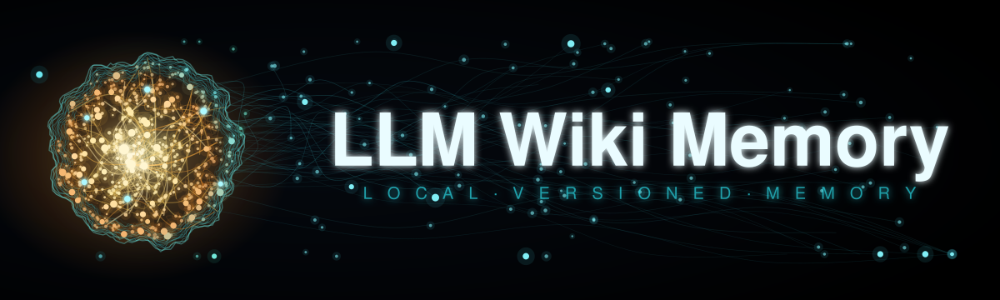

<div align="center">



### Persistent local memory for AI coding agents. Your agent remembers every session, learns from its mistakes, and gets smarter the longer you work with it.

Claude Code, Cursor, Codex, and every other MCP client forget everything when a session ends. LLM Wiki Memory fixes that: it captures your conversations, compiles them into durable project knowledge and lessons your agent applies next time, and recalls the right context through a local MCP server. Memory lives on your machine as plain Markdown in an [LLM wiki](https://github.com/ctxr-dev/skill-llm-wiki) versioned in git, searched with local embeddings, and consolidated offline while you sleep.

<samp><b>No RAG stack. No vector database. No Docker. No cloud. Install with one prompt and your agent never starts from zero again.</b></samp>

<br/>
<br/>

[](#testing)
[](https://nodejs.org)
[](LICENSE)
[](https://modelcontextprotocol.io)

[](#why-a-wiki-instead-of-rag)
[](https://github.com/ctxr-dev/skill-llm-wiki)
[](https://github.com/ctxr-dev/llm-wiki-memory/stargazers)

</div>

## Install

Paste this one-liner into your AI coding agent — it covers both a **fresh install** and an **update**:

```text
Set up llm-wiki-memory in this project: fetch https://raw.githubusercontent.com/ctxr-dev/llm-wiki-memory/main/AI-INSTALL-PROMPT.md and follow it EXACTLY (it covers fresh install and update; if already installed, the same file is local at @.llm-wiki-memory/src/AI-INSTALL-PROMPT.md).
```

Or run it yourself — **macOS / Linux**:

```bash
git clone https://github.com/ctxr-dev/llm-wiki-memory ./.llm-wiki-memory/src
./.llm-wiki-memory/src/bootstrap.sh                    # add --commit-memory to git-track the wiki (you commit it)
./.llm-wiki-memory/src/bootstrap.sh --schedule hourly  # optional: hourly cron / launchd
```

**Windows** (PowerShell — the native installer, same flags): `bootstrap.ps1` / `-CommitMemory` / `-Schedule hourly`.

The bootstrap is **idempotent** — re-running preserves your `.env` and rule files.

> **Full install guide** — what bootstrap does (8 steps), Windows prerequisites, updating, non-Claude client registration, and shared team-wiki setup → [**docs/install.md**](docs/install.md).

## What you get

Session to session, **your assistant carries your context forward on its own, you stay in control of what gets saved, and everything lives on your machine.** How each moment happens: **Automatic** = no action from you · **Agent-led** = in its normal flow · **Asks first** = saves only on your explicit yes · **Background** = offline housekeeping.

| When you… | What you get | How |
| --- | --- | --- |
| **Open a session** | It opens **already knowing where you left off** — a short briefing with your recent notes, in-progress plans + checkbox progress, and the wiki leaves matching your git branch. | **Automatic** |
| **Start a real task** | Before working it recalls lessons from similar past work and applies them silently (`applied lesson: <title>`), so old mistakes don't repeat. | **Agent-led** |
| **Say "remember this"** | Saved as a plain-Markdown leaf in your local wiki (e.g. `knowledge/infra/decision/…md`), versioned in git and shared with every AI tool on your machine — not a scratchpad that vanishes. | **Agent-led** |
| **Correct it / "save that as a lesson"** | It proposes one lesson at a time and saves nothing until you say yes. One approval covers one lesson. | **Asks first** |
| **Approve a plan** | Captured as a tracked `<slug>.plan.md` with checkboxes and `status`, so progress survives across sessions. | **Automatic** |
| **End or compact a session** | The conversation is distilled into dated `daily/` notes; a later step folds those into durable knowledge and lessons. | **Automatic** |
| **Enable the optional schedule** | Offline, it merges near-duplicate notes and archives stale ones — never a hard delete, always reversible. Off by default. | **Background** |

The **Automatic** rows are hooks in Claude Code; every other MCP client (Cursor, Codex, Claude Desktop) does the same steps by following the rules bundled at install, and gets the same MCP tools. The "asks first" consent holds on **every** client.

## Why a wiki instead of RAG

RAG memory stacks are powerful but heavy: a vector database, a container, an embedding service, ongoing ops. For small and medium projects that overhead is rarely worth it, yet you still want the agent to remember everything and improve across sessions. `llm-wiki-memory` gives you that loop with a local hosted wiki as the substrate: every category is a nested tree of plain-Markdown leaves (never a flat pile), git history and validation come free, the tree stays human-readable, and recall runs on local embeddings — nothing leaves your machine.

## Highlights

  Everything lives in a local `.llm-wiki-memory/` folder — no vector DB, no container, no cloud.

  Every memory is a markdown leaf with full git history; your project repo is never touched — unless you install a [shared team wiki](docs/shared-wikis.md).

  Self-improvement lessons save only with your explicit consent, one approval per lesson. → [write-gate.md](docs/write-gate.md)

  Long transcripts are chunked and distilled in pieces; a failed chunk is stashed and retried with no data loss. → [capture.md](docs/capture.md)

  An opt-in offline pass dedupes near-identical notes and refreshes stale ones — reversible, never a hard delete. → [consolidate.md](docs/consolidate.md)

  Transformer embeddings rank queries on-device (default `onnx-community/embeddinggemma-300m-ONNX`); nothing leaves your machine. → [embeddings.md](docs/embeddings.md)

  Every atom carries an apply-strength — `P0` (guardrail) / `P1` (default) / `P2` (contextual). Relevance ranks first; priority only breaks near-ties.

  Paste one prompt or run one script. Idempotent.

## Works with your agent

| MCP client | Hooks (Claude Code only) | MCP tools | Write-gate |
| --- | :---: | :---: | --- |
| **Claude Code** | ✅ session-start / pre·post-compact / session-end / exit-plan-mode / pre-tool-use | ✅ | instructions + hook + server |
| **Cursor · Codex · Claude Desktop · any MCP client** | ✗ | ✅ | instructions + server |

Hook-driven auto-capture is Claude Code only; every other client gets the same MCP tools and the same discipline. Every tool takes a required `scopes` (the directories in play) and every write a `target` (which wiki to write into) — see [docs/mcp-tools.md](docs/mcp-tools.md). The **LLM provider** used for capture / compile / consolidate is set in `.env`, independent of the client — `claude` / `codex` / `cursor-agent` CLIs, `anthropic` / `openai` / `openai-compatible` (ollama, vLLM, lm-studio, litellm) APIs, or `mock`. See [docs/configuration.md](docs/configuration.md).

## Documentation

| Guide | What's in it |
| --- | --- |
| [**How it works**](docs/how-it-works.md) | The write / read / offline flows, with diagrams. |
| [**MCP tools**](docs/mcp-tools.md) | The tool surface, required `scopes` + `target`, read-only CLI, cloud-sync caveat. |
| [**Memory write-gate**](docs/write-gate.md) | The three-layer read-freely / write-gated model + audit ledger. |
| [**Capture pipeline**](docs/capture.md) | Chunked, recoverable distillation; audit frontmatter; `redistill`. |
| [**Consolidate**](docs/consolidate.md) | The opt-in offline refinement pass — every pass, verdict, and knob. |
| [**Embeddings**](docs/embeddings.md) | On-device ranking, the vector cache, model choice. |
| [**Configuration**](docs/configuration.md) | `.env` + `settings.yaml` reference; embedding-model guide. |
| [**Manual commands**](docs/commands.md) | The `cli.mjs` surface + architecture responsibility matrix. |
| [**Private brain & shared team wikis**](docs/shared-wikis.md) | The scope chain, shared install/adoption, ranking, team caveats. |
| [**Architecture**](ARCHITECTURE.md) | Per-concern split (this package vs the underlying engine). |
| [**Install (full)**](docs/install.md) | Bootstrap steps, clients, shared setup, updating. |

## Testing

```bash
npm test           # unit suite
npm run test:e2e   # full lifecycle against the real skill-llm-wiki CLI (LLM stubbed)
```

**1961 tests** (1797 unit + 164 e2e). The e2e suite builds a wiki from scratch in a temp directory and asserts genesis, daily capture, lesson / knowledge / plan / investigation absorption, compile promotion + dedup, recall, tree-growth integrity, and idempotency against the real `skill-llm-wiki` CLI with mocked LLM responses.

## Requirements

Node 20 or newer, and git. No Docker, no Python. The embedding model (~197 MB quantized) downloads on first recall, then runs fully offline (set `embed.backend: lexical` in `settings.yaml` to skip it entirely).

| Model (`embed.model` in `settings.yaml`) | Dim | Window | Download | License |
| --- | :---: | :---: | :---: | --- |
| `onnx-community/embeddinggemma-300m-ONNX` — **default** | 768 | 2048 | ~197 MB (q4) | Gemma Terms of Use |
| `Xenova/bge-large-en-v1.5` — previous default | 1024 | 512 | ~340 MB (q8) | MIT |
| `Xenova/bge-base-en-v1.5` | 768 | 512 | ~110 MB | MIT |
| `Xenova/bge-small-en-v1.5` | 384 | 512 | ~35 MB | MIT |

A model change re-embeds the vector caches automatically — see [docs/embeddings.md](docs/embeddings.md).

## License

[MIT](LICENSE)
