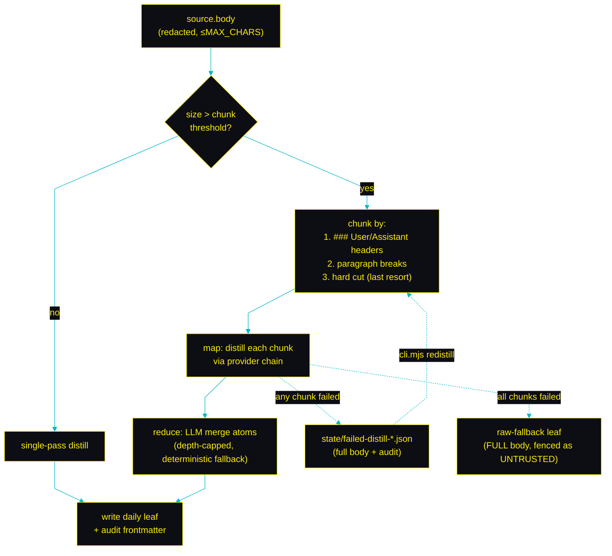

# Capture pipeline — chunked & recoverable

How a live agent session becomes durable dated notes in `daily/`, without losing
context when a transcript is huge or a provider call fails.

The **flush worker** runs off the Claude Code lifecycle hooks (PreCompact /
PostCompact / SessionEnd). It reads the (redacted, size-capped) transcript,
distills typed atoms from it via a provider/model chain, and writes a `daily/`
leaf. Everything below is what makes that robust.

---

## Chunking, stashing & redistill

Oversized transcripts are chunked and each chunk distilled under its own timeout
budget, then merged (map-reduce). A clean "nothing durable" verdict writes **no
leaf at all** (the breadcrumb log keeps visibility); a partial or total failure
preserves the full body to a stash so `cli.mjs redistill` can re-attempt later
with no data loss.

## Audit frontmatter

Every leaf records `chunks_total`, `chunks_succeeded`, `failed_chunks`,
`provider_chain_tried`, and `final_provider`, so a distillation is reproducible
from frontmatter alone. Redistilled leaves also carry `redistilled_from`,
`redistill_attempts`, and `original_outcome`.

## What each failure mode does

| Failure mode | What happens |
| --- | --- |
| One CLI call exceeds its timeout | Each chunk has its own budget; only the failed chunk(s) are stashed for retry |
| Model deprecated mid-run | Provider's model list iterates to the next entry; if exhausted, the chain moves to the next provider |
| `claude` / `codex` CLI not installed | Chain transparently fast-fails to the next provider |
| Distillation produced no atoms | **No leaf written.** Breadcrumb log only |
| Redistill races a live worker | Per-session lock → `ESESSIONBUSY`; the stash is preserved |

## Redistill

`cli.mjs redistill` re-attempts a stashed distillation (`--leaf`, `--session`,
or `--all`). It re-enters the same chunk → map → reduce path with the preserved
full body, so a transient provider outage never costs the underlying context.
