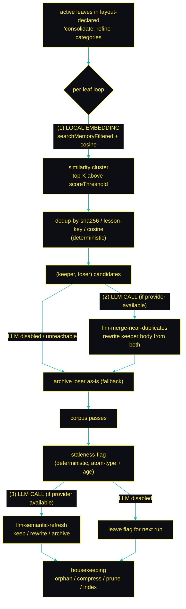
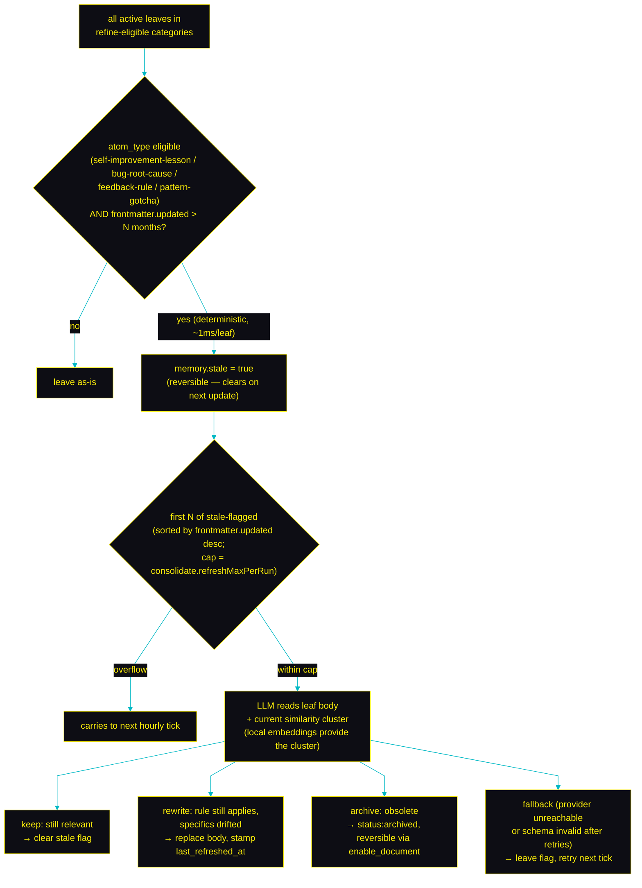

# Consolidate internals

Deep dive on the offline refinement pass. For the overview — what consolidate is and that it is opt-in — see [**§ Consolidate in the README**](../README.md#consolidate-offline-refinement). This page is the full reference: the per-leaf pipeline, where local-embedding runs vs where the LLM runs, every pass and why, the staleness → refresh mechanism + verdicts, cost controls, tuning knobs, self-healing, and determinism.

## The per-leaf pipeline

Each active leaf in a `consolidate: refine` category runs through: a local-embedding cluster lookup, deterministic dedup, an optional LLM merge of near-duplicates, a deterministic staleness flag, an optional LLM semantic refresh, then structural housekeeping. Every LLM step has a safe deterministic fallback, so a missing provider never blocks the run.

## Where local embedding runs vs where the LLM runs

**(1) Local embedding** lights up only inside the per-leaf cluster lookup. The bge model runs on-device; nothing leaves your machine to find which leaves are similar. Cosine similarity then ranks the cluster — also local.

**(2) LLM · merge near-duplicates** runs once per `(keeper, loser)` pair found by the dedup passes — but only when a provider is reachable. The LLM sees both bodies + frontmatter and decides whether to merge them into one fresher body or leave the keeper as-is. If the provider is missing, consolidate falls back to "archive the loser unchanged" so the run never blocks.

**(3) LLM · semantic refresh** runs once per stale-flagged leaf, capped at `consolidate.refreshMaxPerRun`. The LLM sees the leaf + its current cluster context and chooses keep / rewrite / archive. The deterministic staleness-flag pass nominates candidates; the LLM only acts when it can.

## Every pass, and why it exists

| Pass | Why it exists |
| --- | --- |
| `dedupe-by-sha256` | Same file content was written twice (race between compile runs, manual re-save). Cheapest dedup. |
| `dedupe-by-lesson-key` | Same failure pattern logged with different wording. Catches semantic duplicates the byte hash misses. |
| `dedupe-by-cosine` | Near-paraphrases that drifted across edits. The cosine-against-cluster check is the safety net for "we already said this". |
| `llm-merge-near-duplicates` | When two leaves overlap, the keeper shouldn't just survive — it should be the synthesis of both. The LLM produces that synthesis from the structured pair. |
| `staleness-flag` | Long-untouched leaves are candidates for review. The flag is the deterministic gate to a more expensive LLM revisit. |
| `llm-semantic-refresh` | A bug-root-cause may be fixed; a feedback-rule may be reversed. The LLM judges current relevance against fresh context and updates the leaf accordingly. |
| `prune-orphan-leaves` | Leaves with no inbound link and no recall hits in a year contribute noise to recall. Archive (reversibly). |
| `compress-archived` | An archived body sitting in git forever is dead weight; truncate to the gist + footer pointing at the original sha256 in frontmatter. |
| `prune-empty-ancestors` / `prune-embeddings` / `index-rebuild` | Structural hygiene. Empty dirs, orphan embedding-cache entries, ancestor `index.md` regens. |

## The staleness → refresh pipeline

A memory store that only ever GROWS becomes a graveyard. Bug root-causes get fixed permanently. Feedback rules get reversed. Pattern-gotchas survive an API rename and start pointing at functions that no longer exist. Without a way to revisit aged knowledge, recall starts surfacing leaves that contradict the current codebase — and your agent confidently gives advice that was correct two quarters ago.

`consolidate`'s answer is a deliberate two-step pipeline: the cheap deterministic step nominates candidates; the expensive LLM step judges them.

**Step 1 — staleness-flag (deterministic).** Pure file-metadata rule: atom_type in the eligible set + `frontmatter.updated` older than `consolidate.staleAfterMonths` (default 6). No LLM, no body inspection — just a flag. It also flips OFF: a fresh edit (a newer `frontmatter.updated`) clears the flag on the next run, so freshly-updated content un-flags itself automatically.

**Step 2 — llm-semantic-refresh (LLM, capped, runs on the stale-flagged subset only).** For each candidate, the LLM sees the leaf's body, its frontmatter, and a small bundle of *currently-active* leaves on the same topic (the similarity cluster — pulled via local embeddings, no network). It returns one of four verdicts:

| Verdict | What happens | When the LLM picks this |
| --- | --- | --- |
| **keep** | `memory.stale` cleared; body untouched. | Content is still factually correct; the flag was a false positive (low recall ≠ low relevance). The reset restarts the next window cleanly. |
| **rewrite** | Body replaced with the LLM's synthesis; `memory.last_refreshed_at` stamped; `memory.stale` cleared. | The rule still applies but specifics drifted — file paths renamed, library upgraded, API moved. The lesson survives; the references update. |
| **archive** | `disableDocument` — `memory.status: archived`, `memory.consolidated_at` stamped. File stays on disk + in git. | The bug got fixed permanently; the convention was reversed; the gotcha became obsolete. Reversible any time via `enable_document`. |
| **fallback** | The flag persists; the next tick retries. | The provider is unreachable, the response failed the schema after `consolidate.llmMaxRetries`, or the model hallucinated the leaf id. Bias is always toward NOT destroying content. |

**Why an LLM, and not a deterministic rule?** The flag is structural ("when was this leaf last touched?"); the verdict is semantic ("is what this leaf SAYS still true?"). No deterministic rule can read a `bug-root-cause` body and decide whether the bug was fixed in v1.4.2; no rule can tell that a `pattern-gotcha` about an `apply` factory still applies after a team-wide migration to `def resource(...)` smart constructors. Reading the leaf body **in current context** and producing a *trinary* decision (keep / rewrite / archive) is exactly the kind of judgment an LLM does well — and exactly what a deterministic policy can't reach without becoming either too aggressive ("archive everything aged" — loses live knowledge) or too timid ("never touch anything" — the wiki ages into noise).

## Cost controls: capping & opt-out

**Capped per run.** `consolidate.refreshMaxPerRun` (default 25) bounds the LLM budget per tick. A corpus with 100 stale-flagged leaves makes 25 calls this hour, 25 next, and so on — steady progress without billing surprises. Recently-recalled leaves are processed first (more likely to be load-bearing), so the budget lands on the highest-leverage candidates.

**LLM opt-out.** Set `consolidate.llmPassesEnabled: false` to keep the deterministic flag but skip the LLM verdict. Useful for cost-sensitive setups, sealed environments, or running consolidate purely for dedup + housekeeping. Flip it back on later and the flags accumulated meanwhile become that run's working set.

## Net effect on the wiki

- Recall keeps finding **correct, current** advice instead of two-year-old reruns.
- Leaf count plateaus instead of growing forever (archives count toward "compressed", not "live").
- Still-right knowledge is left alone (`keep`); drifted knowledge is updated in place (`rewrite`); obsolete knowledge moves out of the active set (`archive`) but stays recoverable.
- The next tick reads the now-cleaner corpus, so cluster quality **compounds**: less noise, sharper similarity scores, fewer false positives.

## Self-healing operation

Each hourly cron tick runs `cli.mjs cron-job`. Logging is two-tier: a slim attempt entry (timings, exit codes, totals, a pointer to the full log) appends to `state/.consolidate-attempts.log` (last `consolidate.attemptsKeep` runs), and the complete record of the run — redacted stdout/stderr plus the full per-entity consolidate report — lands at `state/logs/<yyyy>/<mm>/cron-<ts>.json`, pruned after `consolidate.fullLogRetentionDays`. The internal `--if-due` throttle bounds the heavy lifting to once per `consolidate.intervalDays`. When daily docs are pending but no LLM provider is reachable, `compile` exits `69` (`EX_UNAVAILABLE`): the tick records a FAILED attempt (so `cron-health` flips `healthy:false` immediately and self-clears on the next good tick) while consolidate's deterministic passes still run. The scheduled job's PATH is baked by bootstrap (your login PATH plus well-known CLI install dirs), and provider spawns append the same dirs at runtime, so launchd/cron's minimal PATH can no longer hide the provider CLIs.

Health is judged per ENTITY across runs, not per tick: a failure that a later tick resolves stays silent, while an entity still failing after `consolidate.escalateAfterAttempts` consecutive attempts — or one error signature recurring across several distinct entities, which smells like a code bug — escalates. Provider availability itself is tracked the same way: persistent provider-unavailable compile aborts and consolidate LLM-skips accrue as the synthetic entities `system:compile-llm-providers` / `system:consolidate-llm-providers` and escalate after the same threshold; the first healthy tick resolves the episode. Escalation deterministically writes a redacted skeleton issue report to `issues/<yyyy>/<mm>/<dd>/<signature>.<version>.md` (episodes version on recurrence; resolution flips `status: resolved` in place, files are never auto-pruned). The SessionStart hook (`cli.mjs cron-health` for hook-less agents) surfaces open escalations with a one-line summary and the newest report path, and offers to investigate; copy the report to the [llm-wiki-memory issues](https://github.com/ctxr-dev/llm-wiki-memory/issues) or use it to draft a fix PR.

## All tuning knobs (defaults)

| Knob | Default |
| --- | --- |
| `consolidate.enabled` | `false` (master switch — off by default) |
| `consolidate.intervalDays` | `1` (throttle for `--if-due`) |
| `consolidate.llmPassesEnabled` | `true` |
| `consolidate.staleAfterMonths` | `6` |
| `consolidate.refreshMaxPerRun` | `25` |
| `consolidate.cosineThreshold` | `0.97` (`0.995` on lexical fallback) |
| `consolidate.clusterTopK` / `clusterScoreThreshold` | `12` / `0.75` |
| `consolidate.orphanTtlDays` | `365` |
| `consolidate.archiveBodyMax` / `archiveAgeDays` | `1200` / `30` |
| `consolidate.llmMaxRetries` | `2` |
| `consolidate.attemptsKeep` / `fullLogRetentionDays` / `escalateAfterAttempts` | `50` / `90` / `3` |

## Determinism

Deterministic passes produce byte-identical state across two runs on the same wiki + frozen clock. LLM passes are reproducible via `MEMORY_LLM_MOCK_FILE` / `MEMORY_LLM_MOCK_RESPONSE` for tests. Locking is shared with `compile.mjs`, so they never race; the cron-job wrapper sequences them. Never hard-deletes — every archival uses `disableDocument` (status flip), recoverable via `enable_document`.
