# Diagram examples

Every diagram type this engine can render, drawn by the engine itself. The subject matter is
one system throughout (an agent memory engine) so the page reads as a tour rather than a set of
unrelated samples.

**[Open the live gallery](diagrams-examples.html)** for full-screen viewing and a dark-mode toggle.
The images below are PNGs on purpose: GitHub's sanitizer strips inline `<svg>`, so a markdown
gallery built from SVG renders as nothing in the place most people read it.

## Pick a type

| kind | use it for |
|---|---|
| [`flow`](#ingest-path) | How a captured session becomes a durable leaf: hook, flush, distill, compile, and promotion into the wiki. |
| [`architecture`](#trust-boundary-map) | The engine's processes, external calls, and disk storage grouped by trust boundary, from caller to git-backed wiki. |
| [`sequence`](#gated-save-handshake) | The gated save handshake: a duplicate probe runs first, so a near-duplicate becomes an update instead of a new leaf. |
| [`flowchart`](#recall-ladder) | The recall decision ladder: warm the cache if needed, search, and flag any hit that needs validation as a prior. |
| [`state`](#leaf-lifecycle) | A leaf's lifecycle from a captured daily atom through distillation, promotion, consolidation, and archival. |
| [`swimlane`](#capture-to-recall-lanes) | One capture-to-recall pass crossing four owners: the hook, the engine, the LLM, and the wiki. |
| [`tree`](#embedding-module-tree) | The embedding subsystem's module ownership: backends, cache, and chunking, each broken into concrete files. |
| [`org-chart`](#surface-ownership) | Who owns each engine surface, and the exact command or trigger that invokes it. |
| [`nested`](#deployment-containment) | What actually runs inside what: two OS processes on one workstation, each hosting its own components. |
| [`er`](#wiki-data-model) | The wiki's data model: leaves keyed by category, cached as embeddings, and split into recallable chunks. |
| [`bar`](#leaves-by-category) | Knowledge leaves dominate the 90-day promotion count, with a long tail across the other six categories. |
| [`line`](#recall-latency-percentiles) | The p99 recall tail spikes during a week-5 lexical-fallback incident and recovers once the guard fix lands. |
| [`scatter`](#embed-cost-vs-accuracy) | Bigger embedding models buy accuracy at a steep cost premium; the shipped default sits near the elbow of that curve. |
| [`gantt`](#engine-build-phases) | The embed-cache guard rewrite is the critical middle block between baseline profiling and the consolidate rollout. |
| [`radar`](#embed-backend-scorecard) | Lexical wins on speed, memory and cost; transformers wins only on accuracy, which keeps it the shipped default. |
| [`polar`](#captures-by-hour) | Captures track the working day, peaking mid-afternoon and nearly silent overnight. |
| [`pyramid`](#capture-funnel) | Just a quarter of session turns get captured, and barely one in ten of those are ever recalled again. |
| [`treemap`](#corpus-bytes-treemap) | Knowledge dwarfs the other seven categories, though the gated self_improvement cell is the one worth watching. |
| [`venn`](#leaf-lifecycle-venn) | Most recalled leaves were not touched again this week; only a small core sits in all three sets. |
| [`sankey`](#capture-routing-sankey) | Manual saves are a small but steady stream into the same captured pool that automatic turn-capture fills. |
| [`quadrant`](#quadrant-effort-impact-roadmap) | Eight roadmap items scored by effort and impact, with cross-repo consolidation as the single flagship bet. |
| [`wardley`](#wardley-memory-engine-value-chain) | The memory engine's value chain from a developer's question down to the commodity embedding model it depends on. |
| [`timeline`](#timeline-release-history) | Seven releases across the year, spaced by real elapsed time, with the local embedding swap as the turning point. |
| [`loop`](#loop-memory-flywheel) | The memory flywheel: capture feeds distillation, distillation feeds compile, and compile feeds the next recall. |
| [`fishbone`](#fishbone-recall-returned-nothing) | Four root-cause categories for an empty recall, with an empty corpus as the most common culprit. |
| [`layers`](#layers-recall-stack) | The recall stack from git-backed wiki leaves up to the MCP tool surface an agent actually calls. |
| [`kanban`](#kanban-diagram-engine-board) | The diagram engine's own work board: a wide backlog, a WIP-limited pass in progress, an empty review lane, and settled work. |
| [`medallion`](#medallion-captured-corpus-tiers) | Five tiers of the captured corpus, from a hook's raw daily atom to a garbage-collected cold archive. |
| [`high-level`](#highlevel-platform-end-to-end) | The platform end to end: hooks capture, git stores, chunked search recalls, and the MCP server serves it back to the agent. |

The same catalogue is available to an agent at any time with:

```
node scripts/cli.mjs render-diagram --list
```

## Authoring a diagram

Write a spec, render it, and let the engine refuse anything illegible:

```
node scripts/cli.mjs render-diagram --spec my-spec.mjs --strict
node scripts/cli.mjs render-diagram --spec my-spec.mjs --html --out preview.html
```

`--strict` exits non-zero when the geometric check finds a defect (a label sitting on a box, a
run cutting through an unrelated node, content clipped outside the frame). `--html` writes a
page to LOOK at, because the mechanical check and the eye catch different failures.

## Regenerating this page

Both this file and the HTML gallery are GENERATED. Do not hand-edit either: the next
regeneration overwrites them.

```
npm run docs:gallery          # rewrites the .md and the .html
npm run docs:gallery -- --png # also re-rasterises every PNG (needs Playwright Chromium)
```

To change what the gallery shows, edit the example specs, which live beside the renderers:

- `scripts/lib/gallery/graph.mjs` — flow, sequence, flowchart, state, swimlane, tree, org-chart, nested, architecture, er
- `scripts/lib/gallery/charts.mjs` — bar, line, scatter, gantt, radar, polar, pyramid, treemap, venn, sankey
- `scripts/lib/gallery/positional.mjs` — quadrant, wardley, timeline, loop, fishbone, layers, kanban, medallion, high-level

Each entry is `{ kind, name, caption, spec }`. `name` is the slug used for the PNG filename and
the anchor, so renaming one changes its permalink. Page layout and styling live in
`scripts/lib/gallery/page.mjs`; the generator itself is `scripts/cli-gallery.mjs`.

`test/gallery-*.test.mjs` asserts every example renders with ZERO geometric findings, so a spec
that would look broken fails the build rather than reaching this page. Adding a new diagram kind
without adding an example here fails `test/gallery-coverage.test.mjs`.

The PNG step needs a Chromium that Playwright has already downloaded (the webapp workspace
installs one). Without it, `--png` reports what it would have written and leaves the existing
images in place, so the docs still regenerate on a machine with no browser.

### flow

<a name="ingest-path"></a>

How a captured session becomes a durable leaf: hook, flush, distill, compile, and promotion into the wiki.

[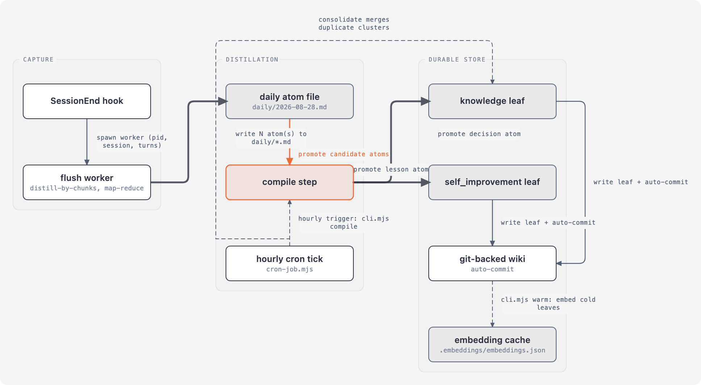](diagrams-examples.html#ingest-path)

[Open full screen](diagrams-examples.html#ingest-path)

---

### architecture

<a name="trust-boundary-map"></a>

The engine's processes, external calls, and disk storage grouped by trust boundary, from caller to git-backed wiki.

[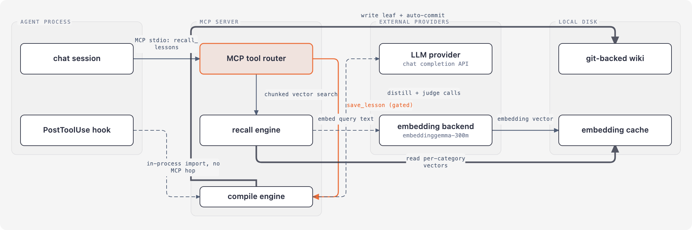](diagrams-examples.html#trust-boundary-map)

[Open full screen](diagrams-examples.html#trust-boundary-map)

---

### sequence

<a name="gated-save-handshake"></a>

The gated save handshake: a duplicate probe runs first, so a near-duplicate becomes an update instead of a new leaf.

[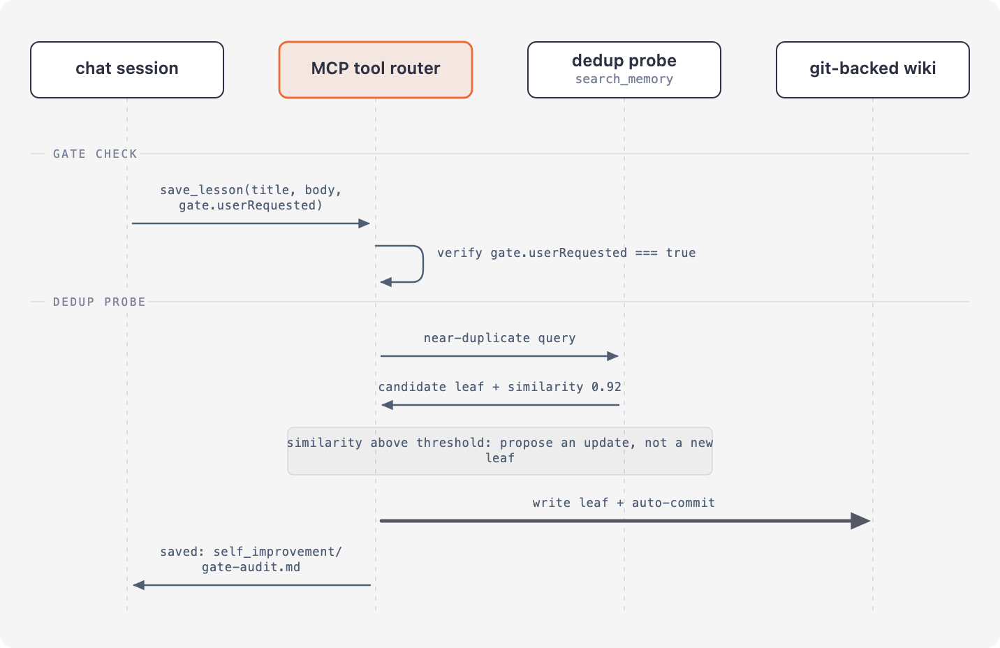](diagrams-examples.html#gated-save-handshake)

[Open full screen](diagrams-examples.html#gated-save-handshake)

---

### flowchart

<a name="recall-ladder"></a>

The recall decision ladder: warm the cache if needed, search, and flag any hit that needs validation as a prior.

[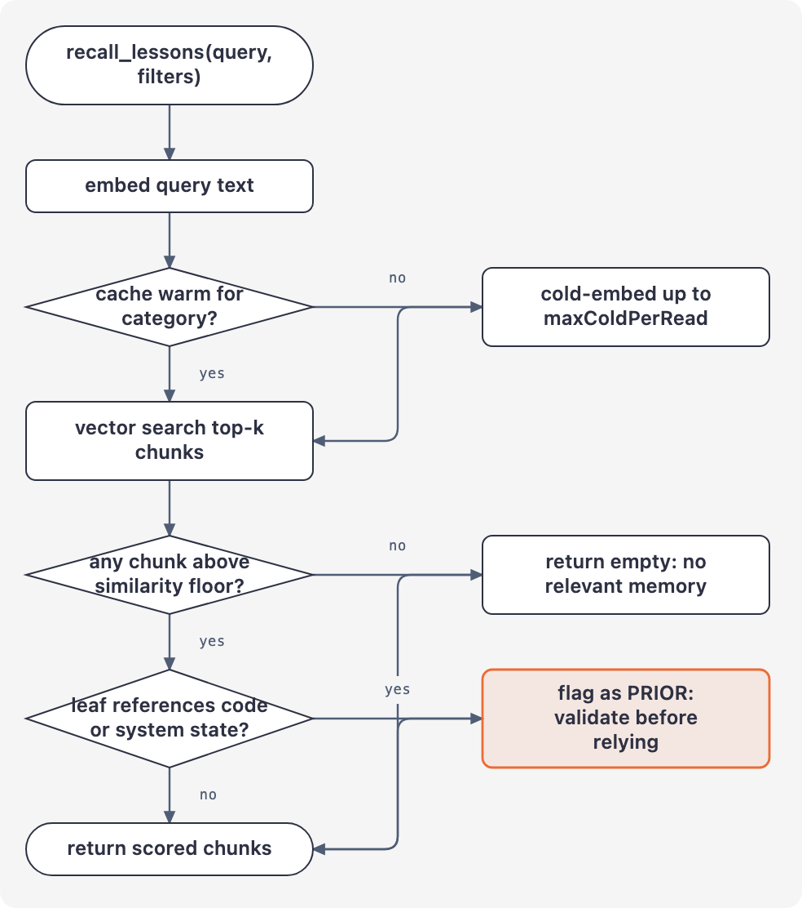](diagrams-examples.html#recall-ladder)

[Open full screen](diagrams-examples.html#recall-ladder)

---

### state

<a name="leaf-lifecycle"></a>

A leaf's lifecycle from a captured daily atom through distillation, promotion, consolidation, and archival.

[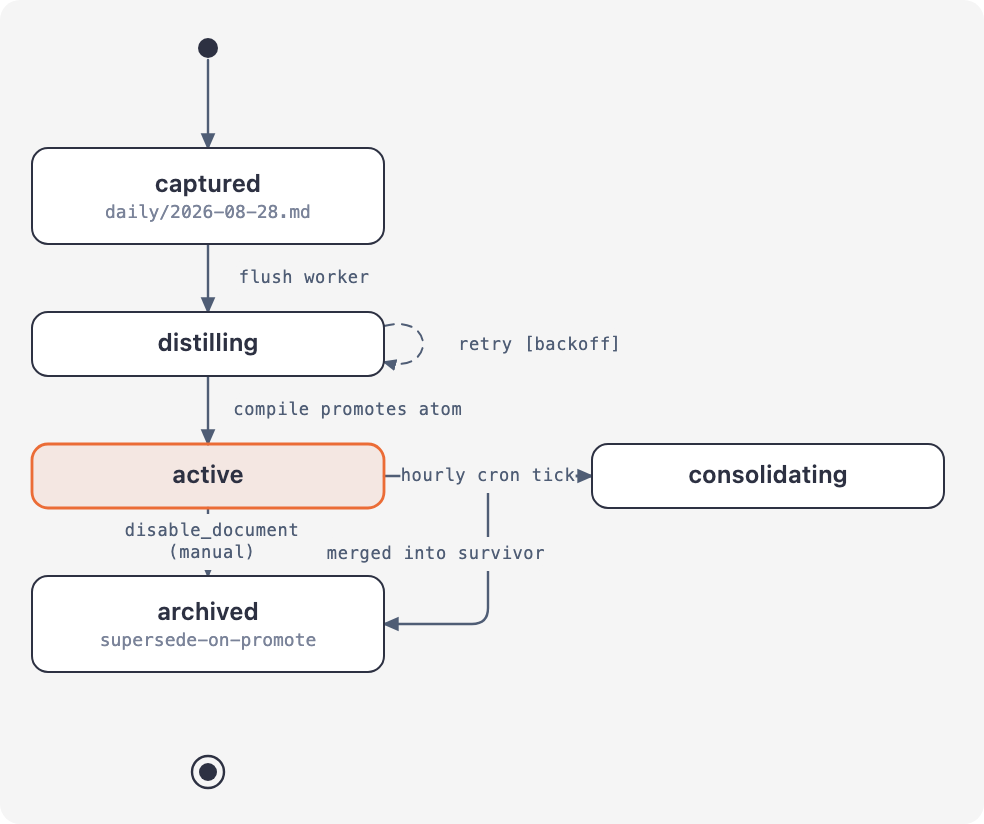](diagrams-examples.html#leaf-lifecycle)

[Open full screen](diagrams-examples.html#leaf-lifecycle)

---

### swimlane

<a name="capture-to-recall-lanes"></a>

One capture-to-recall pass crossing four owners: the hook, the engine, the LLM, and the wiki.

[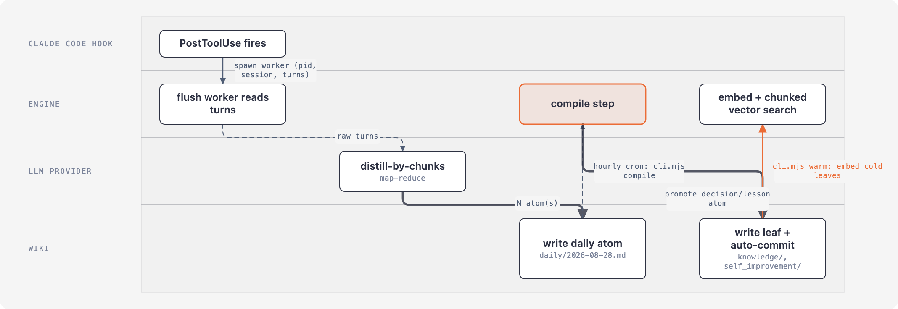](diagrams-examples.html#capture-to-recall-lanes)

[Open full screen](diagrams-examples.html#capture-to-recall-lanes)

---

### tree

<a name="embedding-module-tree"></a>

The embedding subsystem's module ownership: backends, cache, and chunking, each broken into concrete files.

[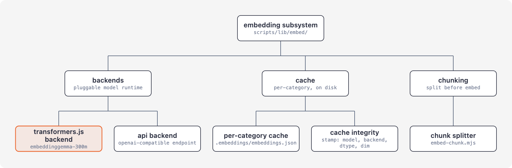](diagrams-examples.html#embedding-module-tree)

[Open full screen](diagrams-examples.html#embedding-module-tree)

---

### org-chart

<a name="surface-ownership"></a>

Who owns each engine surface, and the exact command or trigger that invokes it.

[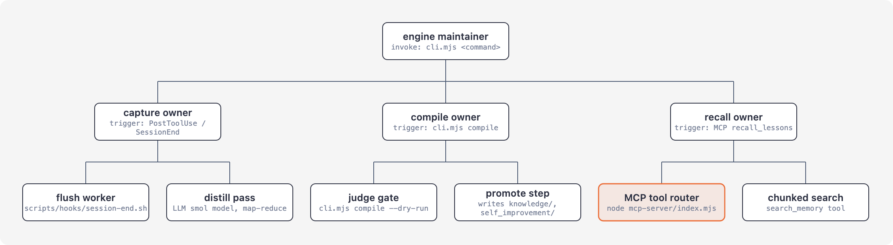](diagrams-examples.html#surface-ownership)

[Open full screen](diagrams-examples.html#surface-ownership)

---

### nested

<a name="deployment-containment"></a>

What actually runs inside what: two OS processes on one workstation, each hosting its own components.

[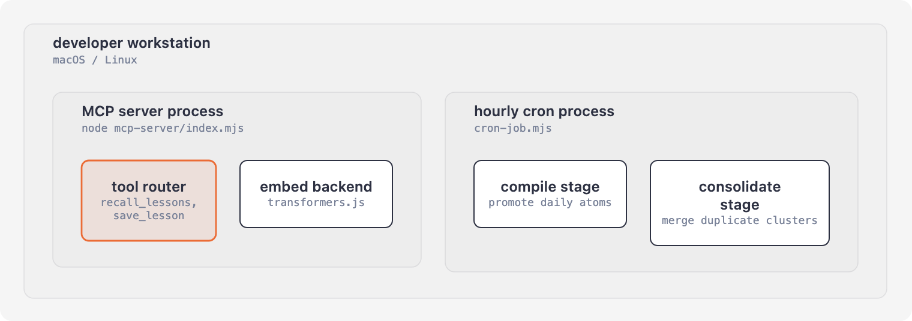](diagrams-examples.html#deployment-containment)

[Open full screen](diagrams-examples.html#deployment-containment)

---

### er

<a name="wiki-data-model"></a>

The wiki's data model: leaves keyed by category, cached as embeddings, and split into recallable chunks.

[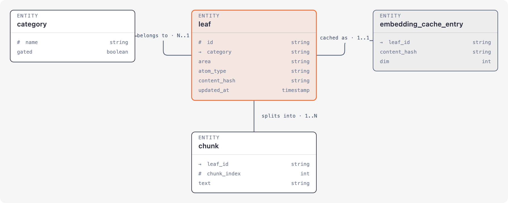](diagrams-examples.html#wiki-data-model)

[Open full screen](diagrams-examples.html#wiki-data-model)

---

### bar

<a name="leaves-by-category"></a>

Knowledge leaves dominate the 90-day promotion count, with a long tail across the other six categories.

[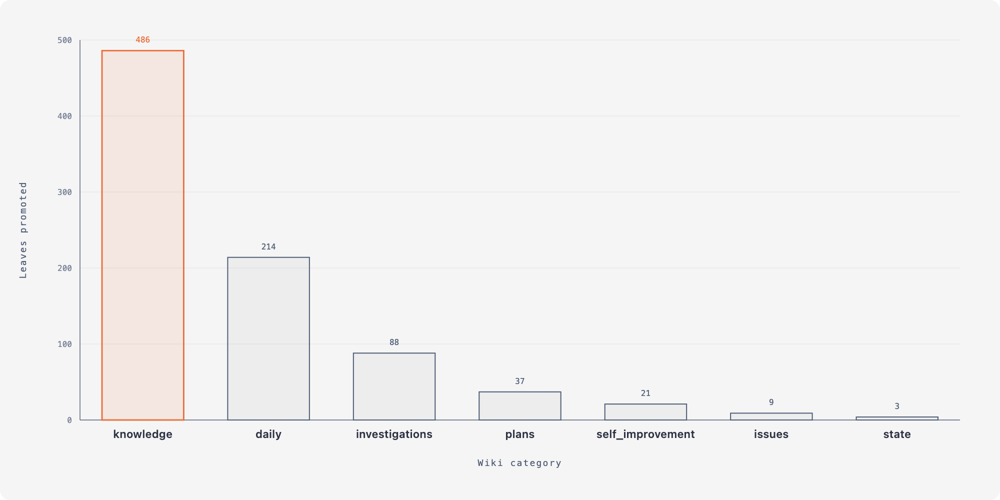](diagrams-examples.html#leaves-by-category)

[Open full screen](diagrams-examples.html#leaves-by-category)

---

### line

<a name="recall-latency-percentiles"></a>

The p99 recall tail spikes during a week-5 lexical-fallback incident and recovers once the guard fix lands.

[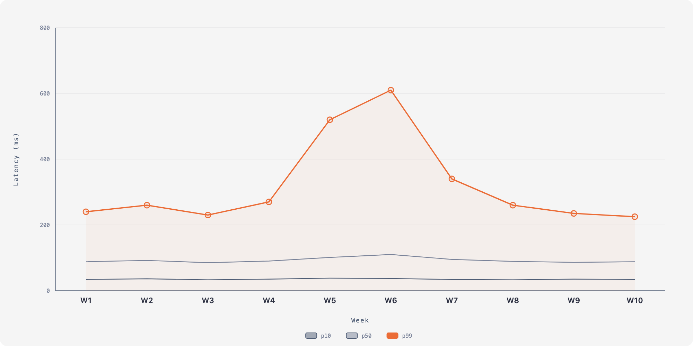](diagrams-examples.html#recall-latency-percentiles)

[Open full screen](diagrams-examples.html#recall-latency-percentiles)

---

### scatter

<a name="embed-cost-vs-accuracy"></a>

Bigger embedding models buy accuracy at a steep cost premium; the shipped default sits near the elbow of that curve.

[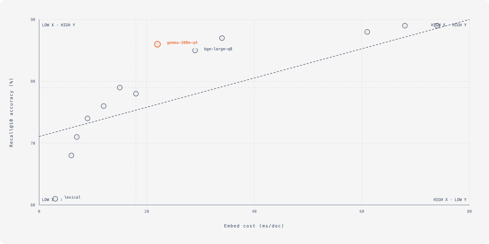](diagrams-examples.html#embed-cost-vs-accuracy)

[Open full screen](diagrams-examples.html#embed-cost-vs-accuracy)

---

### gantt

<a name="engine-build-phases"></a>

The embed-cache guard rewrite is the critical middle block between baseline profiling and the consolidate rollout.

[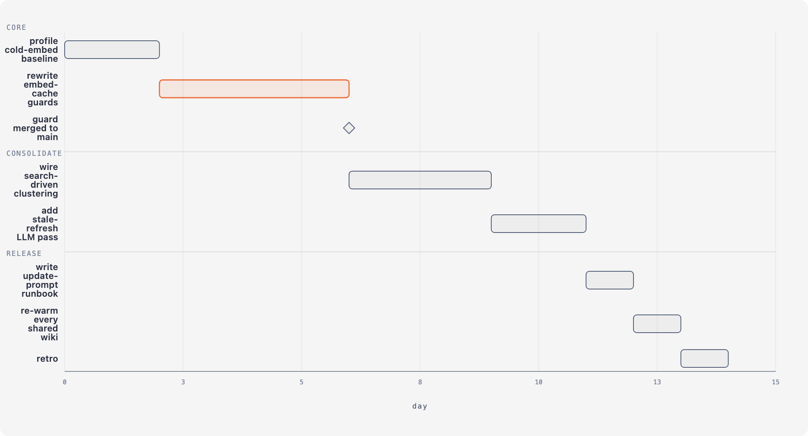](diagrams-examples.html#engine-build-phases)

[Open full screen](diagrams-examples.html#engine-build-phases)

---

### radar

<a name="embed-backend-scorecard"></a>

Lexical wins on speed, memory and cost; transformers wins only on accuracy, which keeps it the shipped default.

[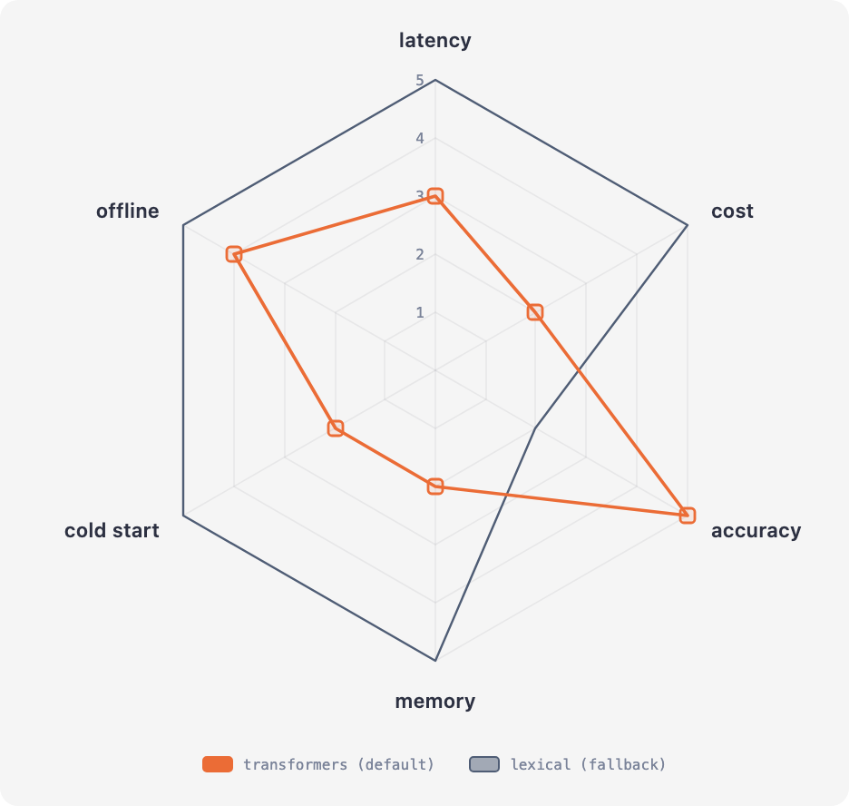](diagrams-examples.html#embed-backend-scorecard)

[Open full screen](diagrams-examples.html#embed-backend-scorecard)

---

### polar

<a name="captures-by-hour"></a>

Captures track the working day, peaking mid-afternoon and nearly silent overnight.

[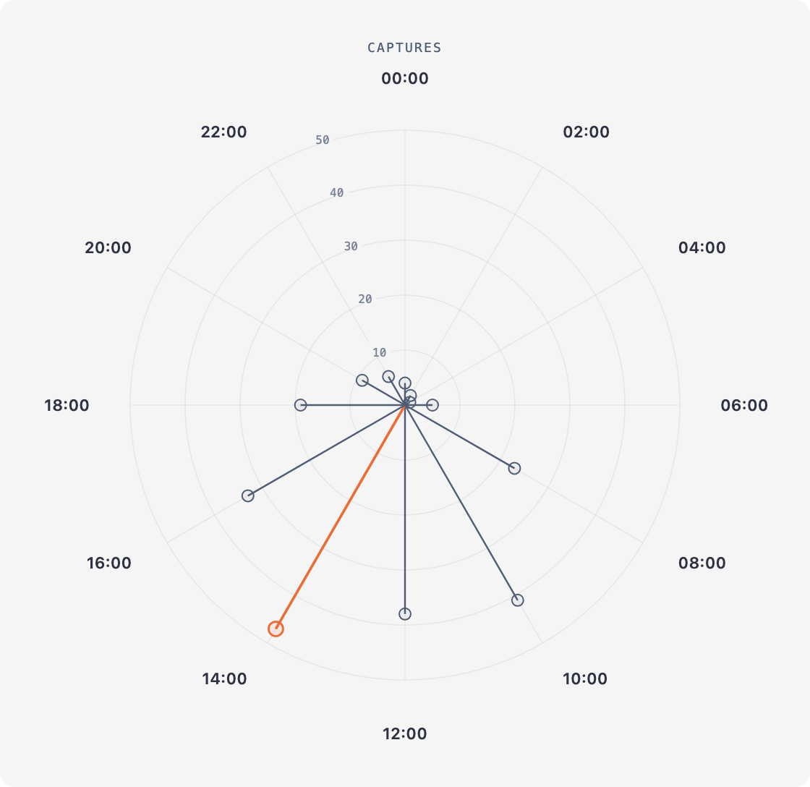](diagrams-examples.html#captures-by-hour)

[Open full screen](diagrams-examples.html#captures-by-hour)

---

### pyramid

<a name="capture-funnel"></a>

Just a quarter of session turns get captured, and barely one in ten of those are ever recalled again.

[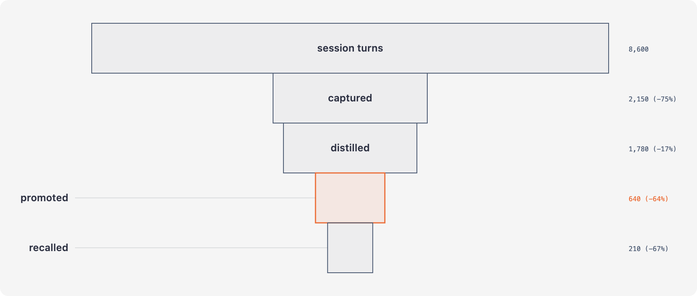](diagrams-examples.html#capture-funnel)

[Open full screen](diagrams-examples.html#capture-funnel)

---

### treemap

<a name="corpus-bytes-treemap"></a>

Knowledge dwarfs the other seven categories, though the gated self_improvement cell is the one worth watching.

[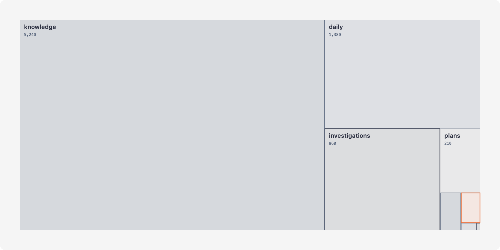](diagrams-examples.html#corpus-bytes-treemap)

[Open full screen](diagrams-examples.html#corpus-bytes-treemap)

---

### venn

<a name="leaf-lifecycle-venn"></a>

Most recalled leaves were not touched again this week; only a small core sits in all three sets.

[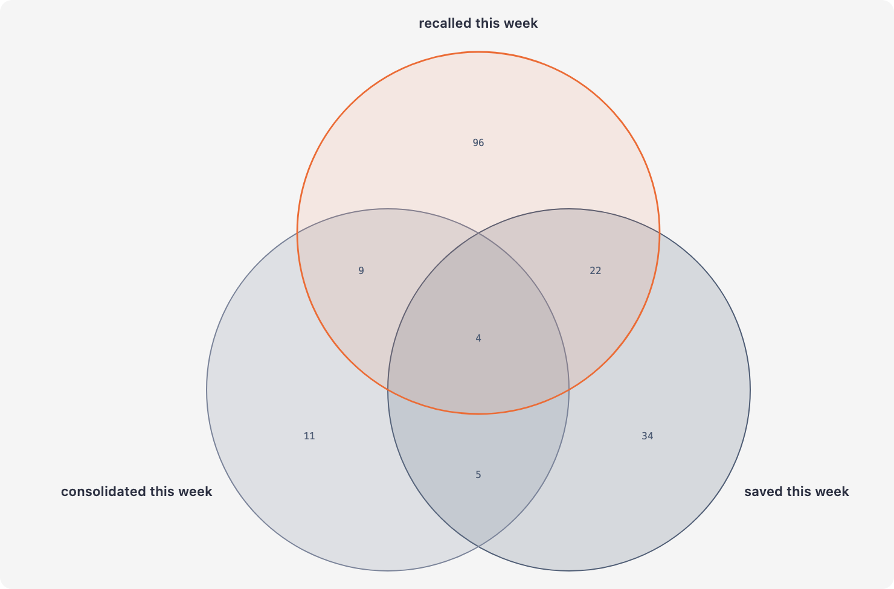](diagrams-examples.html#leaf-lifecycle-venn)

[Open full screen](diagrams-examples.html#leaf-lifecycle-venn)

---

### sankey

<a name="capture-routing-sankey"></a>

Manual saves are a small but steady stream into the same captured pool that automatic turn-capture fills.

[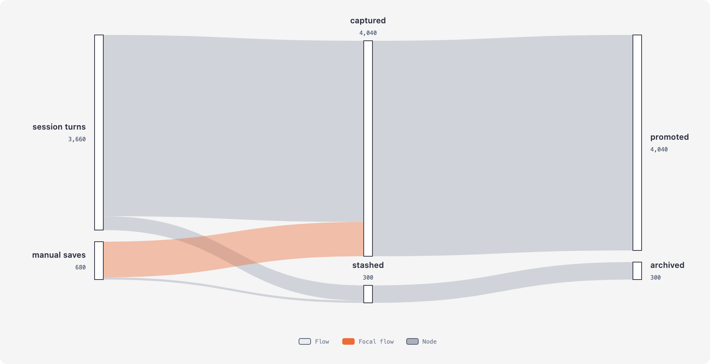](diagrams-examples.html#capture-routing-sankey)

[Open full screen](diagrams-examples.html#capture-routing-sankey)

---

### quadrant

<a name="quadrant-effort-impact-roadmap"></a>

Eight roadmap items scored by effort and impact, with cross-repo consolidation as the single flagship bet.

[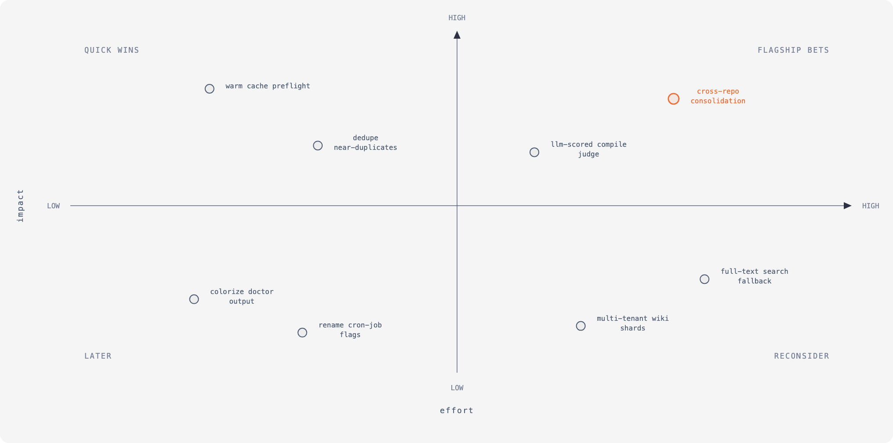](diagrams-examples.html#quadrant-effort-impact-roadmap)

[Open full screen](diagrams-examples.html#quadrant-effort-impact-roadmap)

---

### wardley

<a name="wardley-memory-engine-value-chain"></a>

The memory engine's value chain from a developer's question down to the commodity embedding model it depends on.

[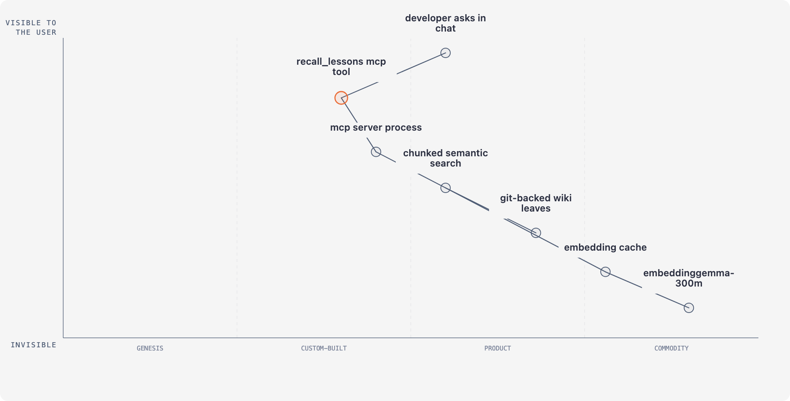](diagrams-examples.html#wardley-memory-engine-value-chain)

[Open full screen](diagrams-examples.html#wardley-memory-engine-value-chain)

---

### timeline

<a name="timeline-release-history"></a>

Seven releases across the year, spaced by real elapsed time, with the local embedding swap as the turning point.

[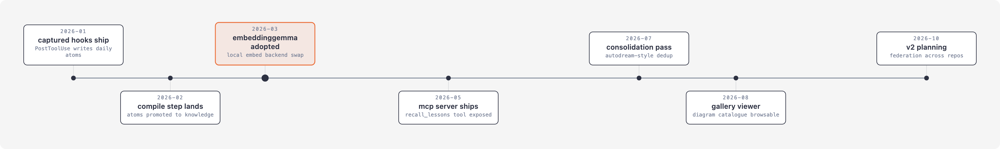](diagrams-examples.html#timeline-release-history)

[Open full screen](diagrams-examples.html#timeline-release-history)

---

### loop

<a name="loop-memory-flywheel"></a>

The memory flywheel: capture feeds distillation, distillation feeds compile, and compile feeds the next recall.

[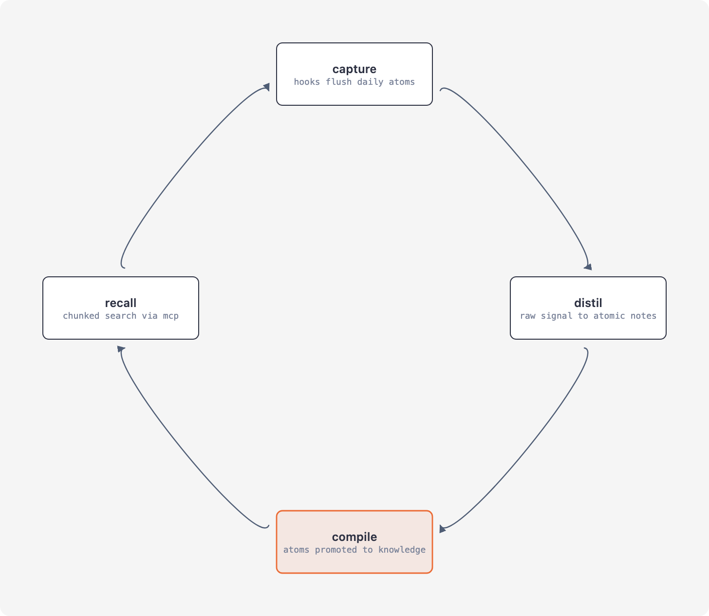](diagrams-examples.html#loop-memory-flywheel)

[Open full screen](diagrams-examples.html#loop-memory-flywheel)

---

### fishbone

<a name="fishbone-recall-returned-nothing"></a>

Four root-cause categories for an empty recall, with an empty corpus as the most common culprit.

[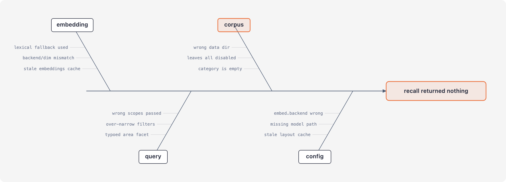](diagrams-examples.html#fishbone-recall-returned-nothing)

[Open full screen](diagrams-examples.html#fishbone-recall-returned-nothing)

---

### layers

<a name="layers-recall-stack"></a>

The recall stack from git-backed wiki leaves up to the MCP tool surface an agent actually calls.

[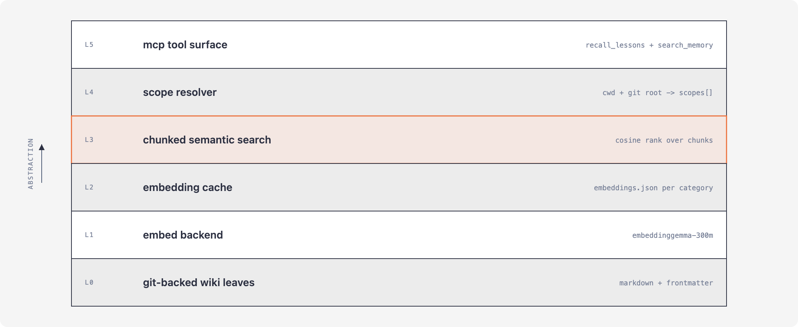](diagrams-examples.html#layers-recall-stack)

[Open full screen](diagrams-examples.html#layers-recall-stack)

---

### kanban

<a name="kanban-diagram-engine-board"></a>

The diagram engine's own work board: a wide backlog, a WIP-limited pass in progress, an empty review lane, and settled work.

[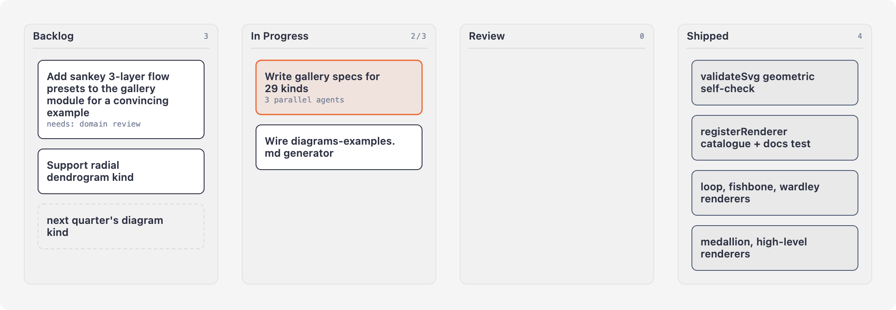](diagrams-examples.html#kanban-diagram-engine-board)

[Open full screen](diagrams-examples.html#kanban-diagram-engine-board)

---

### medallion

<a name="medallion-captured-corpus-tiers"></a>

Five tiers of the captured corpus, from a hook's raw daily atom to a garbage-collected cold archive.

[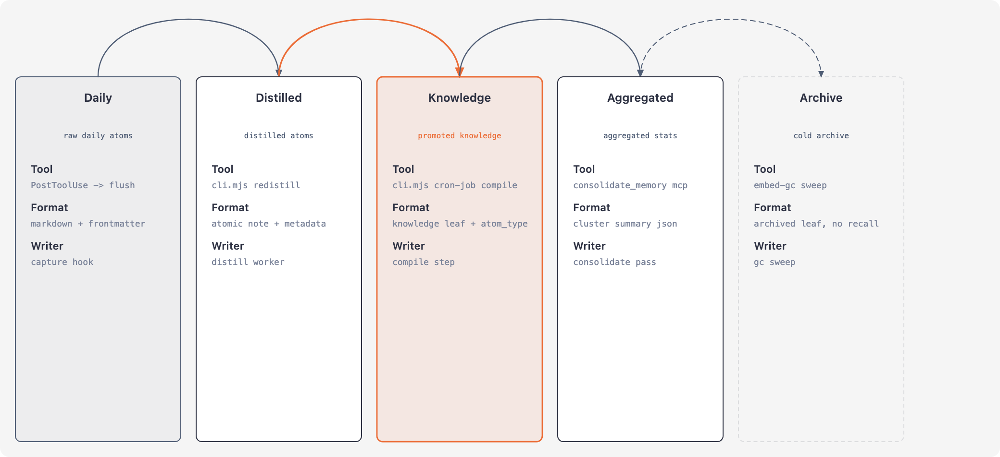](diagrams-examples.html#medallion-captured-corpus-tiers)

[Open full screen](diagrams-examples.html#medallion-captured-corpus-tiers)

---

### high-level

<a name="highlevel-platform-end-to-end"></a>

The platform end to end: hooks capture, git stores, chunked search recalls, and the MCP server serves it back to the agent.

[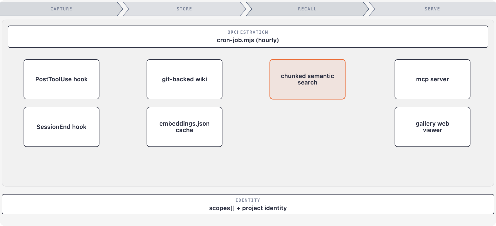](diagrams-examples.html#highlevel-platform-end-to-end)

[Open full screen](diagrams-examples.html#highlevel-platform-end-to-end)
