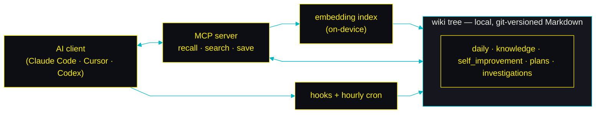
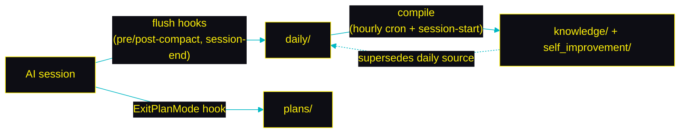

# How it works

Three flows, all on-device: a **write path** (a session becomes durable notes), a **read path** (those notes come back as context), and **offline upkeep** (the store refines itself).

**The pieces.** An AI client talks to the MCP server (recall / search / save) and fires lifecycle hooks; an hourly cron does maintenance; both read and write one local, git-versioned Markdown tree, ranked by an on-device embedding index.

## Write path — capture then compile

A session is captured to dated `daily/` notes by the flush hooks (and approved plans go straight to `plans/`); the hourly cron then promotes those atoms into the durable `knowledge/` and `self_improvement/` trees, superseding the daily source.

The capture worker chunks oversized transcripts and is recoverable on failure — full detail in [capture.md](capture.md).

## Read path — recall

Before a task (and at session start) the agent calls `recall_lessons` / `search_memory`; the embedding index ranks leaves across the trees and returns the top hits as a briefing or an applied lesson — nothing leaves the machine.

How embedding, ranking, and the vector cache work: [embeddings.md](embeddings.md).

## Offline upkeep

An opt-in hourly pass keeps the store from becoming a write-only graveyard (dedup, staleness refresh, housekeeping) and logs each attempt so failures surface next session — see [consolidate.md](consolidate.md).

## See also

- [mcp-tools.md](mcp-tools.md) — the MCP tool surface, `scopes`, and `target`.
- [write-gate.md](write-gate.md) — how self-improvement writes are gated.
- [../ARCHITECTURE.md](../ARCHITECTURE.md) — the per-concern responsibility split (this package vs the underlying engine).
