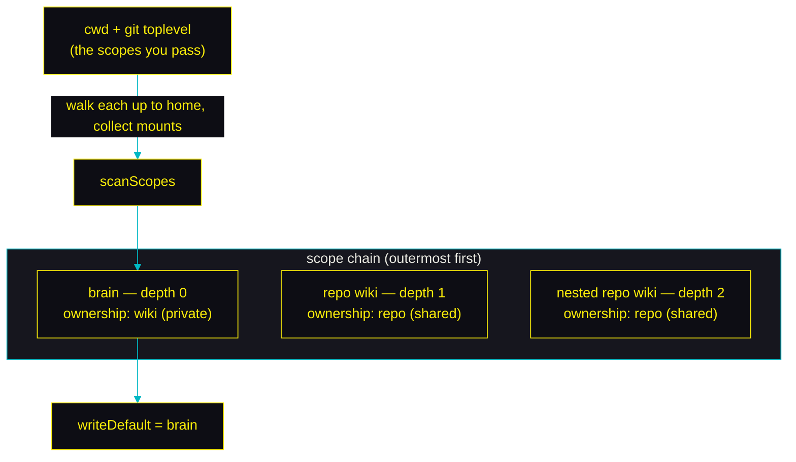
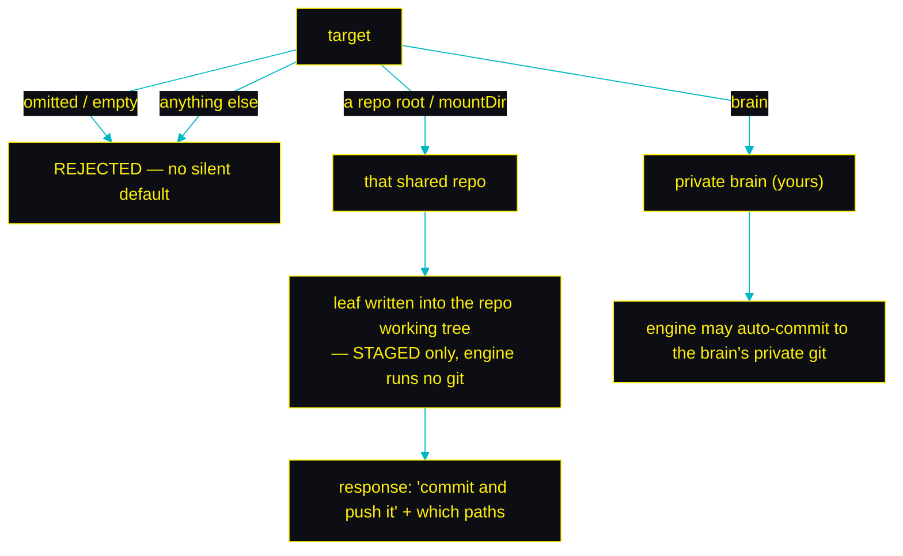

# Shared team wikis

By default your memory is a **private brain**: one wiki in your home directory,
gitignored, visible to every AI tool on your machine but to no one else. This
page is about the other mode: giving a **repo its own shared wiki** — a
`knowledge` tree that **you** commit into the project so everyone who clones it
inherits that knowledge — and exactly how the two behave together. A hard rule
runs through all of it: **the engine never runs git on a shared wiki** — not on
save, recall, search, install, or uninstall. It only writes files to disk; you
commit them with your own git.

The two coexist. The engine discovers every `.llm-wiki-memory` wiki by walking up
from where you are working (your cwd and the repos in play), stacking them into a
**scope chain**: your private brain plus any repo-owned wikis above it. Reads fan
out across the whole chain; each write picks one destination.

---

## The two kinds of memory

| | **Private brain** | **Shared repo wiki** |
|---|---|---|
| Where it lives | `~/.llm-wiki-memory/wiki` | `<repo>/.llm-wiki-memory/wiki` |
| Ownership | `wiki` (yours) | `repo` (the team's) |
| Git | gitignored from your home; its own private repo (engine auto-commits) | the `knowledge/` tree is **git-tracked in the project — YOU commit it; the engine never runs git on it** |
| Layout template | `default` (knowledge, self_improvement, plans, investigations, daily) | `repo` (a single `knowledge` tree, `consolidate: none`) |
| Depth in the chain | 0 (always present) | 1+ (deeper = more local) |
| Who sees it | every AI tool on **your machine** | everyone who **clones the repo** |
| Auto-maintained | yes (compile, consolidate, capture, cron) | no — the team curates it via git; only its embeddings are auto-warmed |

The brain is the whole story for most installs. A shared wiki is **opt-in** and
additive: adding one to a repo changes nothing about your brain.

---

## The scope chain — how levels are discovered

Every memory tool takes a required `scopes` array: the directories you are
working in (your cwd, and any repos in play). The engine walks each scope
**upward to your home directory**, collecting every `.llm-wiki-memory` mount it
finds, and stacks them into levels — the brain at depth 0, repo wikis above it.



**Depth reflects true nesting, not scan order.** The brain is 0; each repo mount
is `1 + (number of in-scope repo mounts that are strict path-ancestors of it)`.
So a repo nested inside another gets a deeper level (and keeps its locality
advantage), while two **sibling** repos share a depth and are then ranked purely
by relevance — never by which one sorts first alphabetically.

A repo wiki with a broken/unreadable `layout.yaml` is **skipped** with a warning
(it can't wedge an operation on your brain or another repo); a broken **brain**
layout is fatal (it's your default and must be trustworthy).

---

## Installing (or adopting) a shared wiki

**There is only ONE engine clone on your machine — the private brain at
`~/.llm-wiki-memory/src`, installed once by `bootstrap.sh`. The engine is NEVER
cloned into a project repo.** To turn a repo into a shared team wiki — or to
adopt one after cloning it — run the global engine's `mount-init` against the
repo:

```bash
node ~/.llm-wiki-memory/src/scripts/mount-init.mjs /path/to/repo   # or "$PWD" from inside it
```

One idempotent command covers both cases. On a repo with no wiki yet it **seeds**
the `repo` layout (a single `ownership: repo` `knowledge` tree); on a clone that
already carries one it **adopts** it. Either way it — in place, with no engine
clone — writes the mount `.gitignore` (un-ignores the shared contract, ignores the
private/derived parts), initialises a separate private git repo for your personal
notes, installs three git hooks that keep the shared embeddings warm, and upserts
exactly ONE machine-independent remote-read block into `AGENTS.md`/`CLAUDE.md`. It
runs **no git** on the wiki — **you** commit the shared tree.

> **The `repo` template is a FULL-doc team wiki.** Unlike the private brain (which
> distils short atomic notes), the shipped shared `knowledge` category is
> `full: true` — every leaf is a WHOLE document, stored verbatim and embedded whole
> (see `docs/embeddings.md`). It nests subject-only, two levels deep
> (`knowledge/<domain>/<subtopic>/<leaf>`), over a UNIVERSAL team `subject_domains`
> vocabulary (architecture, product, operations, data, security, process,
> onboarding, integrations, decisions, reference, general) — curate that list for
> your team in `layout.yaml`. This is the natural target for `absorb` (import
> existing design docs / RFCs / runbooks as-is): `node
> ~/.llm-wiki-memory/src/scripts/cli.mjs absorb <path…> --category=knowledge
> --target=<repo> --dry-run`, then commit + push the staged leaves. See the
> `absorb` skill.

**A shared repo carries ZERO machine-dependent files** — no engine clone, no
per-repo client config, no `~/…` @-pointer files. The MCP server and the Claude
Code hooks are registered **globally** in each developer's home config
(`~/.claude.json` + `~/.claude/settings.json`, Cursor `~/.cursor/mcp.json`, Codex
`~/.codex/config.toml`, Claude Desktop) by `bootstrap.sh`, never per-repo. So the
only things in the project repo are the wiki data + yaml (`wiki/**`, `layout.yaml`,
`layout.local.yaml`) + the mount `.gitignore`, PLUS exactly ONE machine-independent
remote-read block in `AGENTS.md`/`CLAUDE.md` pointing at
`https://raw.githubusercontent.com/ctxr-dev/llm-wiki-memory/main/templates/agents-memory-instructions.md`.
A teammate just installs the engine globally once (`bootstrap.sh`, which registers
the MCP server + hooks in their home config), runs the `mount-init` above, and
picks up the memory discipline from that committed remote-read block.

**What's git-tracked vs ignored** (the mount `.gitignore` contract):

| Committed into the project repo | Kept out of git |
|---|---|
| `wiki/.layout/layout.yaml` (the shared layout) | `layout.local.yaml` (your personal per-repo overrides) |
| the ONE machine-independent remote-read block in `AGENTS.md`/`CLAUDE.md` | any per-repo client config or `~/…` @-pointer (never written — MCP/hooks are global) |
| each `ownership: repo` category dir + its `.md` leaves (the shared knowledge) | any non-shared category |
| `.gitignore` itself | `.embeddings/` (vector caches) and every `index.md` (regenerated locally) |
| | `personal/` (your private git for this repo) + engine internals / runtime state |

So a teammate who pulls sees the shared **knowledge leaves and layout** — and
nothing of your caches, indexes, or personal notes.

**On a fresh clone**, the committed leaves + layout are present but the gitignored
derived artifacts (`.embeddings/` vector caches, every `index.md`) are not —
`mount-init` wires the sync-embeddings hooks so the next `git pull` warms the
shared-category vectors (until then, search embeds lazily); the `index.md`
nav files are regenerated by the engine on the next index operation.
`mount-init` never moves, re-clusters, or deletes the committed leaves, and it
registers **no** MCP server (the shared repo carries no client config) — the
global `bootstrap.sh` install already
did that in your home config.

> **Legacy setup path.** Older docs ran `./.llm-wiki-memory/src/bootstrap.sh
> --template repo --commit-memory` from an engine clone *inside* the repo. That
> still works, but it vendors a redundant engine copy into the project (gitignored,
> never shared) — prefer the no-clone `mount-init` above, run from the one home
> engine.

> **The engine never runs git (add / commit / push / gc) on a shared wiki — in
> ANY operation** (install, save, recall, uninstall). This is a hard code guard:
> `gitUsable()` refuses any wiki that declares an `ownership: repo` category, so
> even a stray `.git` accidentally at the wiki root can't make the engine commit
> it. Install only WRITES FILES (the layout, the `.gitignore` block, the hooks)
> and initialises a SEPARATE private `personal/` git for your own notes; it never
> commits the shared tree. **You** commit the shared knowledge with your own git.

---

## Writing — which wiki a save lands in

Every write names a **required, explicit `target`**. There is no implicit
default — an omitted target is an error, so a note can never land somewhere
unexpected.



**A shared write is staged, never committed or pushed by the engine.** When you
target a repo, the leaf is written into that repo's working tree and that's all —
the engine drops every repo-owned leaf before any auto-commit, and it never runs
`git push`/`git pull` anywhere. The response tells you to **commit and push it
yourself** (stage everything under the wiki dir — the leaf plus its regenerated
index — e.g. `git add -A`, then commit and push). It isn't shared with the team
until you do.

**The agent asks before writing to a shared repo.** Writing to a teammate-visible
tree is a deliberate choice, so the discipline requires the assistant to confirm
with you first, then pass that repo as the `target`.

**Discovering the targets.** Call `get_memory_config` — its `levels` array lists
every level in your resolved chain (`root`, `mountDir`, `projectModule`,
`ownership`, `depth`), which is how you (or the agent) pick a target by path. This
is also the only way to distinguish two identical sibling clones (same project
identity, different roots).

---

## Recall — how results are ranked across the chain

A search fans out over every level, runs the **same single embedding model**
across all of them (never one copy per level), and merges the results. A
repo-only category (say a tracker `issues` tree the brain doesn't declare) is
searched, listed, and discoverable because the category set is the **union**
across the chain.

The rank of each hit is `adjustedConfidence = cosine + depthBoost`, where the
depth boost is **banded**:

```
boostEligible      = cosine >= (best cosine this query) - depthBoostBand
depthBoost         = boostEligible ? depth * depthBoostPerLevel : 0
adjustedConfidence = cosine + depthBoost
```

**How the three factors combine** (relevance dominates; locality and priority are
refinements):

| Factor | Role | Default |
|---|---|---|
| **cosine similarity** | The gate. Dominant signal. | — |
| **`scoreThreshold`** | Relevance **floor** — noise-level hits are dropped before ranking. | `0.05` |
| **`depthBoostPerLevel` × depth** | Prefers the **more-local repo** — but only when a hit is *comparably* relevant (within the band). Default `1` exceeds the 0–1 cosine range, so a comparably-relevant repo hit outranks a general brain hit. | `1` |
| **`depthBoostBand`** | The window (below the top cosine) in which the depth boost applies. A clearly-weaker deep hit gets **no** boost, so it can't bury a strong brain hit. | `0.15` |
| **`priority` (P0/P1/P2)** | A **within-band tie-break** only — among near-equally-relevant hits, a P0/P1 orders above a P2. Never overrides relevance. | band `0.05` |
| **`searchPerLevelCap`** | How many hits each tree contributes before the merge. | `20` |

In plain terms: **the most relevant note wins; when a repo note and a brain note
are about equally relevant, the repo (more local) one is preferred; priority only
breaks near-ties.** A weak repo note never outranks a strongly-relevant brain
note.

Each hit is tagged with the tree it came from (`resolvedRoot`) and that tree's
`projectModule`, and the merge collapses only the *same file on disk* — so two
different trees that happen to share a relative path both survive.

---

## Identity — how notes from the same project gather

Each shared leaf is stamped with a **portable project identity** so notes about
the same project group together regardless of where any teammate cloned it:

- A git repo → its canonical **`org/repo`** (derived from the origin remote,
  host/protocol stripped) — so an ssh clone and an https clone, on any machine,
  agree.
- A repo with **no origin remote** → `file://<absolute-path>` (machine-specific).
  A shared write to such a repo is flagged with a **warning** that the stamped
  identity won't match a teammate's clone — add an `origin` remote (or a
  `project_id` in the layout) before sharing.
- Nested repos → a `//`-joined chain (outermost → owning), and recall
  **suffix-matches the innermost segment**, so clones of the same inner repo
  gather no matter the nesting or local path.

---

## Automatic vs manual for a team

The engine's background automation is **brain-only by design** — a shared wiki's
knowledge is never auto-rewritten under you. The team owns shared knowledge and
curates it through git; the engine only keeps its search index warm.

| Capability | Scope | Notes |
|---|---|---|
| compile (promote daily → knowledge) | **brain only** | shared repos have no `daily` tree |
| consolidate (dedup / staleness refresh) | **brain only** | the `repo` layout is `consolidate: none` — shared knowledge is never auto-rewritten |
| capture / flush / plan-sync / cron / monitoring | **brain only** | private-session artefacts |
| auto-commit of leaves | **brain** (+ non-repo categories) | repo-owned leaves are dropped from every engine commit |
| **sync-embeddings hooks** | **shared** | warm shared-category vectors on `git pull` / checkout / rebase — background, best-effort, never blocks git |
| **SessionStart "current-work" context** | **spans the chain** | surfaces a branch's plan even when it lives in the shared repo |
| **`audit_memory` (missing-metadata on knowledge)** | **spans the chain** | flags a shared repo's incomplete leaves, tagged with which repo |
| `audit_memory` (self_improvement / duplicates) | **brain only** | lessons are personal + write-gated |

---

## Upgrading a shared install

The engine is the single home clone — **upgrade it once**, in `$HOME`, and every
shared mount follows (each one references that engine, not a per-repo copy):

```bash
git -C ~/.llm-wiki-memory/src pull --ff-only && ~/.llm-wiki-memory/src/bootstrap.sh
```

If a release changes the mount contract (the sync hooks or the `.gitignore`),
re-run `node ~/.llm-wiki-memory/src/scripts/mount-init.mjs "$PWD"` in the repo to
re-provision it (idempotent — it never reverts the shared wiki to private or runs
git on it; you commit the tracked tree). Optional sanity check on a mount after an
upgrade:

- the mount `.gitignore` still re-includes the shared categories (not a bare `/.llm-wiki-memory`);
- no `wiki/.git` exists inside the shared tree (`ls -la .llm-wiki-memory/wiki/.git` → absent);
- the three sync hooks are present (`grep -l llm-wiki-memory .git/hooks/post-*`).

> **Legacy per-repo clone:** a repo that still vendors its own
> `./.llm-wiki-memory/src` can re-run that `bootstrap.sh` (it auto-detects the
> shared wiki — a bare re-run never reverts it to private and needs no
> `--commit-memory`). Prefer migrating to the no-clone `mount-init` above.

## Uninstalling a shared wiki

```bash
./.llm-wiki-memory/src/bootstrap.sh --uninstall
```

This removes the cron/launchd/Task Scheduler entry and strips the marker-fenced sync-embeddings
block from the three git hooks. It **never** deletes your memory data or commits
anything. Deleting the shared knowledge itself, and the `personal/.git`, are
deliberately **manual** steps (the engine won't destroy data for you) — the
uninstaller prints them.

---

## Configuration knobs

All under `recall:` in `<data>/settings/settings.yaml`:

| Key | Default | Meaning |
|---|---|---|
| `recall.scoreThreshold` | `0.05` | Relevance floor; hits below it are dropped. `0` keeps every hit. |
| `recall.depthBoostPerLevel` | `1` | Additive per-level locality boost. `0` = pure cosine (no locality preference). |
| `recall.depthBoostBand` | `0.15` | The band (below the top cosine) in which the depth boost applies. `0` = only exact-top hits boosted; larger = closer to always-boost. |
| `recall.priorityBand` | `0.05` | Cosine proximity within which P0/P1/P2 breaks ties. |
| `recall.searchPerLevelCap` | `20` | Per-level hit cap before the fan-out merge. |

**Team caveat — keep everyone on the same embedding model.** Vectors from
different `embed.model` / `embed.backend` are not comparable. If a team shares a
wiki, agree on one embedding model so recall ranks consistently across machines;
a mismatch just means each machine re-embeds locally (correctness is never at
risk — the content hash gates re-embedding — but cross-machine cosine scores can
drift).

---

## Team scenarios

**1 — Save a team convention to the shared repo.** The agent asks first, then
`save_to_dataset(dataset:"knowledge", target:"<repo root>", …)`. The leaf is
written into the repo working tree and stamped with the repo's `org/repo`
identity; the engine runs no git. You get a "commit and push it" note. You
`git add -A && git commit && git push` to share it — teammates get it on pull.

**2 — Recall across your brain + two repos.** With `scopes` covering the repos,
the chain is `[brain, repoA, repoB]`. A repo hit within `0.15` of the top cosine
outranks a comparably-relevant brain hit (locality preferred); a clearly-weaker
deep hit does not bury a strong brain hit. Each hit shows which tree it came from.

**3 — Two clones of the same repo on different machines/paths.** Both share the
git origin, so both stamp the identical `org/repo`; recall's suffix-match gathers
their notes together regardless of local path. (A repo with no origin remote
stamps a machine-specific `file://…` and is warned about at write time.)

**4 — A repo-only `issues` (tracker) category.** The brain doesn't declare it, but
the category union makes it searchable, listable, and discoverable. Writes to it
target the repo and carry an explicit topology `path=`; recall reaches it under
the repo's level.

**5 — Two sibling repos both in scope.** They share a depth and are ranked purely
by relevance. A write to one is stamped with only that repo's identity — a
sibling's origin never leaks into the other's leaf.

---

## Correctness guarantees worth knowing

- **A read-only shared tree never breaks recall.** If you can't write to a
  teammate's curated tree, the embedding-cache write is best-effort — search
  still returns, scoring from in-memory vectors.
- **A git-merge-conflicted shared leaf never blanks recall for everyone.** An
  unreadable leaf (conflict markers in its frontmatter) is skipped with a
  breadcrumb; every other leaf still returns.
- **A broken repo layout can't wedge your brain.** A discovered repo mount with a
  malformed layout is skipped; brain-only and other-repo operations are
  unaffected.
- **The engine never runs git against your project repo during a write** — shared
  saves are staged only; committing and pushing is always your explicit action.

---

*Architecture reference: [ARCHITECTURE.md](../ARCHITECTURE.md) § "Federation". The
shared layout template lives in `examples/layouts/repo/`. Install/adopt/upgrade
procedures for agents are in `AI-INSTALL-PROMPT.md`.*
