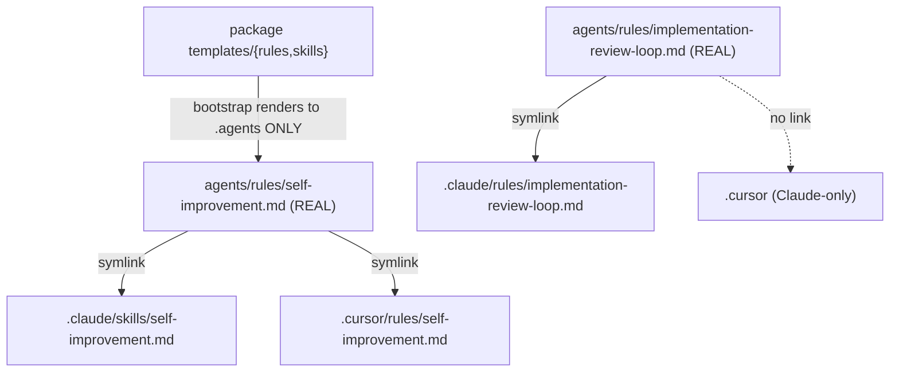

# Refactor: `.agents` is the single source of truth; every client rule/skill is a per-file symlink

**Status:** pending (decisions locked via grill; saved for later — not yet executed)
**Scope:** the `.llm-wiki-memory` package (`src/bootstrap.sh` + a new shipped rule) **and** the live `~/repos` workspace config (`.agents` / `.claude` / `.cursor`).
**Standing rules:** never commit/push/PR — user gates all git writes. `~/repos` is NOT a git repo (no VCS safety net here) and may be cloud-synced → back up + pause sync before structural changes.

## 1. Context — the problem & the decision

`.agents/{rules,skills}` is meant to be canonical, with `.claude` / `.cursor` *referencing* it. In reality three classes coexist and some are **duplicated, not referenced**:
- **Workspace-authored rules** (planning-methodology, no-comments, scala-review-gate, scala-team-conventions) — already correct: real in `.agents/rules`, per-file symlinks in `.claude`/`.cursor`.
- **12 package-shipped files** `bootstrap.sh` **hard-copies** to every surface each run: 5 process-rules (`templates/rules/*`: cloud-sync-safety, memory-write-gate, releases-docs, topology-path-routing, **priority** [new in v0.3.0]) → `.agents/rules`+`.claude/rules`+`.cursor/rules`; 7 memory-discipline (`templates/skills/*`) → `.agents/rules`+`.claude/skills`+`.cursor/rules`. (Rendered copies are byte-identical — verified by hash — so nothing has silently diverged.)

**Release sync (v0.3.0, 2026-06-14):** `src` is already at `origin/main` (nothing to pull), but the workspace install is **one render behind** — `templates/rules/priority.md` (discipline rule 11) is not yet in `.agents/rules`. The render *model* is unchanged, so this refactor applies as-is; `priority.md` is just a 5th process-rule. **Do NOT do a plain pre-upgrade re-bootstrap** — it would hard-copy `priority.md` into every surface, re-creating the duplication we're removing. The **refactored** bootstrap re-run (Phase 3.3) performs the upgrade (renders `priority.md` into `.agents` + symlinks it out) in one clean pass. (Also noted: a stray untracked `src/undefined/index.md` — a package anomaly to flag separately, out of scope.)
- **Divergences** (real file in only one place): `implementation-review-loop.md`, `plans-lifecycle.md`, `testing.md` (only `.claude/rules`); `scala-team-conventions/` **skill** (only `.claude/skills`); `scala-essentials/` skill (only `.agents/skills`).

**Locked decisions (from grill):**
| # | Decision |
|---|---|
| 1 | **Per-file symlinks, never folder symlinks** — so other sources (ai-hub plugins, etc.) can drop their own real files into `.claude`/`.cursor` without a folder-link hijacking them, and each canonical file can be linked into *different* client folders (Claude `skills/` vs Cursor `rules/`). |
| 2 | **`.agents/{rules,skills}` holds the only real files** for managed content; `.claude`/`.cursor` hold only per-file symlinks (POSIX) / copies (Windows, other consumers). |
| 3 | **Change `bootstrap.sh`**: render the package files into `.agents` **only**, then per-file-symlink them into the client surfaces (reuse the existing OS-conditional wiring). |
| 4 | Cross-routing handled per-file: a memory-discipline file is one real file in `.agents/rules`, symlinked into `.claude/skills` **and** `.cursor/rules`. |
| 5 | Claude-only rules link into `.claude/rules` **only** (not `.cursor`); Claude-only skills into `.claude/skills` only. |
| 6 | A **hard, mandatory rule** + an enforceable check, so this never regresses. |

## 2. Mandatory skills/gates bound across planning → implementation → review
- **`no-comments`**, **`testing`** (package uses `node:test`; see `run-tests-safely` skill), **`implementation-review-loop`** (+ the Phase-1b mandatory commands), **`releases-docs-authoring`** (bootstrap behavior change → release runbook), **`cloud-sync-safety`** (symlinks vs sync daemon), **`dev-principles`** (llm-wiki-memory invariants: atomic writes, fail-loud, cross-client portability), **`debugging`**. Bind each at implementation + a reviewer per gate.

## 3. Target model — the routing matrix

One real file in `.agents`; each surface gets an individual symlink (POSIX) into the folder *that client* expects:

| Canonical real file (in `.agents/`) | `.claude/` symlink | `.cursor/` symlink | Source |
|---|---|---|---|
| `rules/<process-rule>.md` (cloud-sync-safety, memory-write-gate, releases-docs, topology-path-routing, **priority**) | `rules/` | `rules/` | package `templates/rules/` |
| `rules/<memory-discipline>.md` (consolidate, current-work-context, embed-gc, investigation-capture, plan-capture, self-improvement, session-end-capture) | **`skills/`** | `rules/` | package `templates/skills/` |
| `rules/<workspace-rule>.md` (planning-methodology, no-comments, scala-review-gate, scala-team-conventions) | `rules/` | `rules/` | workspace |
| `rules/<claude-only>.md` (implementation-review-loop, plans-lifecycle, testing) | `rules/` | — (none) | workspace (moved from `.claude`) |
| `skills/scala-team-conventions/` | `skills/` | — | workspace (moved from `.claude`) |
| `skills/scala-essentials/` | — (Claude already has it user-level — see Edge cases) | — | workspace |

## 4. Phased checkboxes

### Phase 0 — safety (no VCS net here)
- [ ] Pause cloud-sync on `~/repos` (cloud-sync-safety) before any move/symlink.
- [ ] Snapshot the three dirs: `tar czf ~/agentic-config-backup-<ts>.tgz .agents .claude .cursor` (recoverable if anything goes wrong).
- [ ] Re-confirm every existing hard-copy is byte-identical to its `.agents` twin before replacing with a symlink (already hash-verified; re-check at run time).

### Phase 1 — `.llm-wiki-memory/src/bootstrap.sh` (the package change)
- [ ] 1.1 **Render package files into `.agents` only** (two-phase, render BEFORE wire): `templates/rules/*` → `.agents/rules`; `templates/skills/*` → `.agents/rules` (canonical home unchanged — vendor-neutral). Delete the `cp` into `.claude`/`.cursor` (current lines ~237–264). **Order is load-bearing:** a POSIX `ln -s` to a not-yet-rendered target succeeds silently as a dangling link (no install-time error) — so ALL renders into `.agents` must complete before ANY wiring.
- [ ] 1.2 Generalize the existing per-file wiring (lines ~266–338) into a `wire_file(canonical, client_target)` helper that **reuses the existing `RULE_WIRE_MODE` (symlink POSIX / copy Windows) + pseudo-symlink-repair** (lines ~304–330) — do NOT add a separate always-symlink path (that would regress Windows/cloud-sync for the ex-hard-copied process-rules). On a pre-existing real file: `rm -f` then link.
- [ ] 1.3 Drive wiring from an explicit **routing manifest** (the §3 matrix): process-rules → `.claude/rules`+`.cursor/rules`; memory-discipline → `.claude/skills`+`.cursor/rules`; workspace cross-tool rules → `.claude/rules`+`.cursor/rules`; Claude-only rules → `.claude/rules`; Claude skills → `.claude/skills`. **Per-entry, verify the computed relpath matches the target's depth** (hard-coded `../../.agents/rules/` at line ~300 is correct for `.claude/skills` too — both depth-2 — but make it a checked value so a future depth-3 target can't silently dangle).
- [ ] 1.4 **Carve-out fix (BLOCKING, surgical):** at line ~297, remove ONLY the `[ -e templates/rules/$rule_name ]` clause (those 5 process-rules, incl. `priority.md`, must now be wired, not skipped). **KEEP the `self-observability.md` clause** — the opt-in block (~340–374) remains its sole owner; it writes independent `@`-include POINTER files (never symlinks, Drive-safe) and the opt-out path deletes them. The generic wire step must never touch `self-observability.md`, and the opt-in block must still run AFTER wiring. **Do not unify the four deliberately-distinct mechanisms** (package `@`-include dev rules in `src/.{claude,cursor}`, bootstrap POSIX symlinks, self-obs pointer files, Windows copies).
- [ ] 1.5 Update the **AGENTS.md/CLAUDE.md pointer heredoc** in bootstrap (lines ~376–400) to describe the new routing (everything symlinked from `.agents`; the Claude-only-rules class) — `dev-principles` "three surfaces change together" makes this mandatory.
- [ ] 1.6 Idempotency: a 2nd run is a no-op (correct symlink in place → leave). Re-verify pseudo-symlink repair still fires for Windows git-checkout artifacts.
- [ ] 1.7 Note: the Claude-only rules (`implementation-review-loop`, `plans-lifecycle`, `testing`) are **workspace-authored, NOT package templates** (no `templates/rules` source exists for them — confirmed). The manifest's "Claude-only" entries are sourced from the workspace `.agents/rules/` files placed there in Phase 3.1; bootstrap does not render them. (`testing.md` basename also exists as the package's OWN dev rule under `src/.agents/rules/` — different file, different tree; keep them distinct.)

### Phase 2 — package tests
- [ ] 2.1 **No existing test exercises bootstrap's render/wire/self-obs logic** (current `discipline.test.mjs` only string-matches heredocs) — so this refactor has no safety net today. Add a `node:test` (temp workspace, run the render+wire blocks) asserting: `.agents` holds the only real files; each client path is a symlink (POSIX) resolving to the right canonical; memory-discipline resolves from BOTH `.claude/skills` and `.cursor/rules`; Claude-only rules present in `.claude/rules`, absent in `.cursor`; **`self-observability.md` is NOT wired by the generic step** (only by the opt-in block, and opt-out removes it); 2nd run idempotent; `RULE_WIRE_MODE=copy` (Windows) branch produces copies + repairs a pseudo-symlink.
- [ ] 2.2 `rm -rf /tmp/lwm-*` then run the suite once (avoid the /tmp leak trap; iterate single-file with `node --test`).

### Phase 3 — migrate the live `~/repos` workspace (STRICT ORDER 3.1 → 3.2 → 3.3)
- [ ] 3.1 **First:** move the 3 Claude-only rules (`implementation-review-loop.md`, `plans-lifecycle.md`, `testing.md`) `.claude/rules` → real files in `.agents/rules` (currently real ONLY in `.claude/rules`; relocation, not copy). They must exist in `.agents/rules` before any symlink points at them.
- [ ] 3.2 **Then:** move the `scala-team-conventions/` **skill** dir `.claude/skills` → `.agents/skills` (currently real ONLY in `.claude/skills`).
- [ ] 3.3 **Then** re-run the updated `bootstrap.sh` (idempotent) — this BOTH upgrades (renders the new `priority.md` into `.agents/rules`) AND converts the byte-identical hard-copies into per-file symlinks, wiring everything per the manifest (`rm -f`-then-link replaces pre-existing real copies). This single pass replaces the plain "upgrade from remote main". Add `scala-team-conventions` skill to the manifest → `.claude/skills` symlink. Do NOT symlink `scala-essentials` into `.claude/skills` (user-level copy already loads it).
- [ ] 3.4 Verify zero managed **real** files remain outside `.agents` (only symlinks + other tools' own plugin files); every client symlink resolves.

### Phase 4 — the mandatory rule + enforcement
- [ ] 4.1 New canonical rule `.agents/rules/agentic-config-canonicalization.md` (then symlinked into `.claude/rules` + `.cursor/rules`, per its own principle): `.agents/{rules,skills}` is the ONLY real-file home; every client entry is a per-file symlink; **never** folder-symlink, **never** duplicate; how to add a new rule/skill (create in `.agents`, add to the routing manifest, re-run bootstrap); cross-routing + Claude-only via per-file links; cloud-sync caveat (daemon flips symlinks → copies: re-run bootstrap to repair).
- [ ] 4.2 An enforceable check (script, e.g. `cli.mjs check-agentic-canonical` or standalone): FAILS if any managed file under `.claude`/`.cursor` `{rules,skills}` is a real file (not a symlink) that has an `.agents` twin, or if a managed real file lives outside `.agents`. Wire into the package's test/CI guard (mirrors `nest --check`).
- [ ] 4.3 Reference the new rule from the root `CLAUDE.md` so it's loaded as project instruction.

### Phase 5 — docs + release runbook (bootstrap behavior changed)
- [ ] 5.1 Update the prose enumerating the surfaces, in lockstep (`dev-principles` "three surfaces change together"): bootstrap's pointer heredoc (§1.5), `README.md` (surface-list lines), `AI-INSTALL-PROMPT.md`.
- [ ] 5.2 Per `releases-docs-authoring`: `docs/releases/yyyy/mm/dd/update-prompt.md` — existing installs re-run `bootstrap.sh`; converts hard copies → symlinks idempotently; paste-ready procedure + VERIFICATION block (the check from 4.2, exact expected log lines). Use the `write-release-runbook` skill.

### Phase 6 — review + verify
- [ ] 6.1 Full review loop (Phase-1b commands incl. `/general:improve-readability`; `@ctxr/skill-codereview`) over `bootstrap.sh` + tests + the new rule.
- [ ] 6.2 Verification (below).

## 5. Edge cases
- **Cloud-sync flips symlinks → copies** (the original chaos cause; cloud-sync-safety.md). The check (4.2) detects it; re-running bootstrap repairs it. Document this loop in the rule.
- **Windows / git `core.symlinks=false`** — keep the copy branch + pseudo-symlink repair for other consumers; this workspace (macOS, non-git) always gets symlinks.
- **Other tools' plugin files** (ai-hub marketplace under `~/.claude/plugins/…`, user-level `~/.claude/skills/scala-essentials`) are NOT managed by this principle — they coexist; the check must scope to workspace-managed files only.
- **`scala-essentials` duplication (flag, decide separately):** a workspace `.agents/skills/scala-essentials` AND a user-level `~/.claude/skills/scala-essentials` both exist. Out of scope here; surface to the user (don't symlink it into `.claude/skills` or Claude would see two).
- **Don't lose anything:** all current hard-copies are hash-identical to `.agents`, so symlink conversion loses no content; the Phase-0 tar is the backstop since there's no git here.
- **Idempotency:** re-running bootstrap must be a no-op once converged.
- **Dangling symlink on POSIX (silent):** `ln -s` to a not-yet-existing target succeeds with no error — only fails at agent-read time. Enforced by the strict render→wire two-phase order (§1.1).
- **`self-observability.md` is special — never generic-wire it:** lives only in `src/.agents/rules/`, wired by the opt-in block as independent `@`-include POINTER files (never symlinks — Drive breaks them); opt-out deletes them. The line-297 carve-out for it MUST stay.
- **`testing.md` name overlap:** the package's own dev rule `src/.agents/rules/testing.md` and the workspace Claude-only `testing.md` are different files in different trees — keep distinct; bootstrap renders neither.

## 6. Critical files
- `.llm-wiki-memory/src/bootstrap.sh` (render→`.agents`-only + generalized `wire_file` + routing manifest); package `test/*.mjs` (new coverage); a new check script under `.llm-wiki-memory/src/scripts/`.
- New `.agents/rules/agentic-config-canonicalization.md` (+ symlinks); root `CLAUDE.md` (reference).
- Workspace moves: `.claude/rules/{implementation-review-loop,plans-lifecycle,testing}.md` → `.agents/rules/`; `.claude/skills/scala-team-conventions/` → `.agents/skills/`.
- Reuse: the existing OS-detection + pseudo-symlink repair already in `bootstrap.sh` (lines ~280–330); the `nest --check` pattern for the guard.

## 7. Verification
1. `find .claude .cursor -type f \( -path '*/rules/*' -o -path '*/skills/*' \)` lists only *other tools'* files — every managed entry is a symlink (`-type l`).
2. No managed real file outside `.agents`: the check script (4.2) exits 0.
3. Each client symlink resolves: `cat` a sample from `.claude/skills`, `.cursor/rules`, `.claude/rules` returns the canonical content; memory-discipline resolves from both `.claude/skills` and `.cursor/rules`.
4. Claude-only rules: present in `.claude/rules` (symlink), absent in `.cursor`.
5. Package tests green (`run-tests-safely`); second `bootstrap.sh` run is a no-op.
6. Backup tar exists; nothing lost (content hashes pre/post identical).
7. The new mandatory rule is referenced from `CLAUDE.md` and resolves on all surfaces.
