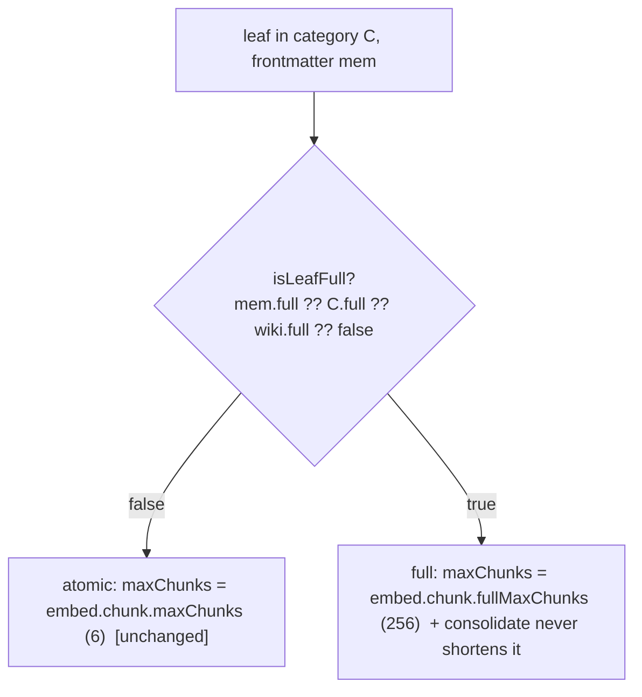

# Configurable full-vs-atomic leaves + `absorb` (import a whole document into the wiki)

## 0. Plain-language version — what we're building, where, and why

**What it is — two coordinated pieces.**
- **"Full" leaves.** Today the only thing that shortens a note is the session-capture→distill pipeline, and it produces only the small atomic `knowledge`/`self_improvement` notes. Everything else (plans, investigations, and anything saved directly) is already stored whole. We make "store this whole, never shorten it, and embed the WHOLE thing for search" a first-class, configurable property: a wiki category can be marked **full** in its layout (and a whole wiki can default to full, and any single note can force it in its own frontmatter). A full note is stored verbatim and — unlike today's 6-piece embedding cap — is split into as many pieces as it takes so **all** of it is searchable.
- **`absorb`.** A new way to pull **existing markdown into a wiki as whole notes** — one file, a whole directory tree, or a glob (`*` / `**`), with an optional repeatable file-mask filter (default: markdown). For each file the system reads it, uses the model to work out where within the target category it belongs (its `subject` path / sub-module `area` / type), lets you override, then writes the file's full text as one note in the right place and embeds all of it. Available as an assistant tool and a terminal command (`cli.mjs absorb <path…> [--match …]`).
- **The shared-team-wiki template becomes a full-doc wiki.** The shipped `repo` template (what a team commits into their project) is set to **full** leaves, nested **2 levels — `knowledge/<domain>/<subtopic>/<leaf>`** (drop the atom-type folder; whole docs aren't typed atoms) so teammates can browse it in their IDE, with a **universal team `subject_domains`** vocabulary (architecture, product, operations, data, security, process, onboarding, integrations, decisions, reference, general) instead of the old dev-tool-centric list.

**Where.** The engine at `~/.llm-wiki-memory/src`: the layout schema + parser (the `full` flag), the embedding path (uncapped chunking for full notes — building directly on the just-shipped chunker), the placement engine (to put an absorbed file in the right folder), and a new small `absorb` module wired to an MCP tool + a CLI command.

**Why.** Short atomic notes are great for distilled lessons/facts, but some knowledge is a whole document (a design doc, an RFC, a spec) that loses meaning when chopped into 700-char atoms — and you may already have such files you want in the wiki. This lets those live whole, land in the right place, and be fully searchable, without changing anything about how atomic notes work today.

**What stays the same.** The session-capture→distiller is **untouched** — it still produces atomic `knowledge`/`self_improvement` notes and never writes into a full category. Atomic notes keep the 6-chunk embedding cap and identical ranking. Retrieval, the write-gate, consolidate on atomic categories, and every existing note are unchanged. "Full" and `absorb` are strictly additive.

## 1. Context

Investigation (3 read-only agents) established:
- **Shortening happens in exactly one place on the write path** — `flush-validate.mjs:97-104` truncates each distilled atom (~700 chars, `compile.atomBodyMaxChars`); the flush prompt tells the LLM to compress. The distiller targets **only** `knowledge`/`self_improvement` (`datasets.mjs ATOM_TYPE_TO_DATASET`). **Direct saves (`save_to_dataset`/`write_memory`/`saveDocument`) are verbatim, no cap**; `plans`/`investigations`/`daily` are `consolidate: none` and stored whole. Consolidate re-shortens only `consolidate: refine` categories (`consolidate-llm-{refresh,merge}.mjs`, `consolidate-corpus-passes.mjs compressArchived`).
- **Layout category schema** = `LayoutEntrySchema` (`layout-schema.mjs:108-133`, `.strict()`); a new optional `full` field slots beside `consolidate`. Top-level `LayoutYamlSchema` is `.passthrough()`. Parsed in `wiki-layout-parse.mjs` (mirror the `consolidate` projection ~177-182); exposed via a `wiki-layout-state.mjs` accessor (mirror `getConsolidateLayout`). Layout auto-reloads on mtime; `validate_layout` uses the schema; live reads tolerate a strict-fail via unvalidated fallback.
- **Placement** = `placementDirForMeta(category, meta)` (`wiki-placement.mjs:119-135`) from the category's `placement_facets` (scalars via `facetValue`; `subject` via `pathFacetSegments`, first segment ∈ the category's `vocabulary`). `saveDocument({placementOverride})` writes at an exact dir, skipping facet inference, validated by `assertKnownSlot`/`assertTopologyPlacement`.
- **Content→metadata inference exists but is unused on save**: `classifyWithLLM({category,title,text,tags,areaChoices,typeChoices,want})` (`facets-classify-llm.mjs:27`) infers `area`/`atom_type` from allowed lists (2000 chars of content); it does **not** infer `subject` or topology facets. Reusable for `absorb`, needs a `subject` extension.
- **Embedding** (just shipped): `embed-chunk.mjs` chunks a leaf's body over ≤`embed.chunk.maxChunks` (6) windows; `scoreLeaf` = penalized max. A full doc past ~6 chunks would have its tail unembedded — so full leaves need an uncapped chunk count.

**User-locked decisions (grilled):** (1) `full` is **per-category** in layout + a **per-doc frontmatter override** (+ a wiki-level default). (2) A full note is **one whole leaf, verbatim** (never split/summarized). (3) **Uncap embedding for full leaves** (embed the whole doc; atomic keeps the 6-cap). (4) `absorb` = **MCP tool + CLI**; **you name the category, the LLM infers the within-category facets, you can override**. (5) Full categories are fed by **absorb + direct save only** — the distiller is never retargeted (so zero capture-pipeline changes).

## 2. Locked decisions

- **`full` is a per-category layout boolean** (`full: true`), with a **top-level wiki default** (`full: true` at the layout root) and a **per-leaf frontmatter override** (`memory.full: true`). Precedence: leaf frontmatter > category > wiki-default > `false`.
- **`full` means: never shortened + embedded whole.** Mechanically, because the distiller never targets full categories and direct saves are already verbatim, `full` only needs to (a) **uncap embedding** for the leaf and (b) **exempt the leaf from consolidate body-compression** (guards a per-doc-full leaf living in a `refine` category). **No change to flush/compile.**
- **Uncapped embedding = a high safety ceiling, not literally unbounded.** New `embed.chunk.fullMaxChunks` (default 256 ≈ ~120k tokens ≈ ~500 KB — every realistic doc fully covered; the ceiling only guards a pathological multi-MB file, and hitting it logs a breadcrumb).
- **`absorb` targets FACET-PLACED categories** (auto-infers `area`/`subject`/`atom_type`). Topology categories (`issues`) need explicit `tracker/prefix/number[/…]` facets (no content heuristic) — `absorb` accepts them as explicit args but never auto-infers them. You always name the `category`; the LLM infers within-category facets; you override any; a `--dry-run`/preview returns the proposed placement without writing.
- **`absorb` stores the file verbatim as one leaf and marks it full** (sets `memory.full` when the target category isn't itself full), so it's embedded whole. LLM-unavailable → fall back to sentinel placement (`area=unscoped`, `subject=general`) + a warning, never hard-fail (classify already error-falls-back).
- **Additive, not breaking.** New optional layout field + new tool + new CLI verb + a new settings knob. An older engine ignores `full` (reads fine; only `validate_layout` on the old engine would flag the unknown key). Ship a short doc/runbook note.
- **No auto-commit/push** — hand off; the user is the git gate.

### 2b. Plan-review corrections (2 read-only agents vs real code; these OVERRIDE the body where they conflict)

- **C1 (CRITICAL) — `memory.full` is dropped on write.** `normaliseMeta` (`wiki-identity.mjs:87-144`) serializes a FIXED whitelist (no passthrough); `full` is not in it, so `absorb`'s `metadata.full`, the per-doc override, and any consolidate re-save all lose the flag. FIX: add `if (m.full === true) out.full = true;` to `normaliseMeta` — this also makes re-save preservation work for free (re-saves pass `leaf.memory`). `wiki-identity.mjs` is now a load-bearing edit (was omitted from §4/§8).
- **C2 (HIGH) — uncapped chunks would BURY full leaves via the penalty.** `scoreLeaf = best − penalty·(n−1)` (default 0.015); a 40-chunk full doc eats ~0.585 → ranks terribly, defeating "all of it searchable." FIX: **full leaves use penalty 0** — thread `full` into `scoreLeaf`/`scoreTree`; add `embed.chunk.fullPenalty` (default 0). The many-chunks penalty guards weak ATOMIC leaves; it must not apply to an intentional full doc.
- **C3 (HIGH) — `absorb` must REFUSE gated + topology categories.** The wire carries no `gate.userRequested` (so a `self_improvement` target can't satisfy the L3 gate) and no `path` (so a topology `issues` category fails `assertTopologyPlacement`). FIX: `absorb` accepts only facet-placed, non-gated categories and refuses `self_improvement`/topology with a clear, actionable error (consistent with "facet-placed only").
- **C4 (MED) — idempotency needs a category-wide name check.** Under `placementOverride`, `saveDocument`'s existence check is scoped to the override dir only — re-absorbing a file the LLM now places at a different `area`/`subject` writes a DUPLICATE. FIX: `absorb` runs a category-wide `findByName` first and reuses the existing leaf's placement (overwrite in place), so re-absorb is idempotent regardless of LLM drift.
- **C5 (MED) — sentinel `subject` must be OMITTED, not `["general"]`.** `pathFacetSegments` throws on a non-empty first segment outside the vocabulary; the fallback applies only when subject is EMPTY. FIX: on LLM fallback/unknown subject, OMIT `subject` (let the facet rule's `fallback` apply) and/or run `remapUnknownPathFacets` before `placementDirForMeta`.
- **C6 (LOW) — `absorb` wraps classify itself.** `classifyWithLLM` does NOT catch (`callLLMWithRetry` throws `LLMProviderUnavailable`); the error-fallback lives in `classifyFacetsLLM`, not the fn we extend. `absorb` must try/catch classify → sentinel.
- **C7 — `classifyWithLLM` is not exported** (only `classifyFacetsLLM`): export it, add `want.subject` + a `subjectChoices` param fed from `placementRulesFor(cat).subject.vocabulary` (`vocabularyFor`).
- **C8 — MCP tool takes `text`, CLI reads the `file`** (portable; fs read stays client/CLI-side). Tools register via `registerWriteTools` (`index.mjs`).
- **C9 — extract a helper**: `wiki-search.mjs` is 298/300; threading `full` must move logic into a helper (embed-chunk) to stay ≤300. warm + search must resolve `full` IDENTICALLY or chunk-hash-length mismatch causes re-embed thrash (not incorrectness).

### 2c. Follow-up scope (user-added after review)

- **Batch absorb — file OR directory OR glob (see D1/D2/D3/D7 for the pinned specifics).** A `absorbPaths({paths, match, category, overrides, dryRun})` core (in `absorb-batch.mjs`): for each `paths` entry — a file → absorb it; a directory → recurse; a glob (`*`/`**`) → expand — collect the files whose name matches any `match` mask (repeatable; **default markdown** `**/*.md`,`**/*.markdown`) via a small **dep-free, unit-tested glob→RegExp + recursive walk** (`fs.globSync` is Node-22-only; separators normalized). Process files **SEQUENTIALLY** (D7), **continue-on-error** (a failing file is reported in `failed[]`, never aborts). The leaf `name` = a deterministic slug of the source path relative to the absorb root (D1 — the idempotency + collision key). `dryRun` classifies each file and returns the proposed `{category, dir, metadata}` but writes nothing. **The CLI (`absorb <path…> [--match=<glob>]…`, equals-form D3) is the batch/fs entry; the MCP tool is a single inline `text` doc (D2)** — an agent absorbs a directory by invoking the CLI. `--category`/overrides are batch-wide; per-file `area`/`subject` are LLM-inferred within that category.
- **Shared `repo` template → full-doc team wiki** (`examples/layouts/repo/layout.yaml`, seeded by `mount-init`): set the `knowledge` category `full: true`; **placement_facets: `[subject]`** (drop `atom_type` from the PATH — it stays in frontmatter for filtering) so the tree is `knowledge/<domain>/<subtopic>/<leaf>` (the absorb classifier returns a ≤2-segment `subject` = domain + optional subtopic; first segment ∈ vocab); replace `subject_domains` with the **universal team vocab** (architecture, product, operations, data, security, process, onboarding, integrations, decisions, reference, general); `consolidate: none` and `ownership: repo` unchanged; refresh the purpose/comment prose. The **default (private) layout is untouched** (still `area/atom_type/subject…`, atomic).
- **TDD-diagnosis discipline (every phase).** Each phase: write tests FIRST (RED) → implement → GREEN → full unit + e2e coverage. When a test fails, explicitly diagnose the cause — **bad TDD planning vs. wrong implementation vs. a wrong/over-specified test** — and fix the right thing (never just force the test green). This is the `testing.md` + `implementation-review-loop.md` gate, reaffirmed per the user.
- **`absorb` AGENT skill + discipline pointer (so the assistant does it properly).** A new `templates/skills/absorb/SKILL.md` (mirrors the capture skills; auto-`@`-pointer-wired to `.claude/skills`/`.agents`/`.cursor`) + a one-line **rule 17** in `templates/agents-memory-instructions.md` ("to absorb/import external docs into a wiki, follow the `absorb` skill"). The skill's procedure: **(1) trigger** on "absorb / import / ingest / pull in" a file/dir/docs into a wiki; **(2) resolve scope+target** via `get_memory_config` (levels: root/mountDir/ownership) + `list_datasets` — map "shared/team" → the `ownership: repo` level, "my/private" → the brain; **(3) pick a `full` category** (prefer an existing one, e.g. `docs`); if none exists in the target wiki, **propose creating one (or a per-doc `full` override) and CONFIRM**; **refuse** gated (`self_improvement`) / topology (`issues`) categories; **(4) batch → dry-run + confirm** (`cli.mjs absorb <path> --match=… --category=… --dry-run` → show the file→category/dir table → get OK + overrides → run for real), **single doc → absorb directly** (MCP `absorb_document` with `text`) + report; **(5) understand each leaf** — trust the per-file classifier but eyeball the dry-run for obvious misplacements and override `area`/`subject` when clearly wrong; **(6) efficiency** — one CLI invocation for a tree (not N tool calls), idempotent (re-absorb overwrites), never re-work unchanged files; **(7) shared-write note** — absorbing into a shared repo STAGES leaves (no engine git) → tell the user to commit + push; **(8) report** what landed / was skipped / failed. `discipline.test.mjs` pins rule 17.

### 2d. Final deep-review corrections (2 read-only agents vs real code; these OVERRIDE the body where they conflict)

- **D1 (HIGH) — leaf-name rule, pinned.** The leaf `name` for an absorbed file = a deterministic slug of the source path **relative to the absorb root** (the dir/glob base the user gave; a single file → its basename slug), extension kept. Used BOTH as the collision key and the `findByName` idempotency key. So two same-basename files under different subdirs get distinct names (`a/notes.md`→`a-notes.md`, `b/notes.md`→`b-notes.md`), and re-absorbing the same root overwrites in place (idempotent). `absorbDocument` takes the derived `name` from the caller (the batch layer computes it); a single-doc MCP call passes an explicit `name`.
- **D2 (MED) — MCP tool is `text`-only; the CLI is the batch entry (upholds C8).** Reading arbitrary fs `paths` inside the MCP server resolves relative paths against the SERVER cwd (scopes → `WikiContext`, not the shell), a silent-wrong footgun and a reversal of C8. So: **MCP `absorb_document({scopes, target, write:{text, name, category, metadata?, dryRun?}})` = one inline doc**; **`cli.mjs absorb <path…>` = the file/dir/glob batch** (fs is the CLI's job). An agent absorbs a directory by invoking the CLI.
- **D3 (MED) — CLI equals-form flags.** The codebase parses `--k=v` and fails loud on the space form (`cli-consolidate.mjs`). Use `--match=<glob>` (repeatable: `rest.filter(a => a.startsWith("--match="))`), `--category=…`, `--area=…`, `--dry-run`, with positional `<path…>` = the non-`--` args. Note the positional+flag mix is novel for this repo — parse explicitly.
- **D4 (HIGH) — F7 test blast-radius.** The repo-template change breaks `test/repo-template.test.mjs` (whole file pins subject→atom_type + old vocab) and the REPO rows of `test/e2e/federation-corpus.mjs` (`EXPECTED_PLACEMENT`, uses `observability`/`languages` — gone from the new vocab). F7 MUST rewrite both to the new `[subject]` 2-level scheme + universal vocab, or `npm run gates` (F9) goes red.
- **D5 (MED) — `isLeafFull` lives in `wiki-layout-state.mjs`** (it already imports `wiki-core` and exports `isFullCategory`); putting it in `wiki-core.mjs` forms a `wiki-core ↔ wiki-layout-state` import cycle. Name the per-leaf embed flag distinctly (e.g. `leafFull`/`item.full`) from the existing `syncEmbeddings({full})` ("warm all shared cats").
- **D6 (LOW) — `fullPenalty` uses `coerceFloat01`** (0∈[0,1]); `coercePos` would reject 0 and silently disable penalty-0.
- **D7 (LOW) — batch is SEQUENTIAL.** No LLM backoff/concurrency helper exists (consolidate/`embedMany` are sequential); `absorbPaths` processes files sequentially (lowest-risk, codebase norm). `classifyWithLLM` caps content at 2000 chars, so per-file cost is bounded. `dryRun` skips WRITES but still classifies each file (it needs the LLM to show the proposed `dir`) — reword the "previews before N LLM calls" framing.
- **D8 (LOW) — file placement:** discipline text → `templates/agents-memory-instructions.md` (+ `templates/rules`); there is NO hardcoded tool-count to bump (drop that F8 sub-task). The new MCP tool registers in `mcp-server/tools-write.mjs` (`registerWriteTools`), not `index.mjs`. Consider splitting `absorb-batch.mjs` from `absorb.mjs` to stay ≤300. `[subject]`-only path inversion is trivially unambiguous (every segment IS subject) — just refresh the repo-template design comment.

## 3. Diagrams

`absorb` flow:
```mermaid
sequenceDiagram
  participant U as absorb_document / cli.mjs absorb
  participant A as absorb.mjs
  participant C as classifyWithLLM (+subject)
  participant P as placementDirForMeta
  participant S as saveDocument (verbatim)
  participant E as embed-chunk (uncapped for full)
  U->>A: { file|text, category, overrides?, dryRun? }
  A->>A: read content; title = first #-heading || filename slug
  A->>C: infer area / atom_type / subject (within `category`, from allowed lists + vocab)
  C-->>A: inferred facets (LLM; sentinel fallback if unavailable)
  A->>A: merge caller overrides over inferred
  alt dryRun
    A-->>U: proposed { category, dir, metadata } (no write)
  else write
    A->>P: dir = placementDirForMeta(category, meta)
    A->>S: saveDocument({ placementOverride: dir, text: FULL body, metadata: {…, full unless category full} })
    S->>E: on next recall/warm, chunk the WHOLE body (fullMaxChunks)
    A-->>U: { id, dir, metadata }
  end
```

`full` resolution + effect (per leaf, at embed time):


## 4. Topology tree — change sites

```
~/.llm-wiki-memory/src
├─ scripts/lib/
│  ├─ layout-schema.mjs        + full: z.boolean().optional() on LayoutEntrySchema (:131, beside consolidate); + top-level full on LayoutYamlSchema
│  ├─ wiki-layout-parse.mjs    project per-category `full` (mirror consolidate ~:177) + capture top-level wiki-default full
│  ├─ wiki-identity.mjs        ★ C1 normaliseMeta: persist `full` (if m.full===true out.full=true) — the load-bearing fix; leafMemory already reads it
│  ├─ wiki-layout-state.mjs    + isFullCategory(cat) (mirror getConsolidateLayout) AND isLeafFull(cat,mem)=mem.full||isFullCategory (D5 — here, not wiki-core; avoids a cycle)
│  ├─ embed-chunk.mjs          cachedLeafVectors: per-item leafFull -> maxChunks = full ? fullMaxChunks : maxChunks;  scoreLeaf/scoreTree: penalty = full ? fullPenalty(0) : penalty (C2)
│  ├─ wiki-search.mjs          (298/300!) searchOneTree: resolve isLeafFull per candidate -> item.full; EXTRACT a helper to stay <=300 (C9)
│  ├─ settings-{defaults,validate,accessors}.mjs   + embed.chunk.fullMaxChunks (256) + embed.chunk.fullPenalty (0)
│  ├─ absorb.mjs               * NEW - absorbDocument({text,name,category,overrides?,dryRun?}): classify(try/catch) -> findByName-reuse|place -> saveDocument verbatim full; refuses gated/topology
│  ├─ absorb-batch.mjs         * NEW - absorbPaths({paths,match,category,overrides,dryRun}): collectFiles -> SEQUENTIAL per-file absorbDocument (name=slug(relpath,root)); continue-on-error; {absorbed,skipped,failed} (split to keep <=300)
│  ├─ glob-match.mjs           * NEW - dep-free globToRegExp + collectFiles(paths,masks)->{file,root}[] (files/dirs/*/**, sep-normalized); default masks **/*.md,**/*.markdown; unit-tested (fs.globSync is node22-only)
│  └─ facets-classify-llm.mjs  EXPORT classifyWithLLM; + want.subject + subjectChoices (vocabularyFor); out-of-vocab -> OMIT subject
├─ scripts/hooks/sync-embeddings.mjs   warmCategory: resolve isLeafFull per leaf -> item.full (uncapped warm for full leaves)
├─ scripts/consolidate-llm-refresh.mjs / consolidate-llm-merge.mjs / consolidate-corpus-passes.mjs   skip body-cap when isLeafFull(cat,mem)
├─ mcp-server/tools-write.mjs  + absorb_document tool (registerWriteTools) — TEXT-ONLY single doc {scopes, target, write:{text, name, category, metadata?, dryRun?}} (D2)
├─ scripts/cli.mjs             + `absorb <path...> [--match=<glob>]... [--category=] [--area=|--subject=|--atom-type=] [--dry-run]` -> cli-absorb.mjs (calls absorbPaths; equals-form D3)
├─ examples/layouts/repo/layout.yaml   ★ shared-team template: knowledge full:true; placement_facets [subject] (drop atom_type); universal subject_domains; refreshed prose
├─ templates/skills/absorb/SKILL.md          ★ NEW agent skill — the 8-step absorb procedure (added to the shipped skill set in wire-memory-surfaces.mjs)
├─ templates/agents-memory-instructions.md   + rule 17 (one-line pointer to the `absorb` skill; discipline.test pins it)
├─ scripts/wire-memory-surfaces.mjs          include `absorb` in the shipped skills so it @-pointer-wires to .claude/skills/.agents/.cursor
├─ templates/settings.yaml     document embed.chunk.fullMaxChunks + fullPenalty
├─ examples/layouts/…          (optional) a `docs` full-category example
└─ docs/embeddings.md + docs/releases/2026/07/…/update-prompt.md   full mode + absorb + the additive `full` field
```

## 5. Mandatory skills / gates (bound plan → impl → review)

- **testing.md** (hard): exhaustive TDD, edge cases, no-regression — RED→GREEN per phase.
- **no-comments.md** / **≤300-line modules** (`check:comments` / `check:size`): `absorb.mjs` is a NEW module; watch `embed-chunk.mjs`/`wiki-search.mjs` (near 300) when threading `full` — keep logic in helpers.
- **deadcode (knip)** clean; new exports must be used.
- **implementation-review-loop.md**: parallel reviewers (layout+embedding correctness · absorb/placement+LLM-fallback · determinism/no-regression) + `@ctxr/skill-codereview` + `/general:improve-readability`.
- **releases-docs**: additive → a short runbook + `docs/embeddings.md`/README update; **new MCP tool + a config change → the `discipline.mjs` INSTRUCTIONS + templates must teach `absorb` and the `full` layout field** (tool-count/rules).
- **plain-language-section.md** + **topology-tree.md**: §0, §4.
- **plans-lifecycle.md**: `status: pending → in-progress → done`.
- Recall/embedding lessons bound: reuse `embedTextForLeaf`, per-category content-hash caches, batched `embedMany`, don't disturb the banded depth-boost / federation determinism; the whole-leaf `vector` invariant from the chunking work still holds.

## 6. Phased, max-granularity checkboxes (TDD; gate per phase)

- [ ] **F1 — the `full` layout flag + resolver + FRONTMATTER PERSISTENCE (no behavior change yet).**
  - [ ] **C1: `wiki-identity.mjs normaliseMeta` — persist `full`** (`if (m.full === true) out.full = true;`). RED: a leaf saved with `metadata.full:true` round-trips `memory.full:true` on disk; a re-save (`updateDocMetadata`/consolidate) that passes the existing memory PRESERVES it. This is the load-bearing fix — without it every other `full` mechanism is dead.
  - [ ] `layout-schema.mjs`: `full` on `LayoutEntrySchema` + an explicit top-level `full` on `LayoutYamlSchema`; `wiki-layout-parse.mjs` projects both; `wiki-layout-state.mjs` `isFullCategory(cat)`. RED tests: category full; wiki-default full; unknown key still validates; precedence.
  - [ ] `wiki-layout-state.mjs` `isLeafFull(cat, mem)` (D5 — lives here, NOT wiki-core, to avoid an import cycle): `mem.full === true || isFullCategory(cat)`; precedence frontmatter > category > wiki-default. Unit tests incl. `memory.full` override in an atomic category.
- [ ] **F2 — uncapped embedding + penalty-0 for full leaves.**
  - [ ] `settings`: `embed.chunk.fullMaxChunks` (default 256, `coercePos`) AND `embed.chunk.fullPenalty` (default 0, **`coerceFloat01`** so 0 survives — D6) — 3 settings files + template + tests.
  - [ ] `embed-chunk.mjs`: per-item `full` → `maxChunks = full ? fullMaxChunks : maxChunks` (in `cachedLeafVectors`) AND **`scoreLeaf`/`scoreTree` use `penalty = full ? fullPenalty(0) : penalty`** (C2 — else a many-chunk full doc ranks worse the longer it is). RED (fake tokenizer + vectors): a `full` item → >6 chunks AND its score is the raw best-chunk cosine (no penalty); an atomic item → ≤6 chunks + penalized (parity with today).
  - [ ] `wiki-search.mjs` `searchOneTree` + `sync-embeddings.mjs` `warmCategory`: resolve `isLeafFull(cat, mem)` per leaf → `item.full`, resolved IDENTICALLY on both paths (C9). **Extract a helper (embed-chunk) to keep `wiki-search.mjs` ≤300** (it is 298/300). Integration: a full-category leaf embeds uncapped + penalty-0; atomic unchanged.
- [ ] **F3 — consolidate exemption for full leaves.**
  - [ ] `consolidate-llm-refresh/merge` + `compressArchived`: skip the body cap when `isLeafFull(cat, mem)`. RED: a per-doc-`full` leaf in a `refine` category is NOT truncated by a consolidate pass; a normal atomic leaf still is.
- [ ] **F4 — `classifyWithLLM` export + subject inference.**
  - [ ] **EXPORT `classifyWithLLM`** (C7 — currently module-private). Extend to `want.subject` + a `subjectChoices` param (fed from `placementRulesFor(cat).subject.vocabulary` via `vocabularyFor`) → returns `subject[]` whose first segment ∈ the vocabulary; an out-of-vocab/absent result → **OMIT subject** (do NOT return `["general"]`, which throws in placement — C5). RED with a mock LLM.
- [ ] **F5 — `absorb.mjs` core (testable, LLM injected/mocked).**
  - [ ] `absorbDocument({text, name, category, overrides?, dryRun?})` (takes `text` + a caller-derived `name` — C8/D1): title from first `#` heading else the `name` slug; **REFUSE a gated (`self_improvement`) or topology category with a clear error** (C3); wrap `classifyWithLLM` in try/catch → on `LLMProviderUnavailable` fall back to sentinel (area=unscoped, subject OMITTED) (C5/C6); merge caller `overrides` over inferred; **category-wide `findByName(categoryAbs, name)` → reuse an existing leaf's placement** so re-absorb is idempotent (C4/D1 — the `name` is the stable key), else `placementDirForMeta`; `dryRun` → return the proposal (no write); else `saveDocument({placementOverride, text: full body, metadata:{…, full:true unless the category is already full}})`; return `{id, dir, metadata}`. RED: verbatim body; correct dir; `full` persisted; dry-run no-write; LLM-down sentinel (no throw, subject omitted); re-absorb (same name) → SAME leaf (no dup); unknown category throws; gated/topology category refused.
- [ ] **F5b — batch: `glob-match.mjs` + `absorb-batch.mjs` (file / dir / glob).**
  - [ ] `glob-match.mjs`: dep-free `globToRegExp` (`*`,`**`,`?`,`{a,b}`; POSIX + Windows separators normalized) + `collectFiles(paths, masks)` → `{ file, root }[]` (a `paths` entry may be a file, a directory → recurse, or a glob; keep only files matching any mask; default masks `**/*.md`,`**/*.markdown`; `fs.globSync` is Node-22-only so a hand-rolled matcher is REQUIRED — D8). Heavy RED unit table: `*` non-recursive, `**` recursive, extension unions, dir recursion, no-match, absolute vs relative, dedupe, `..`/backslash.
  - [ ] `absorb-batch.mjs` `absorbPaths({paths, match, category, overrides, dryRun})` (own module to keep ≤300 — D8): `collectFiles` → **SEQUENTIALLY** (D7) for each `{file, root}`: `name = slug(relpath(file, root))` (D1 — the stable idempotency + collision key), read, `absorbDocument({text, name, category, overrides, dryRun})`; **continue-on-error** (collect `{file, error}`, never abort). `dryRun` → return every file's proposed `{file, category, dir, metadata}` (still classifies per file — no write). Return `{ absorbed[], skipped[], failed[] }`. RED: a 3-file dir tree → 3 leaves at inferred paths; same-basename files in two subdirs → 2 DISTINCT leaves (D1); a non-matching file skipped; a mid-batch classify failure → that file in `failed`, the rest still absorbed; dry-run writes nothing; re-absorb the same root → no new leaves.
- [ ] **F6 — MCP tool (single doc) + CLI (batch).**
  - [ ] `absorb_document` MCP tool in `mcp-server/tools-write.mjs` via `registerWriteTools` (D8), nested wire `{scopes, target, write:{ text, name, category, metadata?, dryRun? }}` — **one inline doc, `text`-only** (D2/C8); refuses gated/topology categories in-handler. RED via the harness.
  - [ ] `cli.mjs absorb <path…> [--match=<glob>]… [--category=…] [--area=…|--subject=…|--atom-type=…] [--dry-run]` → `cli-absorb.mjs` (reads fs, calls `absorbPaths`): **equals-form flags** (D3; positionals = non-`--` args), `--help` guard (`lib/cli-args.mjs`). RED (file, dir, glob, dry-run, repeatable `--match=`).
- [ ] **F7 — shared-team template → full-doc wiki (`examples/layouts/repo/layout.yaml`).**
  - [ ] `knowledge`: `full: true`; `placement_facets: [subject]` (drop `atom_type` from the path); `facet_rules.subject {kind: path, vocabulary: subject_domains, fallback: general}`; `consolidate: none`, `ownership: repo` kept; refresh purpose/comment prose (2-level `knowledge/<domain>/<subtopic>` full-doc team wiki).
  - [ ] Replace `subject_domains` with the universal team vocab (architecture, product, operations, data, security, process, onboarding, integrations, decisions, reference, general); refresh the design comment (with `[subject]`-only, every path segment IS subject → inversion is trivially unambiguous — D8).
  - [ ] **D4: rewrite the tests that pin the OLD repo scheme** — `test/repo-template.test.mjs` (whole file: subject→atom_type paths + old vocab `frameworks`/`languages`) and the REPO rows of `test/e2e/federation-corpus.mjs` `EXPECTED_PLACEMENT` (`observability`/`languages` → gone) — to the new `[subject]` 2-level scheme + universal vocab; re-run `federation-placement-matrix.e2e`.
  - [ ] RED/verify: `validate_layout` clean on the new template; `mount-init` seeds it; an `absorb` into a repo-template wiki lands at `knowledge/<domain>/<subtopic>/<leaf>` full + embedded whole; the absorb classifier returns ≤2 subject segments for this layout. Confirm the DEFAULT layout is byte-unchanged.
- [ ] **F8 — absorb SKILL + discipline + docs + runbook.**
  - [ ] **NEW `templates/skills/absorb/SKILL.md`** — the 8-step absorb procedure (§2c): trigger → resolve scope+target (`get_memory_config`/`list_datasets`) → pick/confirm a `full` category (refuse gated/topology) → batch dry-run+confirm / single direct → verify placements → efficient one-shot + idempotent → shared-write commit note → report. Auto-`@`-pointer-wired by `wire-memory-surfaces.mjs` to `.claude/skills`/`.agents`/`.cursor` (add to the shipped skill set).
  - [ ] **Rule 17** in `templates/agents-memory-instructions.md` (the file `discipline.mjs` READS — D8): one line pointing at the `absorb` skill; `discipline.test.mjs` pins it. No hardcoded tool-count to bump.
  - [ ] Docs: `docs/embeddings.md` (full leaves embed whole); a shared-wiki doc note (full-doc template + nesting + curate `subject_domains`); `docs/releases/2026/07/…/update-prompt.md` (additive `full` field + `absorb` + the repo-template change); `templates/settings.yaml` (`fullMaxChunks`/`fullPenalty`).
- [ ] **F9 — standard closing phases.**
  - [ ] Full `npm run gates` green.
  - [ ] Edge-case pass (§7).
  - [ ] Review-until-clean (parallel agents + `@ctxr/skill-codereview` + `/general:improve-readability`).
  - [ ] Empirical: `absorb` a real directory of big .md files into a fake repo-template (shared) wiki (real model) → each lands at `knowledge/<domain>/<subtopic>/…` full, WHOLE body embedded (deep content findable); atomic recall unchanged.

## 7. Edge cases

- File with no `#` heading → title from `name` slug; empty text → refuse with a clear error.
- LLM unavailable/mock → `absorb` try/catch → sentinel `area=unscoped`, **`subject` OMITTED** (never `["general"]`, which throws in placement — C5) + warning; never hard-fail.
- Absorb into an unknown category → `assertKnownSlot` throws; into a **gated (`self_improvement`) or topology (`issues`) category → refused up-front** (the wire carries no `gate`/`path` — C3); facet-placed categories only.
- Absorb the same file twice, even if the LLM now infers a different area/subject → **category-wide `findByName` reuses the existing leaf** (overwrite in place), no duplicate (C4).
- Batch: an empty dir / a glob with no matches → clear "0 files matched" (no error); a non-markdown file not matching `--match` → skipped; a mid-batch per-file failure (classify error, unreadable file) → recorded in `failed[]`, the rest still absorbed (continue-on-error).
- Batch of a LARGE tree → bounded LLM concurrency + progress; `--dry-run` previews all proposed placements before committing to N writes/LLM calls; two files with the same basename in different dirs → distinct leaf names (path-derived slug) to avoid a same-name collision within one category.
- Glob matching is deterministic + cross-platform (path separators normalized); `**` recurses, `*` does not cross a dir; masks are OR-combined.
- Shared repo template: the DEFAULT (private) layout is byte-unchanged; existing shared wikis keep their own committed `layout.yaml` (only newly-seeded ones get the improved template).
- `memory.full` override on a leaf in an ATOMIC (`refine`) category → embedded uncapped AND consolidate skips shortening it (F3).
- `full: true` + `consolidate: refine` on one category (contradictory) → full wins for shortening (never body-capped); documented.
- Pathological huge file → `fullMaxChunks` ceiling bounds vectors; log when hit.
- Atomic leaves: byte-identical embedding + ranking to today (assert parity — `full` defaults false everywhere).
- Old engine reads a layout with `full` → ignored on read (passthrough/tolerant); `validate_layout` on the old engine flags the unknown key (additive-field caveat — runbook note).
- `absorb` never targets `self_improvement` (refused per C3, since the wire can't carry `gate.userRequested`); the normal `save_lesson` gate path is unaffected.
- `memory.full` persists through a consolidate/`updateDocMetadata` re-save (C1 guard in `normaliseMeta`), so a full leaf stays full across maintenance.
- Federation/determinism: `full` only raises a leaf's own chunk count; the banded depth-boost + `resolvedRoot\0id` dedup are untouched (assert `federation-routing-edge` green).

## 8. Critical files

- New: `scripts/lib/absorb.mjs` (`absorbDocument`), `scripts/lib/absorb-batch.mjs` (`absorbPaths`, D8 split), `scripts/lib/glob-match.mjs`, `scripts/cli-absorb.mjs`, `templates/skills/absorb/SKILL.md`, `test/{absorb,absorb-batch,glob-match}.test.mjs` (+ e2e), `docs/releases/2026/07/…/update-prompt.md`. (The `absorb_document` MCP tool is added IN `mcp-server/tools-write.mjs`, not a new file — D8.)
- Edit (templates/config): **`examples/layouts/repo/layout.yaml`** (shared-team: full + `[subject]` nesting + universal `subject_domains` + prose).
- Edit: **`wiki-identity.mjs` (C1 — persist `full`; load-bearing)**, `layout-schema.mjs`, `wiki-layout-parse.mjs`, `wiki-layout-state.mjs`, `wiki-core.mjs`, `embed-chunk.mjs`, `wiki-search.mjs` (extract helper, 298/300), `sync-embeddings.mjs`, `settings-{defaults,validate,accessors}.mjs`, `facets-classify-llm.mjs` (export + subject), `consolidate-llm-{refresh,merge}.mjs`, `consolidate-corpus-passes.mjs`, `cli.mjs`, `templates/agents-memory-instructions.md` (rule 17 — the file `discipline.mjs` reads, per I1), `scripts/wire-memory-surfaces.mjs` (ship the `absorb` skill), `templates/settings.yaml`, `docs/embeddings.md`.
- Reuse (do NOT reinvent): `placementDirForMeta`/`normalisePlacementOverride` (`wiki-placement.mjs`), `saveDocument`+`placementOverride` (`wiki-mutate.mjs`), `classifyWithLLM` (`facets-classify-llm.mjs`), `embedTextForLeaf`/`leafMemory`/`isActive` (`wiki-core.mjs`), `cachedLeafVectors`/`scoreLeaf`/`chunkTexts` (`embed-chunk.mjs`), `getConsolidateLayout` pattern (`wiki-layout-state.mjs`), the `--help` guard (`lib/cli-args.mjs`).

## 9. Verification

- Unit: `normaliseMeta` persists `full` (round-trip + re-save preservation); layout `full` parse/precedence; `isFullCategory`/`isLeafFull`; `cachedLeafVectors` uncaps a full item (fake tokenizer, >6 chunks) + penalty-0 + atomic parity; consolidate skips a full leaf; `classifyWithLLM` subject (mock, out-of-vocab omitted); `absorbDocument` (verbatim, dir, full persisted, dry-run, sentinel no-throw, idempotent under drift, unknown/gated/topology refused); `glob-match` table; `absorbPaths` batch (dir tree, no-match, continue-on-error).
- Integration/e2e: `absorb` a DIRECTORY into a repo-template (shared, full) wiki (mock LLM) → each file at `knowledge/<domain>/<subtopic>/<leaf>`, verbatim + full; `validate_layout` clean on the new repo template + DEFAULT layout byte-unchanged; searchMemoryFiltered surfaces deep content; atomic categories byte-identical.
- Empirical (real bge-large): a big absorbed doc's whole body is embedded (tail findable, penalty-0 so it ranks); atomic recall unchanged.
- Every phase: TDD RED→GREEN, then diagnose any failure as bad-plan / bad-impl / wrong-test (§2c).
- Skill/discipline: `discipline.test.mjs` pins rule 17; `templates/skills/absorb/SKILL.md` exists and `@`-pointer-wires to `.claude/skills`/`.agents`/`.cursor` (a `wire-memory-surfaces` test asserts the shipped set includes `absorb`); the skill's dry-run→confirm + refuse-gated/topology steps are exercised at least once end-to-end.
- `npm run gates` green; runbook + discipline + skill updated; no engine auto-commit (hand off).
```
