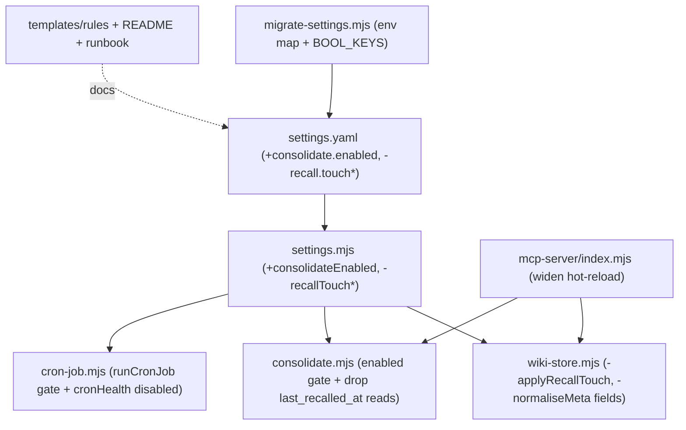

# llm-wiki-memory: remove recall-touch, make consolidation opt-in everywhere, widen hot-reload

**Status:** pending
**Target repo:** `/Users/developer/repos/.llm-wiki-memory/src` (clone of `github.com/ctxr-dev/llm-wiki-memory`, branch `main`)
**Date:** 2026-07-02 UTC
**Breaking:** yes (two breaking changes) → one release runbook `docs/releases/2026/07/02/update-prompt.md`

## Contents
0. Plain-language version — what we're building, where, and why
1. Context
2. Locked decisions
3. Mandatory skills / gates
4. System map (topology tree)
5. Diagrams
6. Phased checkboxes
7. Edge cases
8. Critical files
9. Verification

---

## 0. Plain-language version — what we're building, where, and why

**What this is.** The project has a local "memory" system called llm-wiki-memory. It stores notes as plain text files (called "leaves") and lets AI assistants search and read them. The program that answers those searches is a long-running background service called an "MCP server". All of this code lives in the folder `/Users/developer/repos/.llm-wiki-memory/src`. We are making three changes to that code, plus one housekeeping step first.

**Change 1 — stop writing to a note just because it was read, and remove that feature completely.** Today, every time the memory system finds and returns a note in a search, it also *edits that note* to record the time it was last read and a running count of how many times it was read. Reading a note quietly changes the note on disk. The user wants this removed entirely: not just the writing, but every place in the code that reads or handles those two recorded values ("last read time" and "read count"). After the change, nothing in the code uses them at all. We will NOT go back and clean those values out of note files that already contain them — the values will just sit there, ignored by all code — but no new note will ever get them and no code will read them.

**Change 2 — make "reconciliation" optional, off by default, and off everywhere.** "Reconciliation" (the code calls it "consolidation") is automatic maintenance that finds duplicate or near-duplicate notes, merges them, and marks very old notes as stale. It can be triggered several ways: an hourly scheduled job ("the cron"), a direct command, or an on-demand tool call. The user wants a single on/off switch in the settings file `settings.yaml`, **off by default**, and when it is off, consolidation must do nothing **no matter how it is triggered** — the hourly job, the command line, and the on-demand tool all become no-ops. Because the hourly job exists mainly to run this maintenance, turning the switch off also stops the whole hourly job. Turning it off deletes nothing and uninstalls nothing; it just makes the maintenance inert until someone sets the switch to on.

**Change 3 — make more code changes take effect without restarting the service.** Because the MCP server runs continuously, some changes to its code only take effect after a manual restart. Today: editing `settings.yaml` is picked up automatically on the next request (good), and two specific code files reload themselves automatically, but most other code files require a restart. The user asked us first to *check* this (done — that is the finding just stated) and then to *widen* the automatic reloading so more code files pick up changes without a restart. We will widen it where it is safe. One file that loads a large (~340MB) text-analysis model on startup will deliberately stay restart-only, because reloading it would reload that heavy model.

**Housekeeping — update to the latest code first.** Before the three changes, we bring the local copy up to date with the shared version on GitHub, so our edits sit on top of the newest code.

**Where each change lives.** All edits are inside `/Users/developer/repos/.llm-wiki-memory/src` (the engine, its settings templates, its documentation, and its tests). The settings file operators edit is `/Users/developer/repos/.llm-wiki-memory/settings/settings.yaml`.

**Why now / what prompted it.** These are direct user requests. The "write on read" behavior already caused one real problem (a stale copy of the server relocated notes and left uncommitted edits), so removing it removes a class of surprise. The consolidation switch turns a confusing number (where `0` actually means "run every time") into a plain yes/no that is off unless chosen. The hot-reload widening shortens the edit-and-see-it-work loop while developing the engine.

**What stays the same.** Existing note files are not rewritten or deleted. Searching and saving keep working exactly as before. The write-gate that protects "lessons" from being saved without your say-so is unchanged. Manual *compile* (a different maintenance step that promotes freshly-captured notes into long-term storage) still exists; only consolidation is gated by the new switch, and the hourly job that bundles them is off when the switch is off.

---

## 1. Context

Four asks, all scoped to `.llm-wiki-memory/src`:

1. **Remove the "recall-touch" feature entirely.** `searchMemoryFiltered` (and thus `recallLessons`) stamps `memory.last_recalled_at` + bumps `memory.recall_count` on returned leaves via `applyRecallTouch` → `updateDocMetadata` → `writeFileAtomic`. The user wants the write path removed AND every remaining code reference to those two fields removed (normalisation, staleness, orphan-prune, refresh sort). Existing on-disk leaves are NOT rewritten.
2. **Make consolidation optional, off by default, and off in every path** via one `settings.yaml` flag. Today there is no clean flag — only `consolidate.intervalDays`, whose `0` confusingly means *no throttle / run every tick*.
3. **Widen hot-reload coverage** (the user also asked to first *verify* current behavior — done below).
4. **Bring the clone up to latest** from `origin/main` first.

Verified hot-reload behavior (answer to ask #3's "check"):
- `settings.yaml` isn't watched but is re-read on the next `settings()` call via an mtime cache → value edits apply on the next tool call, **no restart**.
- Source hot-reload exists (`fs.watch` in `mcp-server/index.mjs`) but only `wiki-store.mjs` + `recall.mjs` are in `RELOADABLE`; everything else logs "restart required".

---

## 2. Locked decisions

| # | Decision | Why |
|---|---|---|
| D1 | **Fully remove** recall-touch from code (write path AND all reads). | Explicit user instruction. |
| D2 | Remove **all code use** of `last_recalled_at`/`recall_count`: drop them from `normaliseMeta`; switch `consolidate.mjs` staleness read to `frontmatter.updated`, delete the orphan-prune `last_recalled_at` guard, and key the 3B refresh sort off `updated`. **Do NOT** rewrite/strip existing `.md` leaves (values remain inert on disk). | User: "there should not be anything that uses it… we don't need to clean up md files." |
| D3 | New flag **`consolidate.enabled`** (in the existing `consolidate:` section), **default `false`** (opt-in). | User: reconciliation optional, off, one settings flag. Mirrors `consolidate.llmPassesEnabled` naming. |
| D4 | When `false`, gate the single chokepoint **`consolidateMemory()`** (covers MCP `consolidate_memory`, CLI `consolidate`, the hook-less `consolidate` skill, and the cron's consolidate step) **and** `runCronJob()` (so the hourly compile+consolidate stops). **Hard-off:** `force`/manual does NOT override — flip the flag to `true` to run. | User: "disable consolidation everywhere, not only in cron." |
| D5 | `cronHealth()` reports `healthy:true` + `summary:"consolidation disabled (consolidate.enabled=false)"` when disabled, still surfacing any open-escalation count. | Otherwise SessionStart nags "cron never ran / stale" forever. |
| D6 | Both changes are **breaking** (dropped config keys + env vars + leaf-shape change for recall-touch; new default-off flip for consolidation) → one runbook `docs/releases/2026/07/02/update-prompt.md`. | `releases-docs-authoring.md` gate. |
| D7 | Hot-reload widening: add `scripts/` to the watch and cache-bust MCP dynamic imports of `consolidate.mjs`/`compile.mjs` so their edits apply live. **`settings.mjs`, `embed.mjs`, `llm.mjs`, `index.mjs` stay restart-only** (embedding-backend re-init hazard) with an accurate operator message. | `dev-principles.md` + the documented settings.mjs exclusion. |
| D8 | Update-from-remote: `git config core.fileMode false` → `fetch` → `merge --ff-only origin/main` → `npm install`, then **re-verify anchors**. Leave the stray untracked `undefined/` dir alone. No commit/push (user gates git writes). | `cloud-sync-safety.md` + user's no-auto-commit rule. |

---

## 3. Mandatory skills / gates (bound across plan → implement → review)

- **`dev-principles.md`** (hard): `writeFileAtomic` for durable writes; no provider/model literals in `.mjs`; ESM static imports; comments only where non-obvious; discipline text on 3 surfaces changes together.
- **`testing.md`** (hard): `node:test` + `node:assert/strict`; lexical backend via `test/harness.mjs`; mock-provider seam only; sweep `/tmp/lwm-*`; iterate single files; `node --check` as syntax gate.
- **`releases-docs-authoring.md`** (hard): runbook for the breaking changes, exact structure, grep-verified log strings.
- **`no-comments.md`**, **`plain-language-section.md`** (§0 ✔), **`topology-tree.md`** (§4 ✔), **`cloud-sync-safety.md`** (fileMode/symlink mirrors), **`plans-lifecycle.md`**.
- **`run-tests-safely`** skill. Not Scala → `scala-*` gates N/A.

---

## 4. System map (topology tree)

<pre>
llm-wiki-memory/src
├─ <a href="../../repos/.llm-wiki-memory/src/scripts/lib/wiki-store.mjs#L1338">scripts/lib/wiki-store.mjs</a>
│  ├─ <a href="../../repos/.llm-wiki-memory/src/scripts/lib/wiki-store.mjs#L1338">applyRecallTouch()               :1338</a>  ★ DELETE (whole fn)
│  ├─ <a href="../../repos/.llm-wiki-memory/src/scripts/lib/wiki-store.mjs#L1469">recall-touch call site       :1456-1477</a>  ★ DELETE (call + comment)
│  └─ normaliseMeta() last_recalled_at/recall_count  :~486-496  ★ DELETE (drop keys entirely)
├─ <a href="../../repos/.llm-wiki-memory/src/scripts/lib/settings.mjs#L239">scripts/lib/settings.mjs</a>
│  ├─ consolidate defaults :239  ★ ADD `enabled:false` + coerceBool load
│  ├─ <a href="../../repos/.llm-wiki-memory/src/scripts/lib/settings.mjs#L602">recallTouchEnabled/​MinHours()   :602-604</a>  ★ DELETE (+ remove recall.touch* defaults)
│  └─ + <b>consolidateEnabled()</b> accessor (near :565-581)   ★ ADD
├─ <a href="../../repos/.llm-wiki-memory/src/scripts/migrate-settings.mjs#L102">scripts/migrate-settings.mjs</a>
│  ├─ MEMORY_RECALL_TOUCH* map :102-104  ★ DELETE · BOOL_KEYS recall.touchEnabled :123  ★ DELETE
│  └─ + MEMORY_CONSOLIDATE_ENABLED → consolidate.enabled (env map) + BOOL_KEYS  ★ ADD
├─ <a href="../../repos/.llm-wiki-memory/src/scripts/consolidate.mjs#L1217">scripts/consolidate.mjs</a>
│  ├─ <a href="../../repos/.llm-wiki-memory/src/scripts/consolidate.mjs#L1217">consolidateMemory()              :1217</a>  ★ ADD enabled gate at top → {skipped:"disabled"} (before throttle/lock; force does NOT override)
│  ├─ stalenessFlag() last read  :951  ★ EDIT → `frontmatter.updated` only (drop last_recalled_at)
│  ├─ pruneOrphanLeaves() guard  :1015 `if (m.last_recalled_at) continue;`  ★ DELETE
│  └─ 3B refresh sort/select     :712-713, 752  ★ EDIT → key off `updated`, drop last_recalled_at
├─ <a href="../../repos/.llm-wiki-memory/src/scripts/cron-job.mjs#L625">scripts/cron-job.mjs</a>
│  ├─ <a href="../../repos/.llm-wiki-memory/src/scripts/cron-job.mjs#L625">runCronJob()                     :625</a>  ★ ADD !consolidateEnabled() early-return {skipped:"disabled"}
│  └─ <a href="../../repos/.llm-wiki-memory/src/scripts/cron-job.mjs#L798">cronHealth()                     :798</a>  ★ ADD disabled branch (D5)
├─ <a href="../../repos/.llm-wiki-memory/src/scripts/cli.mjs#L180">scripts/cli.mjs</a>
│  └─ consolidate :180 (→consolidateMemory, gated) · cron-job :250 · cron-health :265 · compile :278 (ungated — not consolidation)
├─ <a href="../../repos/.llm-wiki-memory/src/mcp-server/index.mjs#L108">mcp-server/index.mjs</a>
│  ├─ RELOADABLE set :108 · watchForReload :110 · WATCH_DIRS  ★ WIDEN (D7)
│  ├─ recall-touch comment :344  ★ EDIT
│  └─ consolidate_memory tool dyn-import :670 (→consolidateMemory, gated)  ★ cache-bust (D7)
├─ <a href="../../repos/.llm-wiki-memory/src/templates/settings.yaml#L101">templates/settings.yaml</a>
│  ├─ recall touchEnabled/​MinHours :104-106  ★ DELETE · consolidate section :21  ★ ADD `enabled: false`
├─ <a href="../../repos/.llm-wiki-memory/src/templates/rules/memory-write-gate.md#L62">templates/rules/memory-write-gate.md</a> :62  ★ EDIT (drop recall-touch exemption bullet)
├─ <a href="../../repos/.llm-wiki-memory/src/templates/rules/cloud-sync-safety.md#L32">templates/rules/cloud-sync-safety.md</a> :32  ★ EDIT (recall-touch wording)
├─ <a href="../../repos/.llm-wiki-memory/src/README.md#L298">README.md</a> :298-310 (staleness), :470 (settings tbl), :565 (wiki-store desc)  ★ EDIT + add consolidate.enabled
├─ docs/releases/2026/07/02/update-prompt.md  ★ CREATE (runbook)
└─ test/  ★ recall-touch.test.mjs + normaliseMeta-memory-passthrough.test.mjs DELETE ·
          hardening-review-fixes / wiki-commit / migrate-settings / topology-save-validation /
          consolidate-* EDIT · + new consolidate-enabled + hot-reload tests
rendered consumer mirrors (outside src, re-rendered by bootstrap):
└─ /Users/developer/repos/.agents/rules/ + .claude/rules/ {memory-write-gate,cloud-sync-safety}.md  ★ EDIT/re-render
live install config:
└─ /Users/developer/repos/.llm-wiki-memory/settings/settings.yaml  ★ migrate (drop recall.touch*, add consolidate.enabled:false)
</pre>

---

## 5. Diagrams

### 5a. Recall path — before vs after (sequence)
```mermaid
sequenceDiagram
    participant U as MCP client
    participant S as searchMemoryFiltered
    participant D as disk (leaf)
    Note over U,D: BEFORE
    U->>S: search / recall
    S->>D: read + score leaves
    S-->>U: records
    S->>D: applyRecallTouch → writeFileAtomic (WRITE on read)
    Note over U,D: AFTER (feature removed; no code reads the fields either)
    U->>S: search / recall
    S->>D: read + score leaves
    S-->>U: records
    Note over S,D: no write — read is side-effect-free
```

### 5b. Consolidation gated in every path (sequence)
```mermaid
sequenceDiagram
    participant Cron as hourly cron → runCronJob()
    participant MCP as consolidate_memory tool
    participant CLI as cli.mjs consolidate
    participant CM as consolidateMemory()
    participant Set as settings.consolidate.enabled
    Cron->>CM: (via runCronJob, also gated)
    MCP->>CM: run
    CLI->>CM: run
    CM->>Set: enabled?
    alt enabled=false (default)
        CM-->>MCP: {ok:true, skipped:"disabled"} (no passes; force ignored)
        Note over Cron: runCronJob also early-returns disabled (compile+consolidate skipped)
    else enabled=true (opt-in)
        CM->>CM: dedup → merge → staleness → refresh
    end
```

### 5c. Component map (what each change touches)


---

## 6. Phased checkboxes

### Phase 0 — Update from remote + green baseline
- [ ] `cd /Users/developer/repos/.llm-wiki-memory/src`
- [ ] `git config core.fileMode false` (cloud-sync mode-bit guard)
- [ ] `git fetch origin`
- [ ] Inspect: `git log --oneline HEAD..origin/main` and `git diff --name-only HEAD origin/main -- docs/releases scripts/lib/wiki-store.mjs scripts/consolidate.mjs scripts/cron-job.mjs scripts/lib/settings.mjs`
- [ ] `git merge --ff-only origin/main` (mode-bit noise → `git checkout -- .` + retry; not fast-forwardable → STOP, surface to user)
- [ ] `npm install`
- [ ] New `docs/releases/**/update-prompt.md` arrived → surface to user before proceeding
- [ ] **Re-verify every anchor line number** against the merged tree
- [ ] Baseline: sweep `/tmp/lwm-*`, `npm test` once → green before editing

### Phase 1 — Remove recall-touch entirely (write + all reads)
- [ ] `wiki-store.mjs`: delete `applyRecallTouch()` (:1338-1382) and the call-site block (:1456-1477); `searchMemoryFiltered` returns `{ records }` directly
- [ ] `wiki-store.mjs`: `normaliseMeta` (:~486-496) — remove `last_recalled_at` + `recall_count` handling so they are dropped from output (no passthrough)
- [ ] `wiki-store.mjs`: remove now-unused imports (`recallTouchEnabled`, `recallTouchMinHours`); confirm `isSystemMaintenance` still used (consolidate exemption) — keep if so
- [ ] `consolidate.mjs`: `stalenessFlag` (:951) → `const last = leaf.frontmatter?.updated || null;` (drop last_recalled_at); verify flag still fires from `updated`
- [ ] `consolidate.mjs`: delete `pruneOrphanLeaves` guard `if (m.last_recalled_at) continue;` (:1015)
- [ ] `consolidate.mjs`: 3B refresh sort/select (:712-713, :752) → key off `frontmatter.updated`; remove last_recalled_at reads
- [ ] Grep the whole `scripts/` + `mcp-server/` tree for `last_recalled_at` / `recall_count` → zero non-test hits remain
- [ ] `settings.mjs`: remove `recall.touchEnabled` + `recall.touchMinHours` defaults + load/validation; delete accessors (:603-604); keep `recallScoreThreshold`, `recallPriorityBand`
- [ ] `migrate-settings.mjs`: delete `MEMORY_RECALL_TOUCH*` env map (:103-104) + `recall.touchEnabled` from `BOOL_KEYS` (:123)
- [ ] `templates/settings.yaml`: delete `touchEnabled`/`touchMinHours` + comment (:104-106)
- [ ] `wiki-commit` layer: remove dead `commitReason:"recall-touch"` git-silent sentinel iff exclusive to recall-touch (grep first)

### Phase 2 — `consolidate.enabled` flag (opt-in; consolidation off everywhere)
- [ ] `settings.mjs`: add `enabled: false` to the `consolidate` defaults + YAML load (`coerceBool(consolidate.enabled, false)`) + `export function consolidateEnabled() { return Boolean(settings().consolidate.enabled); }`
- [ ] `migrate-settings.mjs`: add `MEMORY_CONSOLIDATE_ENABLED: "consolidate.enabled"` to env map + `"consolidate.enabled"` to `BOOL_KEYS`
- [ ] `templates/settings.yaml`: add `enabled: false` at top of `consolidate:` with a comment (off = opt-in; disables consolidation in EVERY path — MCP/CLI/cron/skill; hourly cron also no-ops; manual `cli.mjs compile` unaffected)
- [ ] `consolidate.mjs` `consolidateMemory()` (:1217): early-return `{ ok:true, skipped:"disabled", llmRequested:false, llm:false }` when `!consolidateEnabled()`, BEFORE throttle/lock and regardless of `force`
- [ ] `cron-job.mjs` `runCronJob()` (:625): early-return `{ ts, kind:"cron-job", ok:true, skipped:"disabled", compile:null, consolidate:null, escalations:0 }` when `!consolidateEnabled()`, before any step/log write
- [ ] `cron-job.mjs` `cronHealth()` (:798): when `!consolidateEnabled()` return `{ healthy:true, summary:"consolidation disabled (consolidate.enabled=false)", disabled:true, openEscalations:<count> }` (<200-char summary)
- [ ] Confirm MCP `consolidate_memory` + CLI `consolidate` + hook-less `consolidate` skill all funnel through the gated `consolidateMemory()` → no separate gates needed

### Phase 3 — Widen hot-reload coverage
- [ ] `mcp-server/index.mjs`: add repo `scripts/` to `WATCH_DIRS` (so `consolidate.mjs`/`compile.mjs` are seen)
- [ ] Cache-bust (`?v=N`) the dynamic imports of `consolidate.mjs`/`compile.mjs` in their MCP tool handlers so edits apply without restart
- [ ] Add `settings.yaml` to the watcher: stderr breadcrumb + proactive settings-cache bust on change
- [ ] Keep `settings.mjs`, `embed.mjs`, `llm.mjs`, `index.mjs` restart-only; refine the "restart required" stderr message to name them explicitly; update the RELOADABLE comment block

### Phase 4 — Docs / discipline (3 surfaces) + runbook
- [ ] `templates/rules/memory-write-gate.md` (:62): remove the recall-touch exemption bullet
- [ ] `templates/rules/cloud-sync-safety.md` (:32): drop the "engine recall-touch frontmatter should differ" clause
- [ ] `mcp-server/index.mjs` (:344): update the recall-touch comment
- [ ] `README.md`: staleness (:298-310) → `frontmatter.updated` only (drop `last_recalled_at`); settings table (:470) remove `recall.touchEnabled`, add `consolidate.enabled`; wiki-store desc (:565) drop "Hosts the recall-touch instrumentation"
- [ ] Re-render consumer mirrors: edit `/Users/developer/repos/.agents/rules/{memory-write-gate,cloud-sync-safety}.md` + `.claude/rules/` (+ `.cursor/rules/` if present) — or re-run `bootstrap.sh` (pause cloud sync first)
- [ ] Create `docs/releases/2026/07/02/update-prompt.md` per `releases-docs-authoring.md`: (a) recall-touch removed — keys `recall.touchEnabled`/`touchMinHours` + `MEMORY_RECALL_TOUCH*` gone, leaves no longer stamped, no code reads the fields; (b) `consolidate.enabled` new + **default false** — set `true` to restore consolidation + the hourly cron. Grep-verify quoted log strings; idempotent steps; verification block

### Phase 5 — Tests
- [ ] Delete `test/recall-touch.test.mjs`
- [ ] Delete `test/normaliseMeta-memory-passthrough.test.mjs` (passthrough contract removed) — or repoint to assert the fields are DROPPED
- [ ] `test/hardening-review-fixes.test.mjs`: remove test (1) recall-touch maintenance-frame guard
- [ ] `test/wiki-commit.test.mjs` (:166): remove/repoint "recall-touch bookkeeping is git-silent"
- [ ] `test/migrate-settings.test.mjs`: remove `MEMORY_RECALL_TOUCH` assertions (:65,81,146,154,369,383); add `MEMORY_CONSOLIDATE_ENABLED → consolidate.enabled` map + BOOL coercion tests
- [ ] `test/topology-save-validation.test.mjs` (:108-129): recall-touch nested-stamp test → repoint to a generic `updateDocMetadata` in-place-stamp (keep the pin-to-dir guarantee) or remove
- [ ] `test/consolidate-llm-passes.test.mjs` / `consolidate-corpus-passes.test.mjs`: replace `last_recalled_at` fixtures with `frontmatter.updated`; assert staleness/refresh work off `updated` and NEVER read last_recalled_at
- [ ] New `test/consolidate-enabled.test.mjs`: with `consolidate.enabled:false` — (a) `consolidateMemory()` returns `skipped:"disabled"` even with `force:true`; (b) MCP `consolidate_memory` + CLI path both no-op; (c) `runCronJob()` no-ops (no compile/consolidate); (d) `cronHealth()` healthy + disabled. With `true` — runs.
- [ ] New/extended `test/hot-reload.test.mjs`: `consolidate.mjs` change hot-reloads via MCP; `settings.mjs` logs restart-required; settings.yaml breadcrumb fires
- [ ] `node --check` each edited `.mjs` before running

### Phase 6 — Standard closing
- [ ] Full suite: sweep `/tmp/lwm-*`, `npm test` once → all green
- [ ] Edge-case pass (§7) — add missing tests
- [ ] `node scripts/cli.mjs validate` + `doctor` clean
- [ ] Code-review cycle (parallel reviewers: source-correctness, test-correctness, dev-principles/releases gates) → fix EVERY finding → re-review until clean
- [ ] Restart MCP server (settings.mjs/index.mjs changed); smoke-test recall (no write) + `consolidate_memory` (disabled) + `cron-health`
- [ ] Hand off to user for commit (no auto-commit/push/PR)

---

## 7. Edge cases
- **Staleness from `updated` only:** verify `stalenessFlag` still flags with `last_recalled_at` gone; add a test proving it works off `frontmatter.updated` alone.
- **Orphan-prune guard removed:** `pruneOrphanLeaves` no longer protects recently-recalled leaves (that signal is gone). >365-day no-inbound-link leaves become prunable (archive, not delete). Document in runbook; confirm acceptable (consolidation is off by default anyway).
- **Old leaves still carrying the fields:** must not error and must not be re-read; recall over such a leaf returns it unchanged (no stamp), and `normaliseMeta` drops the fields from any leaf it rewrites for other reasons. No migration rewrites leaves proactively.
- **Consolidation disabled + SessionStart:** `cronHealth` returns healthy (D5) so the hook doesn't nag; test the summary string + length (<200, section <1KB).
- **Existing open escalation** (the current unresolved one) stays visible when disabled (don't hide the count).
- **Hard-off vs force:** `consolidate_memory({force:true})` with the flag off still returns `skipped:"disabled"`; test it.
- **Migration idempotency:** re-running migrate when `consolidate.enabled` already present / recall keys already gone is a no-op; test.
- **Legacy `MEMORY_RECALL_TOUCH` in `.env`:** silently ignored after removal; ensure no crash if still set.
- **ff-merge failure modes:** mode-bit noise (fileMode fix) or non-fast-forward (STOP, surface). Untracked `undefined/` untouched.
- **Hot-reload boundary:** cache-busting `consolidate.mjs` does NOT re-import its static deps (`settings.mjs`) — document; don't over-claim.

## 8. Critical files
`scripts/lib/wiki-store.mjs`, `scripts/lib/settings.mjs`, `scripts/migrate-settings.mjs`, `scripts/consolidate.mjs`, `scripts/cron-job.mjs`, `scripts/cli.mjs`, `mcp-server/index.mjs`, `templates/settings.yaml`, `templates/rules/{memory-write-gate,cloud-sync-safety}.md`, `README.md`, `docs/releases/2026/07/02/update-prompt.md`, `test/*` (above). Reuse: `writeFileAtomic`, `coerceBool`, existing `?v=N` reload pattern, `settings()` mtime cache, existing `*.Enabled` accessor style.

## 9. Verification
- `npm test` green (once; `/tmp/lwm-*` swept first).
- `node scripts/cli.mjs validate` + `doctor` clean.
- Recall side-effect-free: save a leaf, `search_memory` it twice → `git status`/frontmatter show **no** `last_recalled_at`/`recall_count`; no working-tree churn.
- No code use of the fields: `grep -rn "last_recalled_at\|recall_count" scripts mcp-server` → zero hits (tests/runbook prose only).
- Config gone: `grep -rn "touchEnabled\|MEMORY_RECALL_TOUCH" scripts templates` → none.
- Consolidation off by default & everywhere: fresh `settings.yaml` has `consolidate.enabled: false`; `node scripts/cli.mjs consolidate` → `skipped:"disabled"`; `consolidate_memory` MCP call → `skipped:"disabled"` (even with force); `node scripts/cli.mjs cron-job` → `skipped:"disabled"` (no compile/consolidate); `cron-health` → healthy + "consolidation disabled".
- Consolidation on: set `consolidate.enabled: true` → `consolidate --dry-run` runs, `cron-job` runs compile+consolidate.
- Hot-reload: edit `consolidate.mjs` → MCP picks it up (stderr breadcrumb) without restart; edit `settings.mjs` → "restart required" logged; edit `settings.yaml` → breadcrumb + next tool call sees new value.
- Runbook present, structure-complete, quoted log strings grep-verified.
